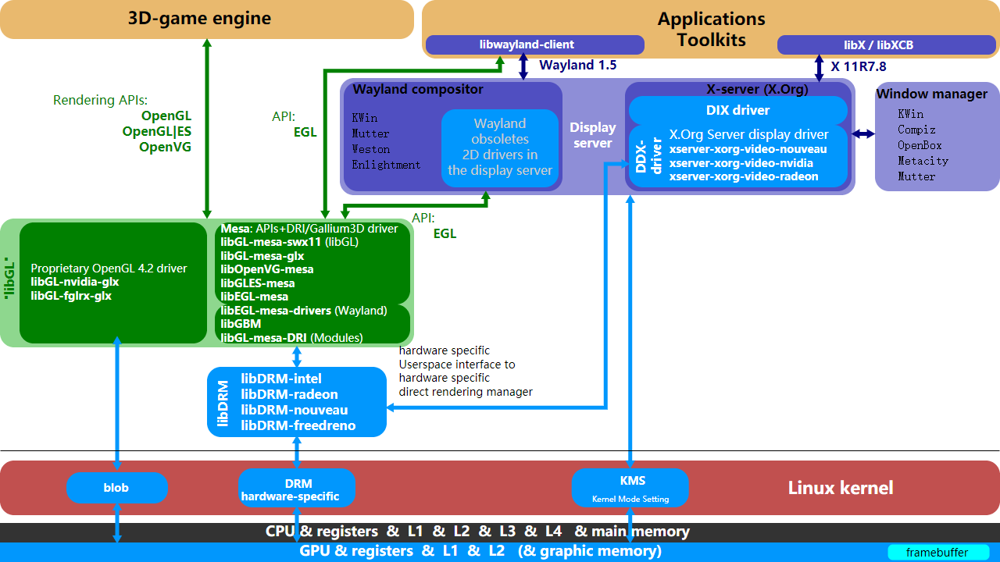
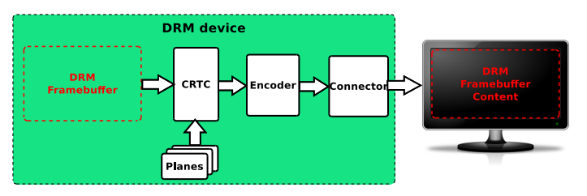
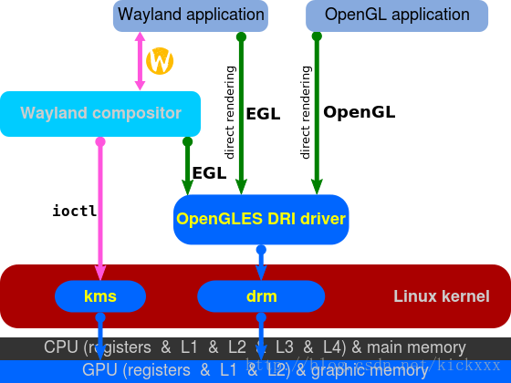

## 1.连接开发板

以前使用的都是kernel+ramdisk的形式，只能用串口线连接，或者用过usb局域网+ssh的形式连接。泰山派的功能更加强大一点支持串口连接也支持adb连接。由于串口线太不优雅了，一堆线看的头疼。所以采用adb的方式。

在我印象里 adb仅支持android使用 他名字也叫做 android debug brige吧。但是debain也支持adb的使用，从说明来看他是更高级的抽象，利用usb网络或者tcp协议来完成的。所以adb如果在这个系统上移植了哪就能用，实在不行连接网络然后ssh也可以。

```
sudo apt install adb
sudo apt-get install android-sdk-platform-tools-commo
```

如果有以下报错

```
error: insufficient permissions for device: user in plugdev group; are your udev rules wrong?
See [http://developer.android.com/tools/device.html] for more information
```

查看用户是否在某个权限组

```
qiu@qiu-RESCUER-R720-15IKBN:~/taishanpai$ id
uid=1000(qiu) gid=1000(qiu) groups=1000(qiu),4(adm),24(cdrom),27(sudo),30(dip),46(plugdev),122(lpadmin),135(lxd),136(sambashare)
```

如果有46(plugdev)，说明在这个权限组，否则，为当前用户加入该权限组

```
$ sudo usermod -aG plugdev $LOGNAME
```

然后，添加规则

```
sudo vim /etc/udev/rules.d/51-android.rules

SUBSYSTEM=="usb", MODE="0660", GROUP="plugdev", SYMLINK+="android%n"
```

我也不知道啥意思，按照文档添加即可，如果不行采用其他的方式连接。连接只是手段，不是重点。

## 2.libdrm

libdrm在软件层面属于上层，也就是用户层，他是利用kernel提供的接口抽象出一些命令方便上层用户调试。如下图，展现了整个的框架。



可以看到，libdrm也是属于较为中间的地位，下接kernel提供的接口，上接一些开源的框架，例如opengl，等等。下面使用libdrm，对整个系统进行观察。

```
DRM框架在用户空间提供的Libdrm，对底层接口进行封装，主要是对各种IOCTL接口进行封装，向上层提供通用的API接口， 用户或应用程序在用户空间调用libdrm提供的库函数，即可访问到显示的资源，并对显示资源进行管理和使用。

这样通过libdrm对显示资源进行统一访问，libdrm将命令传递到内核最终由DRM驱动接管各应用的请求并处理， 可以有效避免访问冲突。
```

这个项目好像并未使用github进行管理，而是gitlab？

```
https://gitlab.freedesktop.org/mesa/drm
```

libdrm不仅提供了shell命令可以用于自行测试，而且提供了接口。如下所示，一般libxxx都会提供.h的接口和对应的链接库。

```
https://gitlab.freedesktop.org/mesa/drm/-/tree/main/man?ref_type=heads
```

```
modetest
```

#### Encoder

转换输出器，负责电源管理、显然输出需要不同的信号转换器，将内存的像素转换成显示器需要的信号。

```
Encoders:
id      crtc    type    possible crtcs  possible clones
149     0       Virtual 0x00000003      0x00000000
151     0       TMDS    0x00000001      0x00000000
162     115     DSI     0x00000002      0x00000000
```

#### Connector

Connector连接器负责硬件设备的接入，比如HDMI,VGA等，可以获取到设备EDID , DPMS连接状态等等。

```
Connectors:
id      encoder status          name            size (mm)       modes   encoders
152     0       disconnected    HDMI-A-1        0x0             0       151
...
163     162     connected       DSI-1           74x132          1       162
  modes:
        name refresh (Hz) hdisp hss hse htot vdisp vss vse vtot)
  720x1280 60 720 728 744 752 1280 1288 1304 1312 59197 flags: nhsync, nvsync; type: preferred, driver
  props:
        1 EDID:
                flags: immutable blob
                blobs:

                value:
        2 DPMS:
                flags: enum
                enums: On=0 Standby=1 Suspend=2 Off=3
                value: 0
        5 link-status:
                flags: enum
                enums: Good=0 Bad=1
                value: 0
        6 non-desktop:
                flags: immutable range
                values: 0 1
                value: 0
        46 brightness:
                flags: range
                values: 0 100
                value: 50
        47 contrast:
                flags: range
                values: 0 100
                value: 50
        50 saturation:
                flags: range
                values: 0 100
                value: 50
        51 hue:
                flags: range
                values: 0 100
                value: 50
```

#### Planes

基本的显示控制单位，每个图像拥有一个Planes，Planes的属性控制着图像的显示区域、图像翻转、色彩混合方式等， 最终图像经过Planes并通过CRTC组件，得到多个图像的混合显示或单独显示的等等功能。

```
Planes:
id      crtc    fb      CRTC x,y        x,y     gamma size      possible crtcs
57      0       0       0,0             0,0     0               0x00000001
  formats: XR24 AR24 XB24 AB24 RG24 BG24 RG16 BG16
```

####  CRTC

CRTC的工作，就是负责把要显示图像，转化为底层硬件层面上的具体时序要求，还负责着帧切换、电源控制、色彩调整等，可以连接多个 Encoder ，实现复制屏幕功能。

```
CRTCs:
id      fb      pos     size
85      0       (0,0)   (0x0)
   0 0 0 0 0 0 0 0 0 0 flags: ; type: 
  props:
...	
115     169     (0,0)   (720x1280)
   0 720 728 744 752 1280 1288 1304 1312 59197 flags: nhsync, nvsync; type: 
  props:
```



上面CRTC、Planes、Encoder、Connector这些组件是对硬件的抽象，即使没有实际的硬件与之对应，在软件驱动中也需要实现这些，否则DRM子系统无法正常运行。

下面介绍modetest的使用，可以看到默认是输出所有的信息。

```
usage: modetest [-cDdefMPpsCvw]
 Query options:
    -c    list connectors
    -e    list encoders
    -f    list framebuffers
    -p    list CRTCs and planes (pipes)
 Test options:
    -P <crtc_id>:<w>x<h>[+<x>+<y>][*<scale>][@<format>]    set a plane
    -s <connector_id>[,<connector_id>][@<crtc_id>]:<mode>[-<vrefresh>][@<format>]    set a mode
    -C    test hw cursor
    -v    test vsynced page flipping
    -w <obj_id>:<prop_name>:<value>    set property
 Generic options:
    -d    drop master after mode set
    -M module    use the given driver
    -D device    use the given device
    Default is to dump all info.
```

主要是用test ops

```
modetest -s 163@115:720x1280@RG24
```

```
163，对应Connectors ID；
115，对应CRTCs ID；
720x1280，输出最大分辨率；
RG24，代表RGB888，每个像素点24bit，R/G/B各8bit；
```

```
root@linaro-alip:/# modetest -s 163@115:720x1280@RG24
trying to open device 'i915'...failed
trying to open device 'amdgpu'...failed
trying to open device 'radeon'...failed
trying to open device 'nouveau'...failed
trying to open device 'vmwgfx'...failed
trying to open device 'omapdrm'...failed
trying to open device 'exynos'...failed
trying to open device 'tilcdc'...failed
trying to open device 'msm'...failed
trying to open device 'sti'...failed
trying to open device 'tegra'...failed
trying to open device 'imx-drm'...failed
trying to open device 'rockchip'...done
setting mode 720x1280-60Hz@RG24 on connectors 163, crtc 115
```

执行完之后，屏幕会出现老式电视一样的花屏图样。

## 3.debugfs

debug是kernel一个ramdisk，和proc一样只有运行时存在的文件系统。

```
/sys/kernel/debug
```

各个子系统都会暴露出debugfs的接口，方便用户层对驱动进行访问和测试。


首先区分drm与dri。



我们可以看出DRM是DRI的一个组成部分，DRI同时还包含kms以及OPenGLES DRI driver部分。

```
root@linaro-alip:/sys/kernel/debug/dri/128# cat summary 
Video Port0: DISABLED
Video Port1: ACTIVE
    Connector: DSI-1
        bus_format[100a]: RGB888_1X24
        overlay_mode[0] output_mode[0] color_space[0]
    Display mode: 720x1280p60
        clk[59197] real_clk[59197] type[48] flag[a]
        H: 720 728 744 752
        V: 1280 1288 1304 1312
    Cluster0-win0: ACTIVE
        win_id: 4
        format: AB24 little-endian (0x34324241)[AFBC] SDR[0] color_space[0] glb_alpha[0xff]
        rotate: xmirror: 0 ymirror: 0 rotate_90: 0 rotate_270: 0
        csc: y2r[0] r2y[0] csc mode[0]
        zpos: 7
        src: pos[0, 0] rect[64 x 64]
        dst: pos[486, 857] rect[64 x 64]
        buf[0]: addr: 0x0000000000743000 pitch: 256 offset: 0
```

可以看到，现在用的VOP是Video Port1: ACTIVE。VOP干啥的我还不知道。此外在sys文件下还有大量的信息，包括对象树如何组织的。但是现在还没有看到代码，所以先忽略。

## 4.日志

```
kmesg ｜ grep drm
```

可以看到加载过程。

```
[    0.244977] rockchip-drm display-subsystem: Linked as a consumer to fe040000.vop
[    0.245891] rockchip-drm display-subsystem: Linked as a consumer to fe0a0000.hdmi
[    0.246289] rockchip-drm display-subsystem: Linked as a consumer to fe070000.dsi
[    0.247371] rockchip-drm display-subsystem: defer getting devfreq
[    0.247643] rockchip-vop2 fe040000.vop: [drm:vop2_bind] vp0 assign plane mask: 0x2a, primary plane phy id: 5
[    0.247670] rockchip-vop2 fe040000.vop: [drm:vop2_bind] vp1 assign plane mask: 0x15, primary plane phy id: 4
[    0.247691] rockchip-vop2 fe040000.vop: [drm:vop2_bind] vp2 assign plane mask: 0x0, primary plane phy id: -1
[    0.247804] [drm] unsupported AFBC format[3432564e]
[    0.247862] rockchip-vop2 fe040000.vop: [drm:vop2_bind] Cluster1-win0 as cursor plane for vp0
[    0.247981] rockchip-vop2 fe040000.vop: [drm:vop2_bind] Cluster0-win0 as cursor plane for vp1
[    0.248059] [drm] failed to init overlay plane Cluster0-win1
[    0.248075] [drm] failed to init overlay plane Cluster1-win1
[    0.248219] rockchip-drm display-subsystem: bound fe040000.vop (ops 0xffffff8008e8def8)
[    0.249641] rockchip-drm display-subsystem: bound fe0a0000.hdmi (ops 0xffffff8008e91a10)
[    0.249696] dw-mipi-dsi fe070000.dsi: [drm:dw_mipi_dsi_bind] *ERROR* Failed to find panel or bridge: -517
[    1.267909] rockchip-drm display-subsystem: defer getting devfreq
[    1.268250] rockchip-vop2 fe040000.vop: [drm:vop2_bind] vp0 assign plane mask: 0x2a, primary plane phy id: 5
[    1.268280] rockchip-vop2 fe040000.vop: [drm:vop2_bind] vp1 assign plane mask: 0x15, primary plane phy id: 4
[    1.268300] rockchip-vop2 fe040000.vop: [drm:vop2_bind] vp2 assign plane mask: 0x0, primary plane phy id: -1
[    1.268439] rockchip-vop2 fe040000.vop: [drm:vop2_bind] Cluster1-win0 as cursor plane for vp0
[    1.268557] rockchip-vop2 fe040000.vop: [drm:vop2_bind] Cluster0-win0 as cursor plane for vp1
[    1.268641] [drm] failed to init overlay plane Cluster0-win1
[    1.268655] [drm] failed to init overlay plane Cluster1-win1
[    1.268796] rockchip-drm display-subsystem: bound fe040000.vop (ops 0xffffff8008e8def8)
[    1.271839] rockchip-drm display-subsystem: bound fe0a0000.hdmi (ops 0xffffff8008e91a10)
[    1.271912] rockchip-drm display-subsystem: bound fe070000.dsi (ops 0xffffff8008e92ad8)
[    1.271928] [drm] Supports vblank timestamp caching Rev 2 (21.10.2013).
[    1.271936] [drm] No driver support for vblank timestamp query.
[    1.272551] rockchip-drm display-subsystem: connector[HDMI-A-1] can't found any modes
[    1.291157] rockchip-drm display-subsystem: fb0:  frame buffer device
[    1.291922] [drm] Initialized rockchip 2.0.0 20140818 for display-subsystem on minor 0
[    1.364759] [drm] Initialized rknpu 0.7.2 20220428 for fde40000.npu on minor 1
[   11.285378] [drm:dw_hdmi_rockchip_set_property] *ERROR* failed to set rockchip hdmi connector property CONNECTOR_ID
[   12.309016] Freeing drm_logo memory: 2076K
```

ok下一步进行代码阅读。


参考连接：

https://gitlab.freedesktop.org/mesa/drm

https://markyzq.gitbooks.io/rockchip_drm_integration_helper/content/zh/introduce.html

https://cloud.tencent.com/developer/article/1867380

https://doc.embedfire.com/linux/rk356x/driver/zh/latest/linux_driver/framework_drm.html

图片来源互联网，侵权删除。