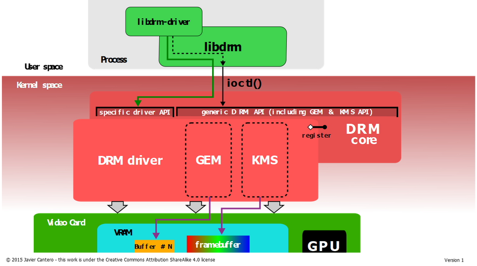
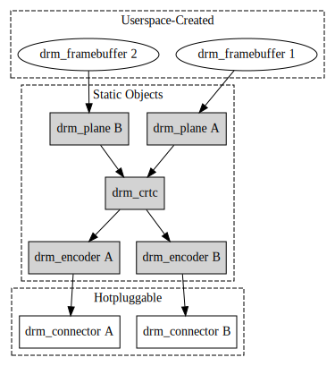
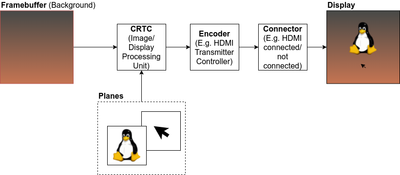
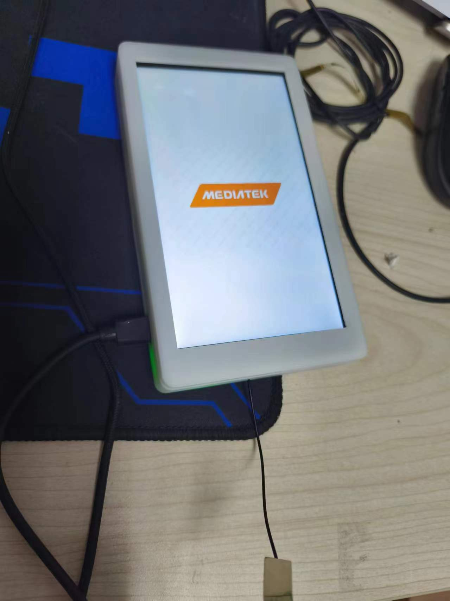

### 图像框架

Linux 中不仅仅只有DRM与图像有关。下面是GPT的回答

##### 1. **DRM (Direct Rendering Manager)**

- **功能**：DRM 是 Linux 内核中用于图形渲染的一个子系统，主要负责与显卡（GPU）硬件的交互，管理显示缓冲区、处理图形和视频渲染、以及支持硬件加速的图形渲染任务。
- **工作原理**：DRM 提供一个现代化的接口，允许用户空间直接访问 GPU 资源进行图形和视频处理。它包含了显示管理（包括多显示器支持）、图形加速（如 OpenGL、Vulkan）、以及对 GPU 驱动的管理。DRM 的核心功能包括 `KMS（Kernel Mode Setting）` 和 `gem（Graphics Execution Manager）` 等。
- **应用场景**：现代桌面环境（如 GNOME、KDE）以及图形驱动程序（如 Intel、AMD、NVIDIA）通常依赖 DRM 进行图形加速。DRM 通常用在较为复杂的图形渲染场景中，如游戏、桌面渲染以及图形工作负载。

##### 2. **V4L2 (Video4Linux2)**

- **功能**：V4L2 是一个用于视频设备（如摄像头、视频采集卡等）的子系统，提供 API 供用户空间应用与视频设备进行交互。它支持多种视频格式的捕获、输出和处理。
- **工作原理**：V4L2 提供了设备控制、视频流采集和处理的功能，支持视频编解码、图像捕获等。V4L2 是用于处理和管理视频输入和输出的标准接口，主要面向视频捕捉卡、摄像头、视频播放设备等硬件。
- **应用场景**：V4L2 被广泛应用于视频采集（如 USB 摄像头）、直播、视频流处理等场景，通常用于与视频相关的输入设备交互。

##### 3. **FBDEV (Framebuffer Device)**

- **功能**：FBDEV 是一个较为古老的 Linux 内核图形子系统，提供通过帧缓冲设备（Framebuffer）直接进行屏幕显示的接口。它允许用户空间直接操作显示器的像素，进行图形输出。
- **工作原理**：FBDEV 将显存（framebuffer）映射到用户空间，使得用户程序能够直接绘制图像、文本或图形到显示设备。它不涉及硬件加速，较为简单，适合嵌入式设备或早期的显示系统。
- **应用场景**：FBDEV 主要用于嵌入式设备或者不需要复杂图形加速的简单显示系统。它的 API 比较简单，但不支持现代图形加速。

##### 4. **区别与联系**

- DRM 与 FBDEV
  - **区别**：DRM 是现代图形显示和硬件加速的接口，提供对 GPU 的支持，而 FBDEV 只提供一个简单的帧缓冲接口，没有硬件加速的支持。FBDEV 更适用于嵌入式设备或者简单的图形应用，而 DRM 适用于需要图形加速和更高性能的环境。
  - **联系**：在现代的 Linux 系统中，FBDEV 通常会通过 DRM 来实现显示功能。FBDEV 可能会基于 DRM 提供的硬件加速支持，通过 `fbdev` 驱动将 framebuffer 渲染到屏幕上。
- DRM 与 V4L2
  - **区别**：DRM 主要处理显示输出和图形加速，而 V4L2 主要处理视频输入和采集。虽然它们的功能不同，但它们都涉及到与视频硬件的交互。
  - **联系**：在某些系统中，V4L2 和 DRM 可能会协同工作，尤其是在处理视频流时。例如，视频播放时，V4L2 可能会捕获视频数据，然后将其交给 DRM 进行显示。
- FBDEV 与 V4L2
  - **区别**：FBDEV 处理的是屏幕显示输出，而 V4L2 主要处理视频输入。FBDEV 直接操作显示设备的帧缓冲区，而 V4L2 通常与视频采集卡、摄像头等设备交互，进行图像或视频捕获。
  - **联系**：在一些设备上，FBDEV 可以用来显示通过 V4L2 捕获的视频流。尤其是在一些早期的嵌入式设备中，FBDEV 可能被用来显示 V4L2 捕获的视频内容。

##### 总结：

- **DRM** 是现代图形和显示管理的核心，支持图形加速，主要处理显示输出和图形渲染。
- **V4L2** 主要处理视频输入设备的接口，负责视频捕获、编码和处理。
- **FBDEV** 是较为传统的图形显示接口，适合简单显示，没有图形加速。

三者之间的联系在于它们都涉及到与图形或视频硬件的交互，并且在一些系统中可能会协同工作。例如，V4L2 捕获的视频可以通过 DRM 渲染显示，而 FBDEV 在一些老旧系统中仍然用于显示视频内容。

GPT的输出可能有问题，但是目前现有个基础的概念。




主要关注GEM和KMS。

**KMS(Kernel Mode Setting):** 即Mode setting：更新画面和设置显示参数。

1. 更新画面：显示buffer的切换，多图层的合成方式，以及每个图层的显示位置。
2. 设置显示参数：包括分辨率、刷新率、电源状态（休眠唤醒）等。

**GEM(Graphic Execution Manager):** 主要负责显示buffer的分配和释放，内存管理与同步。

从上图中来看，应该是drm子系统里面包含着两个组件，类似于pwm子系统里面的core.c但是core.c没用那么成体系规模。

### KMS

**KMS(Kernel Mode Setting):** 即Mode setting：更新画面和设置显示参数。

相关代码路径为

```
kernel/drivers/gpu/drm/*kms*
```

阅读代码之前需要了解几个概念。上篇文章介绍过。



这个东西搞得就很抽象，下面有个简单的demo来展示整个行为，在用户空间使用libdrm提供的api完成的。



既然都是framebuffer完成的上层显示。那么Framebuffer Device应该也是可以使用的。那么如何搞？

首先直接写入

```
/dev/fd0
```

是写入不进去的，首先需要把debain的x11关掉。简单点来讲就是，x11框架或者是别的乱七八糟的显示框架已经占用了这个device。所以你是没办法用的。本人对于这个显示框架不怎么熟悉，所以直接偷懒copy。

```
init 3 关闭图形界面（XServer服务也会关闭）
```

https://jermine.vdo.pub/linux/%E5%90%AF%E7%94%A8%E6%88%96%E5%85%B3%E9%97%AD%E5%9B%BE%E5%BD%A2%E5%8C%96/

关掉之后，fd0就可以写入了。

```
dd if=/dev/urandom of=/dev/fb0
```

可以看到雪花屏，全是噪点。

接下来参考这个博客和项目。

```
https://embear.ch/blog/drm-framebuffer
https://github.com/embear-engineering/drm-framebuffer/tree/main
```

git下载下来之后直接make即可，需要gcc与libdrm库。我们的设备是/dev/dri/card0

```
root@linaro-alip:/home/linaro/drm# ./drm-framebuffer -d /dev/dri/card0 -l
connectors:
Number: 152 Name: HDMI-A-1 Encoder: 0 
Number: 163 Name: DSI-1 Encoder: 162 Crtc: 115
Framebuffers: 
CRTCs: 85 115 
encoders: 149 151 162 
```

可以看到有2个connectors，其中我们用的是DSI而不是HDMI。

```
./drm-framebuffer -d /dev/dri/card0 -c DSI-1 -r                   
#0 - 720x1280@60 (ht: 752 hs: 728 he: 744 hskew: 0, vt: 1312  vs: 1288 ve: 1304 vscan: 0, flags: 0xA) - preferred
```

可以看到，分辨率是720*1280，刷新率是60hz，其他参数还看不懂。

然后需要一个软件imagemagick，直接apt安装即可。

```
convert -resize 720x mediatek.png - | convert -extent 720x1280 -gravity Center - bgra:- | ./drm-framebuffer -d /dev/dri/card1 -c DSI-1
```



下一章，看drm-framebuffer这么操作的，理解这几个对象间的关系。