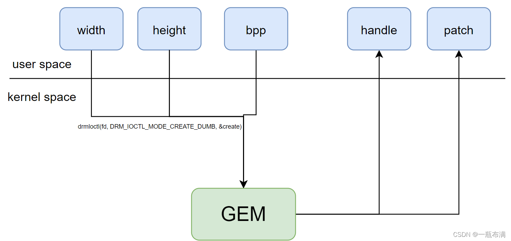

### 1.gdbserver安装与使用

首先给泰山派连接上网络，本来想直接触摸操作，但是debain没有对应的虚拟键盘，要外接键盘打字，害怕功率不够遂止。

采用如下命令连接。之前使用过wpa_cli，但是总是连接不上。而且泰山派只支持2.4g网络。

```
nmcli device wifi connect "xxx" password "yyy"
```

随后安装gdbserver。

```
sudo apt install gdbserver
```

随后运行调试。

```
root@linaro-alip:/home/linaro/drm# gdbserver :12345  ./drm-framebuffer 
Process ./drm-framebuffer created; pid = 924
Listening on port 12345
Remote debugging from host 192.168.1.191
```

为了后续方便，可以在当前目录下搞一个.gdbinit。

```
target remote 192.168.1.206:12345
cd /home/qiu/drm/drm/
```

我没怎么用过gdbserver远程调试，如果当前目录没有c代码，那么调试的时候是显示不出来源代码的。而且这里的目录是gdb所在机器的目录，而不是开发板的目录。搞不太清楚，这样的话必须保证两台机器的文件的一致性。

随后看代码，如果没有给定如下参数，那么直接打印帮助。所以加上设备参数。

### 2.drm-framebuffer调试阅读

```
dri_device = optarg;
```

```
gdbserver :12345 ./drm-framebuffer -d /dev/dri/card0
```

```
int main(int argc, char** argv)
{
    char *dri_device = 0;
    char *connector = 0;
    int c;
    int list = 0;
    int resolution = 0;
    int selected_resolution = -1;
    int ret;

    opterr = 0;
    while ((c = getopt (argc, argv, "d:c:s:lrhv")) != -1) {
        switch (c)
        {
        case 'd':
            dri_device = optarg;
            break;
        case 'c':
            connector = optarg;
            break;
        case 'l':
            list = 1;
            break;
        case 'r':
            resolution = 1;
            break;
        case 'h':
            usage();
            return 1;
        case 'v':
            verbose = 1;
            break;
        case 's':
            selected_resolution = atoi(optarg);
            break;
        default:
            break;
        }
    }

```

随后看l选项，加上l选项

```
gdbserver :12345 ./drm-framebuffer -d -l /dev/dri/card0
```

```

    if (dri_device == 0) {
        printf("Please set a device\n");
        usage();
        return 3;
    }

    if (list) {
        return list_resources(dri_device);
    }

```

可以看到l选项主要是list_resources函数。

```

static int list_resources(const char *dri_device)
{
    int fd;
    drmModeResPtr res;

// 打开设备 open函数
    fd = open(dri_device, O_RDWR);
    if (fd < 0) {
        printf("Could not open dri device %s\n", dri_device);
        return -EINVAL;
    }

//这个函数返回资源 struct 是drmModeResPtr这个
    res = drmModeGetResources(fd);
    if (!res) {
        printf("Could not get drm resources\n");
        return -EINVAL;
    }

 
```


可以看到这个结构体里面有很多信息。相关代码如下，懒得下libdrm了。看看就算了。

```
https://gitlab.freedesktop.org/mesa/drm/-/blob/main/xf86drmMode.h
```

```
typedef struct _drmModeRes {

	int count_fbs;
	uint32_t *fbs;

	int count_crtcs;
	uint32_t *crtcs;

	int count_connectors;
	uint32_t *connectors;

	int count_encoders;
	uint32_t *encoders;

	uint32_t min_width, max_width;
	uint32_t min_height, max_height;
} drmModeRes, *drmModeResPtr;

```

可以看到是typedef定义的，所以代码里面没有struct。

继续往下，根据这个结构体挨个打印。首先是connectors。

```
   printf("connectors:");
    for (int i = 0; i < res->count_connectors; i++) {
        drmModeConnectorPtr connector = 0;
        drmModeEncoderPtr encoder = 0;

        printf("\nNumber: %d ", res->connectors[i]);
        connector = drmModeGetConnectorCurrent(fd, res->connectors[i]);
        if (!connector)
            continue;

        printf("Name: %s-%u ", connector_type_name(connector->connector_type), connector->connector_type_id);
        printf("Encoder: %d ", connector->encoder_id);

        encoder = drmModeGetEncoder(fd, connector->encoder_id);
        if (!encoder)
            continue;

        printf("Crtc: %d", encoder->crtc_id);

        drmModeFreeEncoder(encoder);
        drmModeFreeConnector(connector);
```

结果如下。

```
connectors:
Number: 152 Name: HDMI-A-1 Encoder: 0 
Number: 163 Name: DSI-1 Encoder: 162 Crtc: 115
```

```
typedef struct _drmModeConnector {
	uint32_t connector_id;
	uint32_t encoder_id; /**< Encoder currently connected to */
	uint32_t connector_type;
	uint32_t connector_type_id;
	drmModeConnection connection;
	uint32_t mmWidth, mmHeight; /**< HxW in millimeters */
	drmModeSubPixel subpixel;

	int count_modes;
	drmModeModeInfoPtr modes;

	int count_props;
	uint32_t *props; /**< List of property ids */
	uint64_t *prop_values; /**< List of property values */

	int count_encoders;
	uint32_t *encoders; /**< List of encoder ids */
} drmModeConnector, *drmModeConnectorPtr;
typedef struct _drmModeEncoder {
	uint32_t encoder_id;
	uint32_t encoder_type;
	uint32_t crtc_id;
	uint32_t possible_crtcs;
	uint32_t possible_clones;
} drmModeEncoder, *drmModeEncoderPtr;

```

通过drmModeGetConnectorCurrent获得drmModeConnector，通过drmModeGetEncoder获得drmModeEncoder。

好吧这两个函数也吧啦吧啦写了一堆，看看结构体长啥样就过吧。


随后打印了nFramebuffers，nCRTCs，nencoders然后free掉res。

```
printf("\nFramebuffers: ");
    for (int i = 0; i < res->count_fbs; i++) {
        printf("%d ", res->fbs[i]);
    }

    printf("\nCRTCs: ");
    for (int i = 0; i < res->count_crtcs; i++) {
        printf("%d ", res->crtcs[i]);
    }

    printf("\nencoders: ");
    for (int i = 0; i < res->count_encoders; i++) {
        printf("%d ", res->encoders[i]);
    }
    printf("\n");

    drmModeFreeResources(res);

    return 0;
```

随后的操作都需要制定connector。所以加上这个选项。

```
 if (connector == 0) {
        printf("Please set a connector\n");
        usage();
        return 4;
    }

    if (resolution) {
        return get_resolution(dri_device, connector);
    }
```

```
gdbserver :12345 ./drm-framebuffer -d -l /dev/dri/card0 -c DSI-1
```

如果要获取该connector的分辨率加上r参数。

```
gdbserver :12345 ./drm-framebuffer -d -l /dev/dri/card0 -r -c DSI-1
```

如何获取分辨率？

```
static int get_resolution(const char *dri_device, const char *connector_name)
{
    int err = 0;
    int fd;
    drmModeResPtr res;

    fd = open(dri_device, O_RDWR);
    if (fd < 0) {
        printf("Could not open dri device %s\n", dri_device);
        return -EINVAL;
    }

    res = drmModeGetResources(fd);
    if (!res) {
        printf("Could not get drm resources\n");
        return -EINVAL;
    }

    /* Search the connector provided as argument */
    drmModeConnectorPtr connector = 0;
    for (int i = 0; i < res->count_connectors; i++) {
        char name[32];

        connector = drmModeGetConnectorCurrent(fd, res->connectors[i]);
        if (!connector)
            continue;
/* 比对connector名称如果符合则break，否则设为0，后续退出 */
        snprintf(name, sizeof(name), "%s-%u", connector_type_name(connector->connector_type),
                 connector->connector_type_id);

        if (strncmp(name, connector_name, sizeof(name)) == 0)
            break;

        drmModeFreeConnector(connector);
        connector = 0;
    }
/* 不存在connector，则退出 */
    if (!connector) {
        printf("Could not find matching connector %s\n", connector_name);
        return -EINVAL;
    }

    /* Get the preferred resolution */
    drmModeModeInfoPtr resolution = 0;
    for (int i = 0; i < connector->count_modes; i++) {
    /* 可以看到分辨率 刷新率等信息都藏在了 modes 里面*/
        resolution = &connector->modes[i];
        printf("#%d - %ux%u@%u", i, resolution->hdisplay, resolution->vdisplay, resolution->vrefresh);
        printf(" (ht: %u hs: %u he: %u hskew: %u, vt: %u  vs: %u ve: %u vscan: %u, flags: 0x%X)",
                resolution->htotal, resolution->hsync_start, resolution->hsync_end, resolution->hskew,
                resolution->vtotal, resolution->vsync_start, resolution->vsync_end, resolution->vscan,
                resolution->flags);
        if (resolution->type & DRM_MODE_TYPE_PREFERRED)
            printf(" - preferred");
        printf("\n");
    }

    drmModeFreeConnector(connector);
    drmModeFreeResources(res);
    close(fd);
    return err;
}

```

```
typedef struct _drmModeModeInfo {
	uint32_t clock;
	uint16_t hdisplay, hsync_start, hsync_end, htotal, hskew;
	uint16_t vdisplay, vsync_start, vsync_end, vtotal, vscan;

	uint32_t vrefresh;

	uint32_t flags;
	uint32_t type;
	char name[DRM_DISPLAY_MODE_LEN];
} drmModeModeInfo, *drmModeModeInfoPtr;

```

剩下一段就是向屏幕写数据的代码

```

		/* 可以看到顶层还是使用的framebuffer结构体 */
    struct framebuffer fb;
    /* 初始化 */
    memset(&fb, 0, sizeof(fb));
    
    ret = 1;
    if (get_framebuffer(dri_device, connector, &fb, selected_resolution) == 0) {
        if(!fill_framebuffer_from_stdin(&fb)) {
            // successfully shown.
            ret = 0;
        }
        release_framebuffer(&fb);
    }

    return ret;
```

先看get_framebuffer，首先看传入的这个fb是什么？

```
struct framebuffer {
    int fd;
    uint32_t buffer_id;
    uint16_t res_x;
    uint16_t res_y;
    uint8_t *data;
    uint32_t size;
    struct drm_mode_create_dumb dumb_framebuffer;
    drmModeCrtcPtr crtc;
    drmModeConnectorPtr connector;
    drmModeModeInfoPtr resolution;
};
```

可以看到是他自己定义的一个结构体。关键是drm_mode_create_dumb。

```
int get_framebuffer(const char *dri_device, const char *connector_name, struct framebuffer *fb,
                    int selected_resolution)
{
    int err;
    int fd;
    drmModeResPtr res;
    drmModeEncoderPtr encoder = 0;


  /*重复上述获取connector 分辨率等*/

/* 可以看到，根据connector的resolution设置fb的resolution */
    fb->dumb_framebuffer.height = resolution->vdisplay;
    fb->dumb_framebuffer.width = resolution->hdisplay;
    fb->dumb_framebuffer.bpp = 32;

    err = ioctl(fd, DRM_IOCTL_MODE_CREATE_DUMB, &fb->dumb_framebuffer);
    if (err) {
        printf("Could not create dumb framebuffer (err=%d)\n", err);
        goto cleanup;
    }

```

这里需要深入看一下，因为不是libdrm的而是gem的东西，首先看这个结构体drm_mode_create_dumb。

```
/**
 * struct drm_mode_create_dumb - Create a KMS dumb buffer for scanout.
 * @height: buffer height in pixels
 * @width: buffer width in pixels
 * @bpp: bits per pixel
 * @flags: must be zero
 * @handle: buffer object handle
 * @pitch: number of bytes between two consecutive lines
 * @size: size of the whole buffer in bytes
 *
 * User-space fills @height, @width, @bpp and @flags. If the IOCTL succeeds,
 * the kernel fills @handle, @pitch and @size.
 */
struct drm_mode_create_dumb {
	__u32 height;
	__u32 width;
	__u32 bpp;
	__u32 flags;

	__u32 handle;
	__u32 pitch;
	__u64 size;
};

```

这个dumb buffer确实没绷住。下面有位摩尔线程的大佬的解释。

```
https://blog.csdn.net/hexiaolong2009/article/details/105961192
```

好吧，暂且将dumb buffer理解为，一块缓冲区，用于展示用户输入的数据，这块缓冲区的处理纯纯使用CPU完成。从这张图看出来。



这个函数接受 width，height，bpp返回handler，patch。

这几个参数的含义如下：

```
1. pitch（每行字节数）
意思：pitch 表示一行数据在内存中占据的字节数（有时也称为“步幅”或“行跨度”）。它不仅包括图像的宽度，还可能包含内存对齐的填充字节（比如，如果每行的字节数不是 4 字节对齐，可能会有一些空字节填充在每行的末尾）。
举例：假设图像宽度为 4 像素，每像素 1 字节（即 bpp=8），那么图像的宽度为 4 字节。如果 pitch 为 8 字节，可能是因为每行后面有 4 字节的填充，用于内存对齐。
2. size（缓冲区总大小）
意思：size 表示整个缓冲区的总字节数。它等于图像的高度、宽度、每像素的字节数与 pitch 的乘积。
举例：假设图像宽度是 4 像素，图像高度是 3 像素，每像素 1 字节（bpp=8），pitch 是 8 字节，那么缓冲区的总大小为：
size=pitch×height=8×3=24 字节
3. height（缓冲区高度）
意思：height 是图像的行数，即图像的高度，以像素为单位。它描述了图像在垂直方向上的像素数。
举例：如果图像有 3 行像素，那么 height 为 3。
4. width（缓冲区宽度）
意思：width 是图像的列数，即图像的宽度，以像素为单位。它描述了图像在水平方向上的像素数。
举例：如果图像有 4 列像素，那么 width 为 4。
5. bpp（每像素的比特数）
意思：bpp（Bits Per Pixel）表示每个像素占用多少比特。常见的值有：
8：每个像素占 1 字节（灰度图像）
16：每个像素占 2 字节（例如，16 位色图像）
24：每个像素占 3 字节（真彩色图像）
32：每个像素占 4 字节（带透明通道的 RGBA 图像）
举例：如果 bpp=8，表示每个像素占用 1 字节。如果 bpp=24，则每个像素占用 3 字节（通常用于 RGB 图像）。
举例说明：
假设有一个 3x4 的图像，宽度 4 像素，高度 3 像素，每个像素占 8 位（即 1 字节），并且每行需要填充一些字节以满足内存对齐要求，因此 pitch=8 字节。这个图像的数据布局如下：

width = 4：每行有 4 个像素（4 字节）。
height = 3：图像有 3 行。
bpp = 8：每个像素占 1 字节。
pitch = 8：每行有 8 字节（包括填充字节）。
因此，图像的总缓冲区大小是：
size=pitch×height=8×3=24 字节
每行占 8 字节，而每个像素占 1 字节，所以每行的 4 个像素之后会有填充字节，确保内存对齐。
by:chatgpt
```

所以可以看到一般的size是height*piech计算出来的。

```
int drm_gem_cma_dumb_create(struct drm_file *file_priv,
        struct drm_device *drm, struct drm_mode_create_dumb *args)
{
	struct drm_gem_cma_object *cma_obj;
 
	args->pitch = DIV_ROUND_UP(args->width * args->bpp, 8);
	args->size = args->pitch * args->height;
 
	cma_obj = drm_gem_cma_create_with_handle(file_priv, drm, args->size, &args->handle);
	return PTR_ERR_OR_ZERO(cma_obj);
}
```

看这个drm_gem_cma_object和结构体，cma是什么意思？

```
在 Linux 的 DRM（Direct Rendering Manager）子系统中，CMA 是 Contiguous Memory Allocator 的缩写，表示“连续内存分配器”。它是 Linux 内核中用于分配大块物理连续内存的机制，特别是在需要直接与硬件交互时（例如显卡、显示控制器等）非常重要。
by chatgpt
```

```
https://www.kernel.org/doc/html/v5.4/gpu/drm-mm.html
```

文档的这个部分也有介绍。先用gpt搜，然后google验证。不然一个缩写找半天又。

```
/**
 * struct drm_gem_cma_object - GEM object backed by CMA memory allocations
 * @base: base GEM object 应该是基类
 * @paddr: physical address of the backing memory 物理地址
 * @sgt: scatter/gather table for imported PRIME buffers. The table can have
 *       more than one entry but they are guaranteed to have contiguous
 *       DMA addresses.
 * @vaddr: kernel virtual address of the backing memory 虚拟地址
 */
struct drm_gem_cma_object {
	struct drm_gem_object base;
	dma_addr_t paddr;
	struct sg_table *sgt;

	/* For objects with DMA memory allocated by GEM CMA */
	void *vaddr;
};

```

```
static struct drm_gem_cma_object *
drm_gem_cma_create_with_handle(struct drm_file *file_priv,
    struct drm_device *drm, size_t size,
   uint32_t *handle)
{
	struct drm_gem_cma_object *cma_obj;
	struct drm_gem_object *gem_obj;
	int ret;
 
	cma_obj = drm_gem_cma_create(drm, size);
 
	gem_obj = &cma_obj->base;
 
	ret = drm_gem_handle_create(file_priv, gem_obj, handle);
 
	return cma_obj;
}
```

创建这个对象，然后创建对应的handler，handler就是回调的意思，在这里应该是

```
handle可以找到gem_object进而找到cma_object获取到物理地址或者虚拟地址
```

ok，这部分到这先结束。

```

/* 在这里看参数就是对设备添加一个fream，然后配置一些参数，最后将gem malloc的空间给他 */

    err = drmModeAddFB(fd, resolution->hdisplay, resolution->vdisplay, 24, 32,
            fb->dumb_framebuffer.pitch, fb->dumb_framebuffer.handle, &fb->buffer_id);
    if (err) {
        printf("Could not add framebuffer to drm (err=%d)\n", err);
        goto cleanup;
    }

    encoder = drmModeGetEncoder(fd, connector->encoder_id);
    if (!encoder) {
        printf("Could not get encoder\n");
        err = -EINVAL;
        goto cleanup;
    }

    /* Get the crtc settings */
    fb->crtc = drmModeGetCrtc(fd, encoder->crtc_id);

    struct drm_mode_map_dumb mreq;

    memset(&mreq, 0, sizeof(mreq));
    mreq.handle = fb->dumb_framebuffer.handle;

    err = drmIoctl(fd, DRM_IOCTL_MODE_MAP_DUMB, &mreq);
    if (err) {
        printf("Mode map dumb framebuffer failed (err=%d)\n", err);
        goto cleanup;
    }

    fb->data = mmap(0, fb->dumb_framebuffer.size, PROT_READ | PROT_WRITE, MAP_SHARED, fd, mreq.offset);
    if (fb->data == MAP_FAILED) {
        err = errno;
        printf("Mode map failed (err=%d)\n", err);
        goto cleanup;
    }

  
```

```
	下面来简单介绍一下为什么要执行 DRM_IOCTL_MODE_MAP_DUMB? DRM_IOCTL_MODE_MAP_DUMB的输入是一个 gem handle，返回结果是一个 offset，通过 offset 可以知道 mmap 当前要操作的dumb buffer。所以对 drm device 进行 mmap 操作时，其参数offset 并不是真正的内存偏移量，而是一个 gem object 的索引值。通过该索引值，drm 驱动就可以准确确定当前要操作的是哪个 gem对象，然后可以获取到与该 object 相对应的物理 buffer，并对完成真正的 mmap 操作。
```

通过mmap之后，向fb的data写就等于向dumb_framebuffer写了。

然后就是一些配置。

```
  /* Make sure we are not master anymore so that other processes can add new framebuffers as well */
    drmDropMaster(fd);

    fb->fd = fd;
    fb->connector = connector;
    fb->resolution = resolution;

cleanup:
    /* We don't need the encoder and connector anymore so let's free them */
    if (encoder)
        drmModeFreeEncoder(encoder);

    if (err)
        release_framebuffer(fb);

    return err;
}
```

当上述分配，关联，设置完成之后就可以正式的写入数据啦。

```
if(!fill_framebuffer_from_stdin(&fb)) {
            // successfully shown.
            ret = 0;
        }
        release_framebuffer(&fb);
```

```
int fill_framebuffer_from_stdin(struct framebuffer *fb)
{
    size_t total_read = 0;
    int ret;

    print_verbose("Loading image\n");
    while (total_read < fb->dumb_framebuffer.size)
    {
    /* 从标准输入流里面读取数据最大就是dumb_framebuffer.size */
        size_t sz = read(STDIN_FILENO, &fb->data[total_read], fb->dumb_framebuffer.size - total_read);
        /* stop when getting EOF */
        if(sz<=0) {
            break;
        }
        total_read += sz;
    }

    /* Make sure we synchronize the display with the buffer. This also works if page flips are enabled */
    ret = drmSetMaster(fb->fd);
    if(ret)
    {
        printf("Could not get master role for DRM.\n");
        return ret;
    }
    /* 设置参数 */
    drmModeSetCrtc(fb->fd, fb->crtc->crtc_id, 0, 0, 0, NULL, 0, NULL);
    drmModeSetCrtc(fb->fd, fb->crtc->crtc_id, fb->buffer_id, 0, 0, &fb->connector->connector_id, 1, fb->resolution);
    drmDropMaster(fb->fd);

    print_verbose("Set resolution: %ux%u@%u\n", fb->resolution->hdisplay, fb->resolution->vdisplay,
                  fb->resolution->vrefresh);
    print_verbose("Sent image to framebuffer\n");
/* 异步等待信号？ 看样子应该是 */
    sigset_t wait_set;
    sigemptyset(&wait_set);
    sigaddset(&wait_set, SIGTERM);
    sigaddset(&wait_set, SIGINT);

    int sig;
    sigprocmask(SIG_BLOCK, &wait_set, NULL );
    sigwait(&wait_set, &sig);

    return 0;
}

```


参考连接：

https://wenxiaoming.github.io/2019/06/01/Graphics%20buffer%20Summary/

https://blog.csdn.net/fengchaochao123/article/details/123962337

https://blog.csdn.net/hexiaolong2009/article/details/105961192

https://elixir.bootlin.com/linux/v5.0.21/source/include/drm/drm_gem_cma_helper.h#L8

https://elixir.bootlin.com/linux/v5.0.21/source/drivers/gpu/drm/drm_gem_cma_helper.c#L237

https://gitlab.freedesktop.org/mesa/drm/-/blob/main/xf86drmMode.h