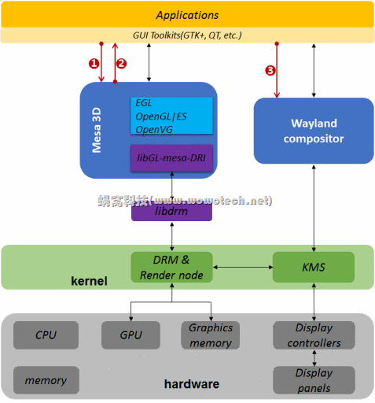

这个是整体的框图，从应用/用户到硬件。

```
1）3D-game engine、Applications和Toolkits，应用软件，其中3D-game engine是3D application的一个特例。

2）Display Server
图片给出了两个display server：Wayland compositor和X-Server（X.Org）。X-Server是linux系统在PC时代使用比较广泛的display server，而Wayland compositor则是新设计的，计划在移动时代取代X-Server的一个新的display server。

3）libX/libXCB和libwayland-client
display server提供给Application（或者GUI Toolkits）的、访问server所提供功能的API。libX/libXCB对应X-server，libwayland-client对已Wayland compositor。

4）libGL
libGL是openGL接口的实现，3D application（如这里的3D-game engine）可以直接调用libGL进行3D渲染。
libGL可以是各种不同类型的openGL实现，如openGL（for PC场景）、openGL|ES（for嵌入式场景）、openVG（for Flash、SVG矢量图）。
libGL的实现，既可以是基于软件的，也可以是基于硬件的。其中Mesa 3D是OpenGL的一个开源本的实现，支持3D硬件加速。

5）libDRM和kernel DRM
DRI（Direct Render Infrastructure）的kernel实现，及其library。X-server或者Mesa 3D，可以通过DRI的接口，直接访问底层的图形设备（如GPU等）。

6）KMS（Kernel Mode Set）
一个用于控制显示设备属性的内核driver，如显示分辨率等。直接由X-server控制。
```

在GUI环境中，一个Application想要将自身的UI界面呈现给用户，需要2个步骤：

1）根据实际情况，将UI绘制出来，以一定的格式，保存在buffer中。该过程就是常说的“Rendering”。

```
不知道为什么，wowo一直觉得“Render”这个英文单词太专业、太抽象了，理解起来有些困难。时间久了，也就不再执著了，看到它时，就想象一下内存中的图像数据（RGB或YUV格式），Rendering就是生成它们的过程。

通常来说，Rendering有多种表现形式，但可归结为如下几类：
a）2D的点、线、面等绘图，例如，“通过一个for循环，生成一个大小为640x480、格式为RGB888、填充颜色为红色的矩形框”，就是一个2D rendering的例子。
b）3D渲染。该过程牵涉比较复杂的专业知识，这里先不举例了。
c）图片、视频等多媒体解码。
d）字体渲染，例如直接从字库中抽出。
```

渲染这个词，玩游戏的可能比较清楚，假设你在玩黑神话悟空，模型里面只会有猴子的模型，树的模型，还有一些场景/地图。当玩家做出一个操作之后，需要实时的渲染，意思就是生成一张图片，里面有猴子，有树，有场景，还有用户对应的动作，然后为了更加真实，会给猴子添加上阴影等等。这个过程就是渲染，具体如何渲染是上层该操心的问题。但是系统设计过程中必须充分考虑这个问题。

2）将保存在buffer中的UI数据，显示在display device上。该过程一般称作“送显”。

现在我们更关系这个步骤，但是同时考虑到如何渲染的更加方便快速。


```
在操作系统中，Application不应该直接访问硬件，通常的软件框架是（从上到下）：Application<---->Service<---->Driver<---->Hardware。这样考虑的原因主要有二：安全性和共享硬件资源（例如显示设备只有一个，却有多个应用想要显示）。

对稍微有经验的软件开发人员（特别是系统工程师和驱动工程师）来说，这种理念就像杀人偿命、欠债还钱一样天经地义。但直到X server+3D出现之后，一切都不好了。因为X server大喊的着：“让我来！”，给出了这样的框架：

看着不错哦，完全满足上面的理念。但计算机游戏、图形设备硬件等开发人员不乐意了：请让我们直接访问硬件！因为很多高性能的图形设备，要求相应的应用程序直接访问硬件，才能实现性能最优[1]。

好像每个人都是对的，怎么办？妥协的结果是，为3D Rendering另起炉灶，给出一个直接访问硬件的框架，DRI就应运而生了，如下：
```

最后如图所示。



可以看到这个drm有两个功能，一个是负责管理硬件，渲染应用的数据。另外一个是负责将应用传入的数据显示出来，正好对应了上述的两个步骤。

```
1）统一管理、调度多个应用程序向显卡发送的命令请求，可以类比为管理CPU资源的进程管理（process management）模块。

2）统一管理显示有关的memory（memory可以是GPU专用的，也可以是system ram划给GPU的，后一种方法在嵌入式系统比较常用），该功能由GEM（Graphics Execution Manager）模块实现，主要包括：

a） 允许用户空间程序创建、管理、销毁video memory对象（称作“"GEM objects”，以handle为句柄）。

b）允许不同用户空间程序共享同一个"GEM objects”（需要将不唯一的handle转换为同一个driver唯一的GEM name，后续使用dma buf）。

c）处理CPU和GPU之间内存一致性的问题。

d）video memory都在kernel管理，便于给到display controller进行送显（Application只需要把句柄通过Wayland Compositor递给kernel即可，kernel会自行获取memory及其内容）。

KMS是Kernel Mode Setting的缩写，也称作Atomic KMS，它是一个在linux 4.2版本的kernel上，才最终定性的技术。从字面意义上理解，它要实现的功能比较简单，即：显示模式（display mode）的设置，包括屏幕分辨率（resolution）、颜色深的（color depth）、屏幕刷新率（refresh rate）等等。一般来说，是通过控制display controller的来实现上述功能的。

也许大家会有疑问：这些功能和DRI有什么关系？说实话，关系不大，之所以要在DRI框架里面提及KMS，完全是历史原因，导致KMS的代码，放到DRM中实现了。目前的kernel版本（如4.2之后），KMS和DRM基本上没有什么逻辑耦合（除了代码位于相同目录，以及通过相同的设备节点提供ioctl之外），可以当做独立模块看待。

继续上面的话题，只是简单的display mode设置的话，代码实现不复杂吧？还真不一定！相反，KMS有关的技术背景、软件实现等，是相当复杂的，因此也就不能三言两语说得清，我会在单独的文章中重点分析KMS。
```

```
也许大家会有疑问：这些功能和DRI有什么关系？说实话，关系不大，之所以要在DRI框架里面提及KMS，完全是历史原因，导致KMS的代码，放到DRM中实现了。目前的kernel版本（如4.2之后），KMS和DRM基本上没有什么逻辑耦合（除了代码位于相同目录，以及通过相同的设备节点提供ioctl之外），可以当做独立模块看待。
```

**这个地方存疑，很多资料上显示drm里面包含kms。但是具体什么关系看到了在了解**