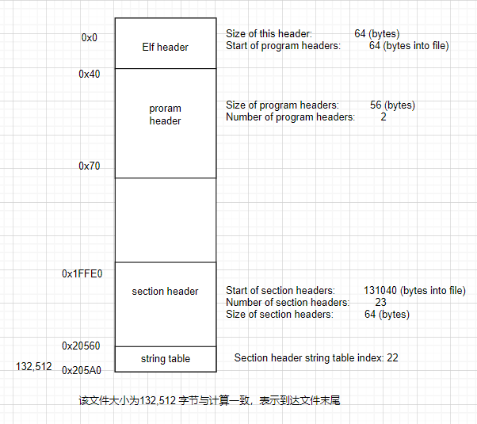

本文章简要介绍GUN  Tools

## 概述

| 工具名     | 描述                                                         |
| ---------- | ------------------------------------------------------------ |
| `gcc`      | GNU Compiler Collection 中的 C 编译器，支持多种编程语言。    |
| `g++`      | GNU Compiler Collection 中的 C++ 编译器，用于编译 C++ 代码。 |
| `gfortran` | GNU Compiler Collection 中的 Fortran 编译器，用于编译 Fortran 代码。 |
| `gdb`      | GNU Debugger，命令行调试器，用于程序调试和分析。             |
| `ddd`      | GNU DDD (Data Display Debugger)，基于 GDB 的图形化调试器。   |

| 工具名      | 描述                                                         |
| ----------- | ------------------------------------------------------------ |
| `as`        | 汇编器，将汇编语言源文件转换成目标文件（机器代码）。         |
| `objcopy`   | 可以复制目标文件的部分或全部内容，并在复制过程中修改文件的格式、属性或内容。 |
| `ld`        | 链接器，将多个目标文件和库文件链接成一个可执行文件或共享库文件。 |
| `objdump`   | 显示目标文件的信息，如反汇编代码、符号表、节（section）信息等。 |
| `ar`        | 归档工具，创建、修改和提取归档文件（静态库文件）中的目标文件。 |
| `ranlib`    | 归档索引工具，为归档文件创建索引，提高访问效率。             |
| `nm`        | 符号表工具，列出目标文件中的符号表信息，包括函数、变量等。   |
| `strip`     | 剥离工具，去除目标文件中的调试信息和符号表信息，减小文件大小。 |
| `readelf`   | ELF 文件分析工具，显示 ELF 格式文件的详细信息，如节信息、符号表等。 |
| `addr2line` | 地址到行号转换工具，将程序中的地址转换为对应的源文件名和行号。 |
| `strings`   | 从目标文件中提取和打印字符串信息。                           |
| `size`      | 显示目标文件的大小统计信息。                                 |


## GCC GNU C Compiler

#### **C程序编译过程**


1.预处理，将.c文件转为.i文件，主要的工作内容为包含头文件，与展开宏定义

2.编译，将.i文件转为.S文件，也就是C代码转为汇编代码

3.汇编，将汇编代码转为机器代码

4.链接，将多个机器代码链接成一个可执行文件

**GCC单独进行每个步骤**

```
#include <stdio.h>

#define MAX(a,b) ((a)>(b)?(a):(b))

int main(int argc,char **argv){
    return MAX(7*12,2+551);
}
```

**预处理**

```
riscv64-unknown-elf-gcc-10.1.0.exe -E .\main.c -o main.i
```

```
typedef __key_t key_t;
typedef _ssize_t ssize_t;
...
int setvbuf (FILE *restrict, char *restrict, int, size_t);
int fprintf (FILE *restrict, const char *restrict, ...)
               __attribute__ ((__format__ (__printf__, 2, 3)));
int fscanf (FILE *restrict, const char *restrict, ...)
               __attribute__ ((__format__ (__scanf__, 2, 3)));
int printf (const char *restrict, ...)
               __attribute__ ((__format__ (__printf__, 1, 2)));
int scanf (const char *restrict, ...)
...
# 5 ".\\main.c"
int main(int argc,char **argv){
    return ((7*12)>(2+551)?(7*12):(2+551));
}
```

预处理的作用：

1.宏定义的替换

2.算数表达式的计算

3.头文件的展开，递归预处理头文件，引用头文件中的函数定义，引用数据类型定义,特殊宏处理 `__FILE__` `__LINE__`

4.预定义宏处理，#ifdef #error等 用户定义的编译错误与警告

5.# 与##处理

`#`运算符(Stringification Operator)把随后的token转化为C语言的字符串。

`##`运算符(Token Pasting Operator)连接两个token为一个token.

注意：如果参数是一个宏，改宏不会被展开，需要使用两层宏的嵌套才能展开。

```
#define xstr(s) str(s)
#define str(s) #s
#define foo 4

str (foo)  // outputs "foo"
xstr (foo) // outputs "4"

first expend
#foo
str(4)

second expend
foo
4
```

参考链接： https://zh.wikipedia.org/wiki/C%E9%A2%84%E5%A4%84%E7%90%86%E5%99%A8#%E7%94%A8%E6%88%B7%E5%AE%9A%E4%B9%89%E7%9A%84%E7%BC%96%E8%AF%91%E9%94%99%E8%AF%AF%E4%B8%8E%E8%AD%A6%E5%91%8A

**编译：**

​	这里的编译不是指程序从源文件到二进制程序的全部过程，而是指**将经过预处理之后的程序转换成特定汇编代码(assembly code)的过程**。

```
riscv64-unknown-elf-gcc-10.1.0.exe -S .i/.c -o main.l
```

​	这条指令中指定文件可以是`.i`文件也可以是`.c`文件。那么为什么说是从预处理文件到汇编代码的过程？上述指令只是`gcc`的使用方式，其中`-E`,`-S`等选项可以理解为到预处理文件/汇编文件为止。而编译的过程这个概念就是预处理文件到汇编代码。

​	这一步非常复杂，涉及到编译原理，本文不做深究。

**汇编：**

​	将汇编代码转为可执行文件，其中gcc调用ar工具来完成，此步仅仅会将.S文件转为.o文件，不会链接。

```
riscv64-unknown-elf-as.exe .\main.S
```

**链接基本介绍：**

​	将多个机器代码链接为可执行文件，分为静态链接，动态链接。

```
riscv64-unknown-elf-ld.exe -o xxx.o xxx.o
```

**总结**

1.上述工具拥有多个选项对应不同功能，使用时注意。

2.-o选项为输出选项，如果不指定，会有默认输出方式，例如-E为在终端打印，-S生成同名文件

**常用选项**

| 选项       | 功能                                               |
| ---------- | -------------------------------------------------- |
| -o  <file> | Place the output into <file>.                      |
| -E         | Preprocess only; do not compile, assemble or link. |
| -S         | Compile only; do not assemble or link.             |
| -c         | Compile and assemble, but do not link.             |

一步编译 直接给定文件不加上述选项即可

```
gcc file1.c file2.c -o my_program
```

**GCC其他常用扩展选项：**

| 选项                     | 功能                                                         |
| ------------------------ | ------------------------------------------------------------ |
| -save-temps              | 保存中间过程中产生的文件                                     |
| -Dname/-Dname=definition | 将名称预定义为宏，并带有定义 例如-DRISCV 则对应#define RISCV |
| -Idir                    | 添加dir目录为头文件搜索路径，如-I./ 在当前目录查找头文件 #include "file.h" |
| -include file            | 包含某个代码,简单来说,就是便于某个文件需要另一个文件的时候,就可以用它设<br/>定,功能就相当于在代码中使用#include |
| -l<库名>                 | 链接时搜索指定的库 库名为 libxxx。例如 -ladd 就是寻找 libadd.x |
| -L<库目录>               | 指定编译时搜索的头文件目录                                   |
| -g                       | 生成调试信息                                                 |
| -O<级别>                 | 指定优化级别，可选级别为`0`、`1`、`2`、`3`                   |
| -std=<标准>              | 指定使用的语言标准，如`-std=c11`、`-std=c++17`等             |
| -Wxxx -w                 | all 显示所有警告信息 error 将所有警告视为错误 -w不生成任何警告信息 |
| -m<选项>                 | 指定目标平台或体系结构相关的选项，如`-march=<架构>`、`-mcpu=<处理器>`等 |
| -static                  | 成静态链接的可执行文件                                       |
| -shared                  | 生成共享库文件                                               |
| -fPIC                    | PIC 是 position-independent code的意思, 此选项去除独立位置代码, 适合于动态链接 |
| -print-search-dirs       | 打印搜索目录                                                 |

​	更多关于链接的信息请看另一篇文章。

## AR

 A utility for creating, modifying and extracting from archives.

​	库文件名都是以lib开头的，静态库以.a作为后缀，表示Archive。

​	ar命令类似于tar命令，起一个打包的作用，但是把目标文件打包成静态库只能用ar命令而不能用tar命令。

​	选项r表示将后面的文件列表添加到文件包，如果文件包不存在就创建它，如果文件包中已有同名文件就替换成新的。

​	选项s 将对象文件索引写入存档，或更新现有索引，即使存档未进行任何其他更改。您可以将此修饰符标志与任何操作一起使用，也可以单独使用。在存档上运行**ar s**相当于在其上运行**ranlib**。

## AS Assemble

the portable GNU assembler.

## LD dynamic linker/loader

ld.so, ld-linux.so* - dynamic linker/loader

## ELF文件与readelf工具

​	最终linux可以执行的文件会以ELF格式组织。下面简单介绍ELF文件。

​	ELF （Executable and Linkable Format）文件，也就是在 Linux 中的目标文件，主要有以下三种类型

- 可重定位文件（Relocatable File），包含由编译器生成的代码以及数据。链接器会将它与其它目标文件链接起来从而创建可执行文件或者共享目标文件。在 Linux 系统中，这种文件的后缀一般为 `.o` 。
- 可执行文件（Executable File），就是我们通常在 Linux 中执行的程序。
- 共享目标文件（Shared Object File），包含代码和数据，这种文件是我们所称的库文件，一般以 `.so` 结尾。一般情况下，它有以下两种使用情景：
  - 链接器（Link eDitor, ld）可能会处理它和其它可重定位文件以及共享目标文件，生成另外一个目标文件。
  - 动态链接器（Dynamic Linker）将它与可执行文件以及其它共享目标组合在一起生成进程镜像。


​	因为ELF文件既可以被执行又可以被链接，所以不同工具看到ELF文件的视角是不一样的，但是文件的内容时相同的，不同工具关心的细节不同。


##### **链接视图**

**ELF头：**描述了整个文件的组织情况

**program header table：**如果程序头部表（Program Header Table）存在的话，它会告诉系统如何创建进程。用于生成进程的目标文件必须具有程序头部表，但是重定位文件不需要这个表。

**section 1-n：**节区部分包含在链接视图中要使用的大部分信息：指令、数据、符号表、重定位信息等等。

**section header table：**节区头部表（Section Header Table）包含了描述文件节区的信息，每个节区在表中都有一个表项，会给出节区名称、节区大小等信息。用于链接的目标文件必须有节区头部表，其它目标文件则无所谓，可以有，也可以没有。


​	section就是如图的.text .rodata等。

##### **执行视图**

​	对于**执行视图**来说，其主要的不同点在于没有了 section，而有了多个 segment。其实这里的 segment 大都是来源于链接视图中的 section。

​	尽管图中是按照 ELF 头，程序头部表，节区，节区头部表的顺序排列的。但实际上除了 ELF 头部表以外，其它部分都没有严格的顺序。

##### ELF头

​	**获得ELF文件的文件头**

```
-h --file-header       Display the ELF file header
PS C:\Users\qiujingbao\Desktop\demo> riscv64-unknown-elf-readelf.exe -h .\main.elf
ELF Header:
对应 e_ident
  Magic:   7f 45 4c 46 02 01 01 00 00 00 00 00 00 00 00 00  e_ident[EI_MAG0-3]
  Class:                             ELF64	 e_ident[EI_CLASS]
  Data:                              2's complement, little endian e_ident[EI_DATA]
  Version:                           1 (current) e_ident[EI_VERSION]
  OS/ABI:                            UNIX - System V
不清楚对应
  ABI Version:                       0
对应 e_type
  Type:                              EXEC (Executable file)
对应 e_machine
  Machine:                           RISC-V
对应 e_version  值 1 表示原始文件格式。EV_CURRENT 的值可根据需要进行更改，以反映当前版本号。
  Version:                           0x1
对应 e_entry
  Entry point address:               0x100c2
  Start of program headers:          64 (bytes into file)
由e_shentsize与e_shnum计算
  Start of section headers:          131040 (bytes into file)
对应 e_flags
  Flags:                             0x5, RVC, double-float ABI
对应e_ehsize
  Size of this header:               64 (bytes)
对应e_phentsize
  Size of program headers:           56 (bytes)
对应e_phnum
  Number of program headers:         2
对应e_shentsize
  Size of section headers:           64 (bytes)
对应e_shnum
  Number of section headers:         23
对应e_shstrndx
  Section header string table index: 22
```

​	ELF lib库的描述

```
#define EI_NIDENT   16

typedef struct {
    unsigned char   e_ident[EI_NIDENT];
    ELF32_Half      e_type;
    ELF32_Half      e_machine;
    ELF32_Word      e_version;
    ELF32_Addr      e_entry; 这一项为系统转交控制权给 ELF 中相应代码的虚拟地址。如果没有相关的入口项，则这一项为 0。
    ELF32_Off       e_phoff; 这一项给出程序头部表在文件中的字节偏移（Program Header table OFFset）。如果文件中没有程序头部表，则为 0。
    ELF32_Off       e_shoff;这一项给出节头表在文件中的字节偏移（ Section Header table OFFset ）。如果文件中没有节头表，则为 0。
    ELF32_Word      e_flags; 这一项给出文件中与特定处理器相关的标志，这些标志命名格式为EF_machine_flag。
    ELF32_Half      e_ehsize; 这一项给出 ELF 文件头部的字节长度（ELF Header Size）。
    ELF32_Half      e_phentsize; 这一项给出程序头部表中每个表项的字节长度（Program Header ENTry SIZE）。每个表项的大小相同。
    ELF32_Half      e_phnum; 这一项给出程序头部表的项数（ Program Header entry NUMber ）。因此，e_phnum 与 e_phentsize 的乘积即为程序头部表的字节长度。如果文件中没有程序头部表，则该项值为 0。
    ELF32_Half      e_shentsize; 这一项给出节头的字节长度（Section Header ENTry SIZE）。一个节头是节头表中的一项；节头表中所有项占据的空间大小相同。
    ELF32_Half      e_shnum; 这一项给出节头表中的项数（Section Header NUMber）。因此， e_shnum 与 e_shentsize 的乘积即为节头表的字节长度。如果文件中没有节头表，则该项值为 0。
    ELF32_Half      e_shstrndx; 这一项给出节头表中与节名字符串表相关的表项的索引值（Section Header table InDeX related with section name STRing table）。如果文件中没有节名字符串表，则该项值为SHN_UNDEF。关于细节的介绍，请参考后面的 “节” 和“字符串表”部分。
} Elf32_Ehdr;

e_ident数组的枚举值如下所示 0-3是幻数
EI_MAG0	0	文件标识
EI_MAG1	1	文件标识
EI_MAG2	2	文件标识
EI_MAG3	3	文件标识
EI_CLASS	4	文件类  class表示elf是32 or 64 
EI_DATA	5	数据编码 data指的是 大小端
EI_VERSION	6	文件版本 标识目标文件的版本
EI_PAD	7	补齐字节开始处 
给出了 e_ident 中未使用字节的开始地址。这些字节被保留并置为 0；处理目标文件的程序应该忽略它们。如果之后这些字节被使用，EI_PAD的值就会改变。

e_ident[EI_CLASS]
ELFCLASSNONE	0	无效类型
ELFCLASS32	1	32 位文件
ELFCLASS64	2	64 位文件

e_ident[EI_DATA]
ELFDATANONE	0	无效数据编码
ELFDATA2LSB	1	小端
ELFDATA2MSB	2	大端

e_ident[EI_VERSION]
EV_NONE	0	无效版本
EV_CURRENT	1	当前版本
```

```
ELF Header: 
  Entry point address:               0x100c2
  Start of program headers:          64 (bytes into file)
  Start of section headers:          131040 (bytes into file)
  Size of this header:               64 (bytes)
  Size of program headers:           56 (bytes)
  Number of program headers:         2
  Size of section headers:           64 (bytes)
  Number of section headers:         23
  Section header string table index: 22
```

​	尝试通过elf头描述整个elf文件，仅需要上述的信息即可。



##### **Section**

​	接下来解析section header并介绍section

section满足以下规则：

1. ​	section header中存在条目，但是不一定存在实际的section，或者说实际的section是0，反之不然。
2. ​	section必须连续不重叠，类似于数组的空间排列。
3. ​	目标文件中可能会有闲置空间（inactive space），各种头和节不一定会覆盖到目标文件中的所有字节，**闲置区域的内容未指定**。

如下为section header的定义

```
typedef struct
{
  Elf32_Word	sh_name;		/* Section name (string tbl index) */
  Elf32_Word	sh_type;		/* Section type */
  Elf32_Word	sh_flags;		/* Section flags */
  Elf32_Addr	sh_addr;		/* Section virtual addr at execution */
  Elf32_Off	sh_offset;		/* Section file offset */
  Elf32_Word	sh_size;		/* Section size in bytes */
  Elf32_Word	sh_link;		/* Link to another section */
  Elf32_Word	sh_info;		/* Additional section information */
  Elf32_Word	sh_addralign;		/* Section alignment */
  Elf32_Word	sh_entsize;		/* Entry size if section holds table */
} Elf32_Shdr;

typedef struct
{
  Elf64_Word	sh_name;		/* Section name (string tbl index) */
  Elf64_Word	sh_type;		/* Section type */
  Elf64_Xword	sh_flags;		/* Section flags */
  Elf64_Addr	sh_addr;		/* Section virtual addr at execution */
  Elf64_Off	sh_offset;		/* Section file offset */
  Elf64_Xword	sh_size;		/* Section size in bytes */
  Elf64_Word	sh_link;		/* Link to another section */
  Elf64_Word	sh_info;		/* Additional section information */
  Elf64_Xword	sh_addralign;		/* Section alignment */
  Elf64_Xword	sh_entsize;		/* Entry size if section holds table */
} Elf64_Shdr;
```


​	选取最后一个section header，已知该elf文件是64位，或者elf header中声明section size是64，为什么是结束地址是590不是5a0？将其想象成一个数组，那么最后一个元素应该是n还是n-1？起始地址计算如下： `start_index()+index*size=131040+22*64=20560`

```
0x20560 11 00 00 00 03 00 00 00 00 00 00 00 00 00 00 00 
0x20570 00 00 00 00 00 00 00 00 FB FE 01 00 00 00 00 00 
0x20580 E4 00 00 00 00 00 00 00 00 00 00 00 00 00 00 00 
0x20590 01 00 00 00 00 00 00 00 00 00 00 00 00 00 00 00 
```

​	根据排列将这个数组解析。

```
  Elf64_Word	sh_name; 4字节 11 00 00 00 
  Elf64_Word	sh_type; 4字节 03 00 00 00
  Elf64_Xword	sh_flags; 8字节 0
  Elf64_Addr	sh_addr; 8字节 0
  Elf64_Off	sh_offset; 8字节 FB FE 01 00 00 00 00 00  
  Elf64_Xword	sh_size; 8字节 E4 00 00 00 00 00 00 00
  Elf64_Word	sh_link; 4字节 00 00 00 00
  Elf64_Word	sh_info; 4字节 00 00 00 00
  Elf64_Xword	sh_addralign; 8字节 01 00 00 00 00 00 00 00
  Elf64_Xword	sh_entsize;	8字节 00 00 00 00 00 00 00 00 
```

​	从上面elf header得知这是个小端排列，就是高字节在高地址。从地址分布来看可以看到地址的1代表一个字节。所以单个字节内的顺序不变，字节间是高字节在高地址。重新排序得到如下

```
  Elf64_Word	sh_name; 4字节 0x11
  Elf64_Word	sh_type; 4字节 0x2
  Elf64_Xword	sh_flags; 8字节 0
  Elf64_Addr	sh_addr; 8字节 0
  Elf64_Off	sh_offset; 8字节 0x1fefb 
  Elf64_Xword	sh_size; 8字节 0xe4 
  Elf64_Word	sh_link; 4字节 0
  Elf64_Word	sh_info; 4字节 0
  Elf64_Xword	sh_addralign; 8字节 0x1
  Elf64_Xword	sh_entsize;	8字节 0x0
```

​	然后使用readelf得到的数据与解析的数据对比验证。

```
-S --section-headers   Display the sections' header
     --sections          An alias for --section-headers

readelf -S -W xxx.elf 获取section信息

-W是宽行显示，下面会介绍显示的更容易看清，与功能无关
```

```
There are 23 section headers, starting at offset 0x1ffe0:
一个由23个section 与elf header中一致，开始地址为0x1ffe0与elf header也一致。
Section Headers:
  [Nr] Name              Type            Address          Off    Size   ES Flg Lk Inf Al
  [ 0]                   NULL            0000000000000000 000000 000000 00      0   0  0
  [ 1] .text             PROGBITS        00000000000100b0 0000b0 00c412 00  AX  0   0  2
  [ 2] .rodata           PROGBITS        000000000001c4d0 00c4d0 000dc8 00   A  0   0 16
  [ 3] .eh_frame         PROGBITS        000000000001e298 00d298 000004 00  WA  0   0  4
  [ 4] .init_array       INIT_ARRAY      000000000001e2a0 00d2a0 000010 08  WA  0   0  8
  [ 5] .fini_array       FINI_ARRAY      000000000001e2b0 00d2b0 000008 08  WA  0   0  8
  [ 6] .data             PROGBITS        000000000001e2b8 00d2b8 001100 00  WA  0   0  8
  [ 7] .sdata            PROGBITS        000000000001f3b8 00e3b8 000060 00  WA  0   0  8
  [ 8] .sbss             NOBITS          000000000001f418 00e418 000040 00  WA  0   0  8
  [ 9] .bss              NOBITS          000000000001f458 00e418 000060 00  WA  0   0  8
  [10] .comment          PROGBITS        0000000000000000 00e418 000012 01  MS  0   0  1
  [11] .riscv.attributes RISCV_ATTRIBUTES 0000000000000000 00e42a 000035 00      0   0  1
  [12] .debug_aranges    PROGBITS        0000000000000000 00e45f 000200 00      0   0  1
  [13] .debug_info       PROGBITS        0000000000000000 00e65f 00248b 00      0   0  1
  [14] .debug_abbrev     PROGBITS        0000000000000000 010aea 000e04 00      0   0  1
  [15] .debug_line       PROGBITS        0000000000000000 0118ee 0041b6 00      0   0  1
  [16] .debug_frame      PROGBITS        0000000000000000 015aa8 000220 00      0   0  8
  [17] .debug_str        PROGBITS        0000000000000000 015cc8 000a3b 01  MS  0   0  1
  [18] .debug_loc        PROGBITS        0000000000000000 016703 005b16 00      0   0  1
  [19] .debug_ranges     PROGBITS        0000000000000000 01c219 001140 00      0   0  1
  [20] .symtab           SYMTAB          0000000000000000 01d360 001f80 18     21 157  8
  [21] .strtab           STRTAB          0000000000000000 01f2e0 000c1b 00      0   0  1
  [22] .shstrtab         STRTAB          0000000000000000 01fefb 0000e4 00      0   0  1
Key to Flags:
  W (write), A (alloc), X (execute), M (merge), S (strings), I (info),
  L (link order), O (extra OS processing required), G (group), T (TLS),
  C (compressed), x (unknown), o (OS specific), E (exclude),
  p (processor specific)
```

```
  Elf64_Word	sh_name; 4字节 0x11  		Name .shstrtab 
  Elf64_Word	sh_type; 4字节 0x2		type STRTAB
  Elf64_Xword	sh_flags; 8字节 0			Flags 空
  Elf64_Addr	sh_addr; 8字节 0 			Address  0000000000000000 
  Elf64_Off	sh_offset; 8字节 0x1fefb   	Offset 0001fefb 
  Elf64_Xword	sh_size; 8字节 0xe4   	Size 00000000000000e4
  Elf64_Word	sh_link; 4字节 0			Link 0 
  Elf64_Word	sh_info; 4字节 0			Info 0 
  Elf64_Xword	sh_addralign; 8字节 0x1	Align 1 
  Elf64_Xword	sh_entsize;	8字节 0x0		EntSize 0000000000000000
  
```

​	可以看到我们解读的与elf基本一致，不一致的地方在于name，这里的name是一个索引，有一个单独的section用以存放section的name，这个section就是上面分析的.shstrtab。从上述信息得知，此section是[0x1fefb-0x1ffdf)，name的索引是0x11。也就是.shstrtab。至于为什么没有字符串的长度，个人猜测是靠冗余的`.`来定位，从index开始读取读取到`.`为止。

```
                                 00 2E 73 79 6D 
74 61 62 00 2E 73 74 72 74 61 62 00 2E 73 68 73 
74 72 74 61 62 00 2E 74 65 78 74 00 2E 72 6F 64 
61 74 61 00 2E 65 68 5F 66 72 61 6D 65 00 2E 69 
6E 69 74 5F 61 72 72 61 79 00 2E 66 69 6E 69 5F 
61 72 72 61 79 00 2E 64 61 74 61 00 2E 73 64 61 
74 61 00 2E 73 62 73 73 00 2E 62 73 73 00 2E 63 
6F 6D 6D 65 6E 74 00 2E 72 69 73 63 76 2E 61 74 
74 72 69 62 75 74 65 73 00 2E 64 65 62 75 67 5F 
61 72 61 6E 67 65 73 00 2E 64 65 62 75 67 5F 69 
6E 66 6F 00 2E 64 65 62 75 67 5F 61 62 62 72 65 
76 00 2E 64 65 62 75 67 5F 6C 69 6E 65 00 2E 64 
65 62 75 67 5F 66 72 61 6D 65 00 2E 64 65 62 75 
67 5F 73 74 72 00 2E 64 65 62 75 67 5F 6C 6F 63 
00 2E 64 65 62 75 67 5F 72 61 6E 67 65 73 00 00 

           ..sym
tab..strtab..shs
trtab..text..rod
ata..eh_frame..i
nit_array..fini_
array..data..sda
ta..sbss..bss..c
omment..riscv.at
tributes..debug_
aranges..debug_i
nfo..debug_abbre
v..debug_line..d
ebug_frame..debu
g_str..debug_loc
..debug_ranges..
```

​	下面是常用的编译器预定义的section。

- .init，`SHT_PROGBITS`，程序运行时，先执行该节中的代码。`SHF_ALLOC + SHF_EXECINSTR`，和.fini对应。现在ELF还包含`.init_array` section。

- .text 此节区包含程序的可执行指令。

- .fini，类型`SHT_PROGBITS`，程序正常结束时，要执行该section中的指令。标志`SHF_ALLOC + SHF_EXECINSTR`（占用内存可执行）。现在ELF还包含`.fini_array` section。

- .rodata和.rodata1。类型`SHT_PROGBITS`, 包含只读数据，组成不可写的段。标志`SHF_ALLOC`。 存放常量

- .data和.data1，包含初始化的全局变量和静态变量。 类型为`SHT_PROGBITS`，标志为`SHF_ALLOC` + `SHF_WRITE`（占用内存，可写）。 初始化是指明确赋值赋值为0也算。

- .bss：包含程序运行时未初始化的数据（全局变量和静态变量）。当程序运行时，这些数据初始化为0。 其类型为`SHT_NOBITS`，表示不占文件空间。`SHF_ALLOC` + `SHF_WRITE`，运行时要占用内存的。未明确赋值的。

  .bss与.data有人叫数据区，有人叫全局区，静态区。

​	**三个表示字符串的相似的section：**

- .shstrtab，类型`SHT_STRTAB`，**包含section的名字**。有读者可能会问：section header中不是已经包含名字了吗，为什么把名字集中存放在这里？ `sh_name` 包含的是.shstrtab 中的索引，真正的字符串存储在.shstrtab中。那么section names为什么要集中存储？我想是这样：如果有相同的字符串，就可以共用一块存储空间。如果字符串存在包含关系，也可以共用一块存储空间。
- .strtab `SHT_STRTAB`，**包含字符串，通常是符号表中符号对应的变量名字**。如果文件有一个可加载的segment包含该section，属性将包含`SHF_ALLOC`。字符串以`\0`结束， section以`\0`开始，也以`\0`结束。一个.strtab可以是空的，它的`sh_size`将是0。针对空字符串表的非0索引是允许的。
- symtab，类型`SHT_SYMTAB`，Symbol Table，**符号表**。包含了定位、重定位符号定义和引用时需要的信息。符号表是一个数组，Index 0 第一个入口，它的含义是undefined symbol index， `STN_UNDEF`。如果文件有一个可加载的segment包含该section，属性将包含`SHF_ALLOC`。**全局变量,静态全局变量，静态局部变量，全局函数名**都会出现在符号表中,而局部变量不会被保存在符号表中。

​	其余section请见参考链接

##### **那么const修饰的一定是放在.rodata中吗？**

全局const或者static修饰的const	

​	 如果const用在全局或者使用了static关键字，例如extern const int i=10，static const int i=10。那么这个i就是一个常量（网上有人说真正意义上的常量），并且该常量是存放在.rodata段的---Read Only Data也就是常量区，是无法通过取地址方式去修改的，修改内容会报段错误。


局部const（不包括局部const数组） 

​	如果const用在局部并且没有使用static关键字(例如在main函数里面const int i=10*2+1)，且 a. 赋值是常量表达式（没有其它变量或者需要外界输入的值）；b.不对该常量进行一些取地址类似的操作(&)；

​	满足上述条件，那么就不会对其分配内存空间。仅仅是将其放在符号表（符号表解释）中；否则，就会将其内容拷贝一份，并为其拷贝内容分配空间，而且这个空间是在栈上的-----常量折叠。这就可以解释如果我们将局部const赋值给指针后，强制类型转换为非const，我们就可以修改其内容了。因为我们操作的是栈而不是常量区。

##### program header

​	section header用于描述section的特性，program header用于描述segment的特性。

```
typedef struct
{
  Elf32_Word    p_type;         /* Segment type */
  Elf32_Off 	p_offset;       /* Segment file offset */
  Elf32_Addr    p_vaddr;        /* Segment virtual address */
  Elf32_Addr    p_paddr;        /* Segment physical address */
  Elf32_Word    p_filesz;       /* Segment size in file */
  Elf32_Word    p_memsz;        /* Segment size in memory */
  Elf32_Word    p_flags;        /* Segment flags */
  Elf32_Word    p_align;        /* Segment alignment */
} Elf32_Phdr;
```

​	通过readelf获得program header

```
riscv64-unknown-elf-readelf.exe -l .\main.elf
```

```
Elf file type is EXEC (Executable file)
Entry point 0x100c2
There are 2 program headers, starting at offset 64

Program Headers:
  Type           Offset             VirtAddr           PhysAddr
                 FileSiz            MemSiz              Flags  Align
  LOAD           0x0000000000000000 0x0000000000010000 0x0000000000010000
                 0x000000000000d298 0x000000000000d298  R E    0x1000
  LOAD           0x000000000000d298 0x000000000001e298 0x000000000001e298
                 0x0000000000001180 0x0000000000001220  RW     0x1000

 Section to Segment mapping:
  Segment Sections...
   00     .text .rodata
   01     .eh_frame .init_array .fini_array .data .sdata .sbss .bss
```

​	可以看到.text .rodata被映射到了文本区，.data .bss被映射到了全局区。

##### readelf常用命令

```
-a 
--all 显示全部信息,等价于 -h -l -S -s -r -d -V -A -I. 

-h 
--file-header 显示elfheader 

-l 
--program-headers  
--segments 显示program header信息(如果有的话)。 

-S 
--section-headers  
--sections 显示section header

-t 
--section-details 显示节的详细信息(-S的)。  更详细的-S 实际是将flag替换成单词

-s 
--syms        
--symbols 显示符号表段中的项（如果有的话）。 

-V 
--version-info 显示版本段的信息。 

-x <number or name>  十分有用，上述我们计算并借助hexdum得到某个端，如果我们需要得到shstrtab我们可以
--hex-dump=<number or name> 以16进制方式显示指定段内内容。number指定段表中段的索引,或字符串指定文件中的段名。 
参数的含义是section index或者名称例如.rodata
riscv64-unknown-elf-readelf.exe -x .shstrtab .\main.elf
riscv64-unknown-elf-readelf.exe -x 22 .\main.elf


-W 
--wide 宽行输出。 
```

参考链接：

https://blog.csdn.net/npy_lp/article/details/102604380

https://ctf-wiki.org/executable/elf/structure/basic-info/

https://www.cnblogs.com/jiqingwu/p/elf_explore_3.html

https://blog.csdn.net/silently_frog/article/details/96737764

## strip

​	strip经常用来去除目标文件中的一些**符号表**、**调试符号表**信息，以减小静态库、动态库和程序的大小。

```
Removes symbols and sections from files
 The options are:
  -I --input-target=<bfdname>      Assume input file is in format <bfdname>
  -O --output-target=<bfdname>     Create an output file in format <bfdname>
  -F --target=<bfdname>            Set both input and output format to <bfdname>
  -p --preserve-dates              Copy modified/access timestamps to the output 
  -D --enable-deterministic-archives
                                   Produce deterministic output when stripping archives
  -U --disable-deterministic-archives
                                   Disable -D behavior (default)
  -R --remove-section=<name>       Also remove section <name> from the output
     --remove-relocations <name>   Remove relocations from section <name>
  -s --strip-all                   Remove all symbol and relocation information
  -g -S -d --strip-debug           Remove all debugging symbols & sections
     --strip-dwo                   Remove all DWO sections
     --strip-unneeded              Remove all symbols not needed by relocations
     --only-keep-debug             Strip everything but the debug information
  -M  --merge-notes                Remove redundant entries in note sections (default)
      --no-merge-notes             Do not attempt to remove redundant notes
  -N --strip-symbol=<name>         Do not copy symbol <name>
     --keep-section=<name>         Do not strip section <name>
  -K --keep-symbol=<name>          Do not strip symbol <name>
     --keep-file-symbols           Do not strip file symbol(s)
  -w --wildcard                    Permit wildcard in symbol comparison
  -x --discard-all                 Remove all non-global symbols
  -X --discard-locals              Remove any compiler-generated symbols
  -v --verbose                     List all object files modified
  -V --version                     Display this program's version number
  -h --help                        Display this output
     --info                        List object formats & architectures supported
  -o <file>                        Place stripped output into <file>
```

**什么是bfdname？**

https://sourceware.org/legacy-ml/binutils/2007-09/msg00016.html

| 选项                    | 描述                                                         |
| ----------------------- | ------------------------------------------------------------ |
| `-s` 或 `--strip-all`   | 去除所有符号表和调试信息，最小化执行文件大小。               |
| `-g` 或 `--strip-debug` | 去除调试信息，但保留符号表，允许程序运行时调试或与其他程序链接。 |
| `-N <section>`          | 删除指定节（section）中的内容，节包含程序的不同部分（例如代码段、数据段）。 |
| `-K <section>`          | 保留指定节（section）中的内容，确保不被删除，即使使用了其他的 strip 选项。 |
| `-R <symbol>`           | 从符号表中删除指定的符号，符号表包含程序中定义的函数名、变量名等标识符。 |
| `-o <output>`           | 将修改后的结果保存到指定的输出文件中，保留原始文件不变。     |

​	上述表格chatgpt生成，请注意辨别。

## objdump

 	Display information from object <file(s)>.此工具针对的也是elf文件。

​	**`	objdump`** 更适合用于查看和分析二进制文件的代码段和特定节的内容，以及显示符号表和重定位表。

​	**`readelf`** 更适合用于查看和分析 ELF 文件的整体结构，包括文件头部、节头表、段内容等。

##### 查看section header

```
-x
--all-headers
    显示所可用的header信息，包括符号表、重定位入口。-x 等价于-a -f -h -r -t 同时指定
-t
--syms 
    显示文件的符号表入口。类似于nm -s提供的信息
-h
--section-headers
--headers
    显示obj文件各个sections的头部摘要信息。

    obj文件中segments可能会被relocate，比如在ld时通过使用-Ttext、-Tdata或者-Tbss选项。然而，有一些
    对象文件格式，比如a.out，其本身并没有保存起始地址信息。在这种情况下，尽管ld可以正确的对这些sections
    进行relocate，但是使用objdump -h来查看各sections的头部摘要信息时则不能正确的显示地址信息。
-a
--archive-header
    假如任何一个objfile是库文件，则显示相应的header信息（输出格式类似于ls -l命令）。除了可以列出
    ar tv所能展示的信息，objdump -a还可以显示lib文件中每一个对象文件的格式。

-r
--reloc
    显示文件的重定位入口。如果和-d或者-D一起使用，重定位部分以反汇编后的格式显示出来

-f
--file-headers
    显示每一个obj文件的整体头部摘要信息 elf header某些数据


riscv64-unknown-elf-objdump.exe -f .\main.elf

.\main.elf:     file format elf64-littleriscv
architecture: riscv:rv64, flags 0x00000112:
EXEC_P, HAS_SYMS, D_PAGED
start address 0x00000000000100c2

PS C:\Users\qiujingbao\Desktop\demo> riscv64-unknown-elf-readelf.exe -h .\main.elf
ELF Header:
  Magic:   7f 45 4c 46 02 01 01 00 00 00 00 00 00 00 00 00
  Class:                             ELF64
  Data:                              2's complement, little endian
  Version:                           1 (current)
  OS/ABI:                            UNIX - System V
  ABI Version:                       0
  Type:                              EXEC (Executable file)
  Machine:                           RISC-V
  Version:                           0x1
  Entry point address:               0x100c2
  Start of program headers:          64 (bytes into file)
  Start of section headers:          131040 (bytes into file)
  Flags:                             0x5, RVC, double-float ABI
  Size of this header:               64 (bytes)
  Size of program headers:           56 (bytes)
  Number of program headers:         2
  Size of section headers:           64 (bytes)
  Number of section headers:         23
  Section header string table index: 22


riscv64-unknown-elf-objdump.exe -h .\main.elf

.\main.elf:     file format elf64-littleriscv

Sections:
Idx Name          Size      VMA               LMA               File off  Algn
  0 .text         0000c412  00000000000100b0  00000000000100b0  000000b0  2**1
                  CONTENTS, ALLOC, LOAD, READONLY, CODE
...
                  CONTENTS, READONLY, DEBUGGING, OCTETS
 18 .debug_ranges 00001140  0000000000000000  0000000000000000  0001c219  2**0
                  CONTENTS, READONLY, DEBUGGING, OCTETS
 
 riscv64-unknown-elf-readelf.exe -S -W .\main.elf
There are 23 section headers, starting at offset 0x1ffe0:

Section Headers:
  [Nr] Name              Type            Address          Off    Size   ES Flg Lk Inf Al
  [ 0]                   NULL            0000000000000000 000000 000000 00      0   0  0
  [ 1] .text             PROGBITS        00000000000100b0 0000b0 00c412 00  AX  0   0  2
...
  [19] .debug_ranges     PROGBITS        0000000000000000 01c219 001140 00      0   0  1
  [20] .symtab           SYMTAB          0000000000000000 01d360 001f80 18     21 157  8
  [21] .strtab           STRTAB          0000000000000000 01f2e0 000c1b 00      0   0  1
  [22] .shstrtab         STRTAB          0000000000000000 01fefb 0000e4 00      0   0  1
Key to Flags:
  W (write), A (alloc), X (execute), M (merge), S (strings), I (info),
  L (link order), O (extra OS processing required), G (group), T (TLS),
  C (compressed), x (unknown), o (OS specific), E (exclude),
  p (processor specific)
  
VMA:虚拟内存地址
LMA:加载内存地址
```


##### 查看section

```
-t
--syms 
    显示文件的符号表入口。类似于nm -s提供的信息
-T
--dynamic-syms
    显示文件的动态符号表入口，仅仅对动态目标文件意义，比如某些共享库。它显示的信息类似于 nm -D(--dynamic)
    显示的信息
-s
--full-contents
    打印section的所有内容。以十六进制的形式 与readelf -x功能相同

-j name
--section=name
    仅仅显示指定名称为name的section的信息
配合-s一起用
```

```
riscv64-unknown-elf-readelf.exe -x .symtab -W .\main.elf
此处的显示section仅仅会显示其十六进制数据并不是可读格式。
Hex dump of section '.symtab':
  0x00000000 00000000 00000000 00000000 00000000 ................

riscv64-unknown-elf-objdump.exe -t .\main.elf
以可读格式显示符号表
.\main.elf:     file format elf64-littleriscv

SYMBOL TABLE:
00000000000100b0 l    d  .text  0000000000000000 .text

riscv64-unknown-elf-objdump.exe  -s -j .data .\main.elf 也是显示二进制
```

​	objdump会以可读的形式显示符号表，其余section显示方式与readelf相同。

##### 核心反汇编功能

```
-d
--disassemble
    从objfile中对机器指令进行反汇编。本选项只对那些包含指令的section进行反汇编。
-S
--source
    将反汇编代码与源代码交叉显示。通常在调试版本能够较好的显示尤其当编译的时候指定了-g这种调试参数时，
    效果比较明显。隐含了-d参数。
-C
--demangle[=style]
    将底层(low-level)的符号名解码成用户级(user-level)的名称。除了会去掉由系统添加的头部下划线之外，
    还使得C++的函数名以便于理解的方式显示出来。

-g
--debugging
    用于显示调试信息。这会使得objdump命令尝试解析STABS和IEEE格式的调试信息，然后以C语言语法格式将相应
    的调试信息进行输出。仅仅支持某些类型的调试信息。有些其他的格式被readelf -w支持
```

```
riscv64-unknown-elf-objdump.exe  -S .\main.elf > a.txt
```

**扩展功能，需要使用的时候查阅**

```
--adjust-vma=offset
    当使用objdump命令来dump信息的时候，将section addresses都加上offset。此选项主要用于section
    addresses与符号表不对应的情形下，比如我们需要将相应的section放到某一个特殊的地址处时。

-e
--debugging-tags
    类似于-g选项。但是产生的输出信息格式兼容ctags工具

-D
--disassemble-all
    类似于-d，但是本选项会对所有的sections进行反汇编，而不仅仅是那些包含指令的sections。

    本选项会微妙的影响代码段的反汇编。当使用-d选项的时候，objdump会假设代码中出现的所有symbols都在对应
    的boundary范围之内，并且不会跨boundary来进行反汇编； 而当使用-D选项时，则并不会有这样的假设。这就
    意味着-d与-D选项在反汇编时，可能输出结果会有些不同，比如当数据存放在代码段的情况下。

--prefix-addresses
    反汇编的时候，显示每一行的完整地址。这是一种比较老的反汇编格式

-EB
-EL
--endian={big|little}
    指定目标文件的大小端。这仅仅会影响到反汇编。这在对某一些并未指定大小端信息的obj文件进行反汇编时很有
    用，比如S-records

-F
--file-offsets
    当在对sections进行反汇编时，无论是否显示相应的symbol，都会显示其在文件内的偏移(offset)。
-l
--line-numbers
    用文件名和行号标注相应的目标代码，仅仅和-d、-D或者-r一起使用时有效。通常要求具有调试信息，即编译时使用
    了-g之类的选项。
-p
--private-headers
    显示objfile文件格式的专属信息。具体的输出取决于object file的格式，对于某一些格式，可能并没有一些额外
    的信息输出

--show-raw-insn
    在进行反汇编时，显示每条汇编指令对应的机器码。默认情况下会显示，除非使用了--prefix-addresses

--no-show-raw-insn
    反汇编时，不显示汇编指令的机器码。当使用了--prefix-addresses时，默认就不会显示机器码

--start-address=address
    从指定地址开始显示数据，该选项影响-d、-r和-s选项的输出

--stop-address=address
    显示数据直到指定地址为止，该项影响-d、-r和-s选项的输出
```

参考链接：

https://ivanzz1001.github.io/records/post/linux/2018/04/09/linux-objdump

## nm

​	List symbols in [file(s)]  专门用以查看符号表的工具

| 选项                                 | 描述                                                         |
| ------------------------------------ | ------------------------------------------------------------ |
| 无选项                               | 默认显示所有的符号（函数名、全局变量等）及其地址。           |
| `-u` 或 `--undefined`                | 只显示未定义的符号（外部引用）。                             |
| `-a` 或 `--debug-syms`               | 显示符号的地址类型（通常是十六进制）。                       |
| `-B` 或 `--print-file-name`          | 只显示以 `Common` 声明的符号。                               |
| `-S` 或 `--print-size`               | 显示符号的大小。                                             |
| `-C` 或 `--demangle`                 | 显示 C++ 符号的完整签名。                                    |
| `-D` 或 `--dynamic`                  | 显示动态符号表中的符号。                                     |
| `-t <type>` 或 `--defined-only`      | 只显示指定类型的符号，如 `t` 表示代码段中的符号，`d` 表示数据段中的符号。 |
| `-f <format>` 或 `--format=<format>` | 指定输出格式。                                               |
| `-h` 或 `--help`                     | 显示帮助信息。                                               |
| `-V` 或 `--version`                  | 显示 `nm` 工具的版本信息。                                   |

符号表这个工具是专业的。

## size

​	`size` 是一个用于查看可执行文件、目标文件或者共享库文件中段（section）大小的命令行工具。它可以帮助开发者了解程序或库文件中各个部分的大小，对于优化和调试程序非常有用。

| 选项                           | 描述                                            |
| ------------------------------ | ----------------------------------------------- |
| 无选项                         | 默认显示文件中各个段（text、data、bss）的大小。 |
| `-A` 或 `--format=SysV`        | 显示符号汇总。                                  |
| `-t` 或 `--totals`             | 显示所有段的总大小。                            |
| `-B` 或 `--radix=<number>`     | 使用指定的进制格式显示大小（如 10、8、16 等）。 |
| `-o` 或 `--format=bsd`         | 使用 BSD 格式输出。                             |
| `-d` 或 `--full-archives`      | 显示归档文件中每个对象文件的详细大小。          |
| `-x` 或 `--common`             | 显示 Common 符号的大小。                        |
| `-D` 或 `--format=traditional` | 使用传统格式输出（DEC 格式）。                  |
| `-v` 或 `--version`            | 显示版本信息。                                  |
| `-h` 或 `--help`               | 显示帮助信息。                                  |

```
riscv64-unknown-elf-size.exe .\main.elf 
   text    data     bss     dec     hex filename
  53722    4476     160   58358    e3f6 .\main.elf
riscv64-unknown-elf-size.exe -A -t .\main.elf
.\main.elf  :
section               size     addr
.text                50194    65712
.rodata               3528   115920
.eh_frame                4   123544
.init_array             16   123552
.fini_array              8   123568
.data                 4352   123576
.sdata                  96   127928
.sbss                   64   128024
.bss                    96   128088
.comment                18        0
.riscv.attributes       53        0
.debug_aranges         512        0
.debug_info           9355        0
.debug_abbrev         3588        0
.debug_line          16822        0
.debug_frame           544        0
.debug_str            2619        0
.debug_loc           23318        0
.debug_ranges         4416        0
Total               119603
```

## objcopy

​	`objcopy` 是 GNU Binutils 工具集中的一个命令行工具，主要用于复制目标文件（object file）中的某些部分或将其转换为不同的格式。它的功能涵盖了从简单的复制操作到更高级的格式转换和文件处理。

```
objcopy [选项] 源文件 目标文件
```

| 选项                                   | 描述                                                         |
| -------------------------------------- | ------------------------------------------------------------ |
| `-O format`                            | 指定目标文件的格式。常见的格式有：`binary`、`ihex`、`srec` 等。 |
| `-j ``--only-section=<name>`           | 仅复制指定名称的节（section）。                              |
| `--remove-section=<name>`              | 删除指定名称的节（section）。                                |
| `--add-section=<name>`                 | 向目标文件添加新的节（section）。                            |
| `--rename-section=<oldname>=<newname>` | 重命名节（section）。                                        |
| `--strip-<option>`                     | 去除符号表信息。`<option>` 可以是 `debug`, `all`, `unneeded` 等。 |
| `--keep-symbol=<name>`                 | 保留指定的符号。                                             |
| `--strip-debug`                        | 去除调试信息。                                               |
| `--gap-fill=<value>`                   | 填充二进制文件中的空白部分。                                 |
| `--adjust-vma=<offset>`                | 调整目标文件中节的起始地址。                                 |
| `-I format`                            | 指定输入文件的格式。                                         |
| `-B <architecture>`                    | 指定输出文件的目标体系结构。                                 |
| `-R <section>`                         | 从输出文件中移除指定的节（section）。                        |
| `-S`                                   | 保留符号表。                                                 |
| `-h` 或 `--help`                       | 显示帮助信息。                                               |
| `-V` 或 `--version`                    | 显示版本信息。                                               |

## addr2line

​	Linux下addr2line命令用于将程序指令地址转换为所对应的函数名、以及函数所在的源文件名和行号。当**含有调试信息**(-g)的执行程序出现crash时(core dumped)，可使用addr2line命令快速定位出错的位置。

| 选项                  | 描述                                     |
| --------------------- | ---------------------------------------- |
| `-a, --addresses`     | 显示输入地址的十六进制值。               |
| `-b <format>`         | 指定输入文件格式。                       |
| `-C, --demangle`      | 自动解码 C++ 符号（函数名）。            |
| `-e <file>`           | 指定可执行文件或共享库文件的路径。       |
| `-f, --functions`     | 显示函数名。                             |
| `-i, --inlines`       | 显示内联函数信息。                       |
| `-s, --basenames`     | 只显示源文件的基本名称（去除路径信息）。 |
| `-j <section>`        | 从指定的段（section）读取地址。          |
| `-p, --pretty-print`  | 以可读的格式显示地址信息。               |
| `-s, --basenames`     | 只显示源文件的基本名称（去除路径信息）。 |
| `-t, --target=<name>` | 指定目标文件的体系结构。                 |
| `-w, --wide`          | 宽输出格式，显示完整的文件路径。         |
| `-h, --help`          | 显示帮助信息。                           |
| `-v, --version`       | 显示版本信息。                           |

```
riscv64-unknown-elf-addr2line.exe  -f  -p -a  000222 -e .\main  
0x0000000000000222: ?? ??:0
```

## strings

​	Display printable strings in [file(s)] (stdin by default)

```
  -a - --all                Scan the entire file, not just the data section [default] 扫描整个elf文件不仅仅是数据部分 但是测试了一下elf header应该不扫描
  -d --data                 Only scan the data sections in the file 仅扫描数据部分 符号表 section name 字符串表应该没有扫描
  -f --print-file-name      Print the name of the file before each string 在输出每个字符串前打印文件名
  -n --bytes=[number]       Locate & print any NUL-terminated sequence of at
  -<number>                   least [number] characters (default 4).
  -t --radix={o,d,x}        Print the location of the string in base 8, 10 or 16
  -w --include-all-whitespace Include all whitespace as valid string characters
  -o                        An alias for --radix=o
  -T --target=<BFDNAME>     Specify the binary file format
  -e --encoding={s,S,b,l,B,L} Select character size and endianness:
                            s = 7-bit, S = 8-bit, {b,l} = 16-bit, {B,L} = 32-bit
  -s --output-separator=<string> String used to separate strings in output.
  @<file>                   Read options from <file>
  -h --help                 Display this information
  -v -V --version           Print the program's version number
```