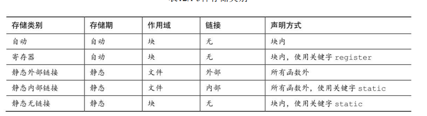

## 存储对象

​	在计算机的视角，只有两种东西，指令和数据。

​	**冯诺依曼**提出了存储程序的思想，将指令和数据都放在内存中，PC寄存器里面存储着指令的内存地址，并提供其他指令流跳转的指令例如，jump等。指令和数据通过数据总线进行传输。

​	**冯.诺伊曼结构**：也称普林斯顿结构，是一种将程序指令存储器和数据存储器**合在一起**的电脑设计概念结构。大多数CPU和GPU是冯诺依曼结构的。

​	**哈佛结构**是一种将程序指令储存 和 数据储存**分开**的存储器结构。常见的有：PIC系列芯片、ARM9、ARM10和ARM11、大多数DSP是哈佛结构的，STM32也是哈佛结构的。

​	对于C语言中的数据，用如下概念来描述。

- 对象（obect）：值占用的一块物理内存。一个对象可以存储一个/多个值。
- 标识符（entity）：程序指定硬件内存中对象的方式，用于访问对象。

​	对象理解为变量的实际内容。

​	标识符可以简单理解为变量名。

使用**存储期**来描述对象，使用**作用域**与**链接**来描述标识符

- 存储期（storage duration）：对象在内存中保存了多长时间。
- 标识符的作用域（scope）和链接（linkage）表明了程序的哪些部分可以使用该标识符。

##### 作用域

| 作用域类别     | 作用域范围                       | 应用                                                         |
| :------------- | :------------------------------- | :----------------------------------------------------------- |
| 块作用域       | 从定义处到包含该定义的块的末尾。 | {}括起来的，for循环、while循环、do while循环和if语句所控制的代码 |
| 函数作用域     | 从标签位置开始延续至函数结束。   | 一个函数中的所有语句标签必须唯一                             |
| 函数原型作用域 | 从形参定义处到原型声明结束。     | 函数原型作用域只适用函数原型中的形参名                       |
| 文件作用域     | 从定义处到该定义所在文件的末尾。 | 任何在所有代码块之外声明的标识符都具有文件作用域。           |

##### 链接

​	链接属性与C语言中各个目标文件及函数的链接过程有关，用于认定不同文件的标识符（即程序中定义的各种名称，包括变量名、函数名）是否是同一个实体。

​	举例，a，b文件同时声明有c变量的存在，那么实际引用的时候是否是同一个c变量。

​	

​	**翻译单元：**c预处理会将#include指令用包含的头文件替换掉。源代码文件中所有#include指令被头文件替换掉后的文件。程序由多个源代码文件组成时，等于由多个翻译单元组成。

| 链接             | 链接描述                                                 | 作用域                                     |
| :--------------- | :------------------------------------------------------- | :----------------------------------------- |
| 外部链接external | 变量可以在多文件程序中使用。                             | 具有文件作用域，多个文件程序中使用         |
| 内部链接internal | 变量可以在一个翻译单元内使用。                           | 具有文件作用域，只能在相同的翻译单元使用。 |
| 无链接none       | 变量属于定义它们的块、函数或原型私有的。其他地方不能访问 | 具有块作用域、函数作用域、函数原型作用域。 |

> 习惯称“内部链接的文件作用域”为“文件作用域” ，称“外部链接的文件作用域”为“全局作用域”或“程序作用域”。

##### **存储期**

​	存储期是指的变量的生命周期。

| 名称           | 作用                           | 变量                                       |
| -------------- | ------------------------------ | ------------------------------------------ |
| 静态存储期     | 执行期间                       | 拥有文件作用域的变量，static修饰的局部变量 |
| 动态分配存储期 | 显示申请到显示释放             | malloc，calloc等分配的                     |
| 自动存储期     | 变量在程序的代码块执行期间存在 | 局部变量，auto                             |

​	静态存储期，程序存续期间一致存在，从这个角度考虑，拥有文件作用域的变量一定是静态存储期，在函数内部定义的常量，在函数内部定义的static修饰的也是静态存储期。

##### **存储类别（Storage Class）**

​	存储类别（storage class）用来描述**变量**或**函数**在程序执行期间如何**存储和访问**的属性。存储类别决定了变量或函数的**生命周期**、**可见性**和**存储位置**等特性。声明存储类别的关键字： auto，external，static，register。

​	完整的定义一个变量在C语言中应该是：

```
storage_class var_data_type var_name;
```

**auto**

​	关键字“auto”是默认省略的，此关键字很少使用

**register**

​	**register变量表示将变量存储在CPU内部寄存器中，而不是单纯地寻址访问**，这样可以提高运算速度和效率，注意实际是否分配到寄存器全靠编译器。

**static**

​	使用 `static` 声明的变量都具有静态存储类别，所谓的 “静态” ，意思是变量在内存中的位置不变，而不是其值不变。静态存储类别都具有静态存储期， 即在程序执行期间一直存在，且只能被初始化一次，不论是局部变量还是全局变量。

​	static在修饰全局变量时，该变量只能在当前文件中使用，其他文件无法访问和使用，即时用extern声明也是无效的，但是可以在多个文件中定义同一个名字的变量，不会受到影响，不同的文件可以使用相同名字的静态函数，互不影响

**extern**

​		当extern用于变量时，extern声明了一个全局变量，该全局变量在其他程序文件中定义。仅仅是声明，不是定义。

​		extern 也可以在定义时使用，说明该变量时外部链接属性。


- 声明可以多次，定义只能一次。
- 用`extern`声明外部变量时，类型名可写可不写，如`"extern int num;"`也可以写成`"extern num;"`
- 变量如果只是用到声明，放在.h中；如果声明的同时并定义一个全局变量的话，在`.h`里用`extern`声明，并在对应的.c里定义。其它的.c文件直接`include“xx.h”`


​	下图来自 C primer plus，说明了使用关键字对应的存储类别以及存储期，作用域，链接属性。




个人感觉如下更好理解一些。

| 定义(external声明使用) | 存储类别 | 存储期 | 作用域 | 链接     | 存储区域       |
| ---------------------- | -------- | ------ | ------ | -------- | -------------- |
| 块内                   | 自动     | 自动   | 块     | 无       | stack          |
| 块内，register         | 寄存器   | 寄存器 | 块     | 无       | register/stack |
| 块内，static           | 静态无   | 静态   | 块     | 无       | .bss/.data     |
| 所有块外               | 静态外部 | 静态   | 文件   | 外部链接 | .bss/.data     |
| 所有块外，static       | 静态内部 | 静态   | 文件   | 内部链接 | .bss/.data     |


##### **限定符（Qualifiers）**

​	下面介绍限定符，`const`，`volatile`，`attribute`，`restrict`。

**const**

​	声明中的`“const”`关键字并不声明存储类，而是声明使用声明变量的方式。如果使用`“const”`关键字声明变量，则可以在声明中为其赋值*一次*，并且不能再次更改。

​	**修饰一般变量**

​		正常使用即可。表示不可修改。

​	**在指针和形参声明中使用const**

|               Type               |           Declaration           | 指向的内容是否可变 | 指针是否可变 |
| :------------------------------: | :-----------------------------: | :----------------: | :----------: |
|     **Pointer to Variable**      |            int * ptr            |        Yes         |     Yes      |
|     **Pointer to Constant**      | const int * ptr int const * ptr |         No         |     Yes      |
| **Constant Pointer to Variable** |         int * const ptr         |        Yes         |      No      |
| **Constant Pointer to Constant** |      const int * const ptr      |         No         |      No      |

修饰指针时，有一个问题就是**const修饰的谁？**

​	第一种解读方式：

​		从右向左读，将p翻译成 p is a。例如 `int * const`翻译成 `ptr p is a const to int *`。

​		p是一个常量对于int *来说，即int *不能变，内容可变。 

​	第二种解读方式：

​		忽略类型限定符，const离谁近就修饰谁。`int * const ptr`，const修饰的是ptr，也就是内容可变，指针不可变。

```
const int *p; // p 可变，p 指向的对象不可变
int const *p; // p 可变，p 指向的对象不可变
int *const p; // p 不可变，p 指向的对象可变
const int *const p; //指针 p 和 p 指向的对象都不可变
```

##### **全局const或者static修饰的const** 

​	如果const用在全局或者使用了static关键字，例如extern const int i=10，static const int i=10。那么这个i就是一个常量（网上有人说真正意义上的常量），并且该常量是存放在.rodata段的---Read Only Data也就是常量区，是无法通过取地址方式去修改的，修改内容会报段错误。

​	局部const（不包括局部const数组） 

 	如果const用在局部并且没有使用static关键字(例如在main函数里面const int i=10*2+1)，且 

​		a. 赋值是常量表达式（没有其它变量或者需要外界输入的值）；

​		b.不对该常量进行一些取地址类似的操作(&)；

 满足上述条件，那么就不会对其分配内存空间。仅仅是将其放在符号表（符号表解释）中；否则，就会将其内容拷贝一份，并为其拷贝内容分配空间，而且这个空间是在栈上的-----常量折叠。这就可以解释如果我们将局部const赋值给指针后，强制类型转换为非const，我们就可以修改其内容了。因为我们操作的是栈而不是常量区。

**volatile**

​	`“volatile”`关键字是一个限定符，与`“const”`一样，用于声明变量时。它告诉编译器变量的值可能随时更改。但这个关键字意味着更改可能随时发生，甚至在可以访问此变量的代码之外。最后编译器优化或者不优化由编译器决定。

​	**使用场景：**

​	中断服务程序中修改的某个变量值是供其他程序检测的状态值

​	操作硬件设备的某些寄存器时需要加volatile修饰：

​	多线程应用中共享全局变量

**restrict**

​	restrict是c99标准引入的，它只可以用于限定和约束指针，并表明指针是访问一个数据对象的唯一且初始的方式.即它告诉编译器，所有修改该指针所指向内存中内容的操作都必须通过该指针来修改,而不能通过其它途径(其它变量或指针)来修改;这样做的好处是,能帮助编译器进行更好的优化代码,生成更有效率的汇编代码.

​	使用场景：

- 非常需要性能。
- 需要改写指针的所指物。
- 明确知道某两个指针在业务逻辑上不会、也不能重叠


##### 面试

### 1.一个参数既可以是const还可以是volatile吗？

> 可以，const代表本程序不可修改这个值，volatile代表存在外部程序可以改这个值。如adc采样寄存器，我们可以时时读取这个最新的采样值。

### 2.一个指针可以是volatile 吗？

> 可以，与const相似，
>
> 

**volatile int * p，volatile修饰内容，代表内容易变。**

​	内容易变很好理解，存在外部修改。

**int * volatile p，volatile修饰指针，代表指针易变。**

​	指针易变，代表外部可以更改指针的指向。

```
program a

int * volatile p;
int c=10;
p=&c;

program b

int * volatile p;
*p != &c
所以取内容时需要更新地址。
```

**attribute**

​	单独介绍

##### 内存分区

1.**代码区**（.text）：代码区中主要存放程序中的代码（二进制），属性是只读。

2.**数据区**（静态存储区）：主要包括静态全局区和常量区，如果要站在汇编角度细分的话还可以分为很多小的区。

   A.全局区（静态区,static）：全局变量和静态变量的存储是放在一块的，初始化的（全局变量和静态变量）在一块区域(**.data，显示初始化为非零的全局变量**)， 未初始化的全局变量和未初始化的静态变量在相邻的另一块区域(**.bss，显式初始化为0或者并未显式初始化**）。 程序结束后有系统释放。

   B.常量区 ：常量字符串就是放在这里的。（**常量、函数名、关键字、字符串等**） 程序结束后由系统释放。

3.**栈区**（stack）：内存的分配和释放都是自动进行 ，存放函数的参数值，局部变量的值等。栈内存分配运算内置于处理器的指令集中，效率高，但容量有限，**局部变量生命周期短**。（linux中查看栈大小，ulimit -s，本机8M）

4.**堆区**（heap）：有些操作对象只有在程序运行时才能确定，这样编译器在编译时无法为他们预先分配内存空间，**只有在程序运行时分配**，所以称为动态内存，malloc/free等。

**变量分区规则**：

​	section 的判断规则为：首先判断全局变量或静态变量是否带 const 修饰。如果带 const 修饰， 无论初始值是否为0，都会存放到`.rodata`section 中；

​	否则，判断是否已初始化且初始值是否为0。如果已初始化且初始值非0，则存放到`.data`section 中；否则，存放到`.bss`section 中。


## attribute

​	GNU C 最好的（但鲜为人知的）特性之一是 **__attribute__**机制，它允许开发人员将特性附加到函数声明中，以便编译器执行更多错误检查。它被设计为与非 GNU 实现兼容，多年来，我们一直*在*高度可移植的代码中使用它，并取得了非常好的效果。

​	attribute可以认为是限定符的一种，他告诉编译器该做什么，每个编译器都有其特性，Clang也支持attribute并且兼容gcc的attribute。https://clang.llvm.org/docs/AttributeReference.html

​	attribute分为四种：函数属性，类型属性，变量属性，Clang特有的。

​	此外由如下等价。

```
__attribute__ ((xxx(8))) 等同于 __attribute__ ((__xxx__(8)))
```


#### GUN attribute检测

​	`__has_c_attribute` 运算符可以在 C 代码的 `#if` 和 `#elif` 表达式中使用，用于检测指定操作数引用的属性是否在 GCC 中被识别，并且是否使用了 `[[ ]]` 语法。GNU 属性必须使用 `__has_c_attribute` 来指定范围为 'gnu' 或 '**gnu**'。当操作数指定了受支持的标准属性时，它将评估为一个形如 YYYYMM 的整数常量，表示该属性首次被引入到 C 标准中的年份和月份，或者该属性操作数的语法在 C 标准中被扩展的日期。

```
#if __has_attribute(aligned)

#else

#endif

```


#### **通用属性**

​	以下属性修饰函数，变量或类型。

##### **packed**

1. ​	当 `packed` 属性附加在结构体或联合体类型定义上时，它指定每个成员在内存中紧密排列，以最小化内存空间的使用。
2. ​	当 `packed` 属性附加在枚举类型定义上时，它指示编译器使用最小的整数类型来表示枚举成员，以节省内存空间。
3. ​	在结构体或联合体类型上指定 `packed` 属性，等效于在每个结构体或联合体成员上都指定 `packed` 属性。
4. ​	不能在没有定义结构体，联合体，enmu的typedef中使用。其实就是如上属性放置的位置一定是描述结构体之类的而不是描述变量

##### **aligned(*alignment*)**

- `aligned` 属性用于指定特定类型的变量在内存中的最小对齐方式（以字节为单位）。
- 指定 `aligned` 属性时，对齐值必须是 2 的幂次方。
- 如果不指定对齐参数，那么意味着使用目标机器上的最大对齐方式。

##### **deprecated**

`deprecated` 属性用于标记变量、函数或类型，表示它们已被弃用，即将在未来的程序版本中移除。

当使用了被标记为 `deprecated` 的变量、函数或类型时，编译器会生成警告，提醒开发者这些元素已不推荐使用。

```
int old_fn () __attribute__ ((deprecated));
int old_fn ();
int (*fn_ptr)() = old_fn;
```

##### weak

`weak` 属性在C/C++中用于将外部符号声明为弱符号，而不是全局符号。

​	**将符号声明为弱符号**，与弱符号相对应的是强符号。

​	除非声明为弱符号，那么默认就是强符号。有的地方说未初始化的符号为弱符号，如下所示，也是个全局符号而不是弱符号。

```
double pi;

riscv64-unknown-elf-gcc -c week.c  -o main
riscv64-unknown-elf-readelf --syms main   
  Num:    Value          Size Type    Bind   Vis      Ndx Name
     0: 0000000000000000     0 NOTYPE  LOCAL  DEFAULT  UND 
     1: 0000000000000000     0 FILE    LOCAL  DEFAULT  ABS week.c
     2: 0000000000000000     0 SECTION LOCAL  DEFAULT    1 
     3: 0000000000000000     0 SECTION LOCAL  DEFAULT    2 
     4: 0000000000000000     0 SECTION LOCAL  DEFAULT    3 
     5: 0000000000000000     0 SECTION LOCAL  DEFAULT    4 
     6: 0000000000000000     0 SECTION LOCAL  DEFAULT    5 
     7: 0000000000000008     8 OBJECT  GLOBAL DEFAULT  COM pi
```

​	连接器发现同时存在弱符号和强符号，有限选择强符号，如果发现不存在强符号，只存在弱符号，则选择弱符号。如果都不存在：静态链接，恭喜，编译时报错，动态链接：对不起，系统无法启动。

​	如下代码：执行会发生什么？编译报错，输出10，输出11？

```
#include <stdio.h>
__attribute__((weak)) int res=10;
int res=11;

int main(){
    printf("%d \n",res);
}
```

​	如果说这种全局变量不能用weak修饰，那么如下代码输出什么？

```
#include <stdio.h>
__attribute__((weak)) void fun(){
    printf("10");
}
void fun(){
    printf("10");
}
int main(){
    fun();
}
```

​	实际上weak针对的是符号，而全局变量是符号的一种。

​	那为什么上述代码不work？weak将符号声明为WEAK，是在链接时起作用。如下所示。

```
static int add(int a,int b){
    int no_static=10;
    static int static_var=11;
    return a+b;
}
int sub(int a,int b){
    int no_static=10;
    static int static_var=11;
    add(no_static, static_var);
    return a-b;
}
__attribute__((weak)) int max(int a,int b){
    return a*b;
}
__attribute__((weak)) double pi = 3.14;
static int res=0;
int t_res=0;

   Num:    Value          Size Type    Bind   Vis      Ndx Name
     0: 0000000000000000     0 NOTYPE  LOCAL  DEFAULT  UND 
     1: 0000000000000000     0 FILE    LOCAL  DEFAULT  ABS add.c
     2: 0000000000000000     0 SECTION LOCAL  DEFAULT    1 
     3: 0000000000000000     0 SECTION LOCAL  DEFAULT    3 
     4: 0000000000000000     0 SECTION LOCAL  DEFAULT    4 
     5: 0000000000000000    46 FUNC    LOCAL  DEFAULT    1 add
     6: 000000000000000c     4 OBJECT  LOCAL  DEFAULT    5 static_var.1559
     7: 0000000000000000     0 SECTION LOCAL  DEFAULT    5 
     8: 0000000000000000     4 OBJECT  LOCAL  DEFAULT    4 res
     9: 0000000000000000     0 SECTION LOCAL  DEFAULT    6 
    10: 0000000000000008     4 OBJECT  LOCAL  DEFAULT    5 static_var.1553
    11: 0000000000000000     0 SECTION LOCAL  DEFAULT    7 
    12: 0000000000000000     0 SECTION LOCAL  DEFAULT    8 
    13: 000000000000002e    76 FUNC    GLOBAL DEFAULT    1 sub
    14: 000000000000007a    42 FUNC    WEAK   DEFAULT    1 max
    15: 0000000000000000     8 OBJECT  WEAK   DEFAULT    5 pi
    16: 0000000000000000     4 OBJECT  GLOBAL DEFAULT    6 t_res

#include <stdio.h>
double pi = 3.1415926;
int max(int a,int b){
    return a*b*pi;
}
int main(){
    printf("%d \n",max(1,1));
}

riscv64-unknown-elf-gcc -c add.c -o libadd.o
riscv64-unknown-elf-gcc week.c -L. -o main
```

​	如果仅仅在一个翻译单元中使用weak那么将会出现重定义的错误，归根到底是weak是给linker看到的。

https://refspecs.linuxfoundation.org/elf/elf.pdf

##### weakref

​	`weakref` 属性用于标记一个声明为弱引用（weak reference）。弱引用是一个别名，它本身不需要对目标符号进行定义。如果目标符号只通过弱引用进行引用，那么它就会成为一个弱未定义符号（weak undefined symbol）。如果直接引用了目标符号，那么强引用会优先，此时需要对目标符号进行定义，但不一定需要在同一翻译单元中。

​	如果声明的弱引用与具名目标相关联，则该声明必须是 `static` 的。

​	`weakref` 属性允许在C语言中创建一个不需要自身定义的别名，而是引用另一个已定义的符号。这对于在库或模块设计中具有灵活性和可替换性的需求特别有用。

https://www.cnblogs.com/downey-blog/p/10470674.html

##### **unused**

This attribute, attached to a function, means that the function is meant to be possibly unused. GCC does not produce a warning for this function.

#### 类型属性

​	这里面有个很重要的问题，并没有区分。就是属性的定义应该放在什么位置，放在不同的位置会不会产生不同的效果。gcc官方文档是如下说的。

```
Type Attributes
An attribute specifier list may appear as part of a struct, union or enum specifier. 
属性指定符列表可以作为结构体、联合体或枚举的一部分出现。也就是属性也可修饰结构体，联合体和枚举。
It may go either immediately after the struct, union or enum keyword, or after the closing brace.
可以紧跟在 struct、union 或 enum 关键字之后，也可以放在闭合大括号后面。
The former syntax is preferred. Where attribute specifiers follow the closing brace, 
更推荐使用前一种语法。当属性指定符跟在闭合大括号后面
they are considered to relate to the structure, union or enumerated type defined, not to any enclosing declaration the type specifier appears in, and the type defined is not complete until after the attribute specifiers.
它们被视为与定义的结构体、联合体或枚举类型相关联，而不是与任何包含类型指定符的外部声明相关联。并且，在应用属性指定符之前，定义的类型是不完整的。
```

​	说实话，看不懂他在写什么。下面是StackOverflow上一位大佬通过实验总结出来的。代码在文末。

- **关键字之前**：它适用于任何声明的变量，但不适用于类型本身。
- **关键字之后标识符之前**：则它既适用于类型，也适用于声明的任何变量。
- **`}`之后**：则其工作方式就像在关键字之前一样`struct`（仅适用于任何声明的变量），除了旧的 GNU 语法，它也适用于类型本身。
- **如果属性位于声明的变量之后，则它仅适用于该变量。**
- **该属性不能位于 标识符与`{`之间。**

​	大佬考虑了很多因素，例如后续推出的[[gnu::aligned(16)]]，alignas(16)等。下面简化一下仅考虑，`attribute`。同样代码放在文末。

```
s:    4;  s_:    4; s__:      4未使用属性的对齐字节，alignof函数获取对齐字节数。x为后续定义变量，s_,s__代表声明时定义的变量

t:    4;  t_:   16; t__:     16 在struct之前使用属性，仅对声明时定义的变量有效。
u:   16;  u_:   16; u__:     16 在struct之后标签之前使用属性，对所有定义有效。
w:   16;  w_:   16; w__:     16 在}之后，第一个变量之前，对所有定义有效
x:    4;  x_:   16; x__:      4 在}之后，第一个变量之后，仅对第一个变量生效
y:    4;  y_:    4; y__:     16 在}之后，第二个变量之前，仅对第二个变量生效
z:    4;  z_:    4; z__:     16 在}之后，第二个变量之后，仅对第二个变量有效
```

**如果同时使用aligned与packed会怎么样？**

```
s:    4;  s_:    4; s__:      4

t:    1;  t_:    1; t__:      1
v:   16;  v_:   16; v__:     16
```

​	可以看到，是以alignment为单位的最小内存对齐。

**bitband**

​	gcc14中并没有这个属性

​	https://gcc.gnu.org/onlinedocs/gcc-14.1.0/gcc/Common-Type-Attributes.html

#### 变量属性

##### alias 

`alias ("target")` 是一个变量属性，用于将声明的变量作为另一个称为别名目标（alias target）的符号的别名进行定义。

1. **功能与作用**：

   - 使用 `alias` 属性可以将一个变量声明为另一个已定义符号的别名。这种别名可以用来简化代码中对于同一变量的不同命名方式的引用。

2. **示例用法**：

   - 下面是一个使用 `alias` 属性的示例：

   ```
   c复制代码int var_target;  // 定义目标变量
   
   // 声明 var_alias 作为 var_target 的别名
   extern int __attribute__((alias("var_target"))) var_alias;
   ```

   在这个例子中，`var_alias` 被声明为 `var_target` 的别名。

3. **要求和限制**：

   - 别名目标必须在同一翻译单元（translation unit）中定义，否则会导致错误。
   - 在使用 `alias` 属性时，编译器将认为具有外部链接的不同声明指代不同的对象。因此，在没有声明别名属性的翻译单元中，使用别名和别名目标访问同一对象是未定义行为。

#### 函数属性：

##### **noinline**

​	`	noinline` 是一个函数属性，用于防止函数被编译器内联优化。

​	`	noinline` 属性用于告诉编译器不要将该函数进行内联优化。内联优化是编译器在调用函数时直接将函数的代码插入到调用位置，从	而减少函数调用的开销，但可能会增加代码的大小。

​	使用 `noinline` 属性可以确保函数不会被内联，即使编译器认为内联会带来性能提升。

即使函数声明为 `noinline`，仍然可能有一些优化会导致对没有副作用的函数调用进行优化，使其不被保留在生成的代码中。这种情况下，可以在函数内部使用 `asm ("");` 语句来创建一个特殊的副作用，以确保调用不会被优化掉。

##### const

- 功能

  - 这主要是为了编译器优化对一个函数的重复调用，编译器知道**重复调用**某些具有**相同参数**值的函数将重复**返回相同的值**。 编译器可以选择只调用函数一次，并缓存返回值。
  - 用 **const属性**修饰的函数与用 **pure** 属性修饰的十分类似，不过 **const** 属性比 **pure** 更严格，它要求函数不能读全局对象（全局变量）。

- 注意

  - 具有指针参数并检查所指向数据的函数不能被声明为 **const**。
  - 调用非 **const** 函数的函数通常不能为 **const**。
  - **const** 函数返回 **void** 是没有意义的。
  - **const** 属性禁止函数在连续两次调用之间读取影响其返回值的对象。

  ```
  
  extern int square(int n) __attribute__((const));
  
  ...
  	for (i = 0; i < 100; i++ )
  	{
  		total += square(5) + i;   // square(5) 每次都返回相同的值，通过添加__attribute__((const))，告诉GCC，对于具有相同参数值的 square 函数，后续调用可以
  		                          // 被第一次调用的结果所取代，而不管它们之间的语句是什么，编译器可以选择只调用函数一次，并缓存返回值。
  	}    
  ```

  ##### `__attribute__ nonnull (arg-index, ...)`

  - 功能：

    - `nonnull` 属性指定一些函数形参应该是非空指针
    - `nonnull` 属性可应用于具有至少一个指针类型参数的函数。
    - `nonnull (arg-index, ...)` arg-index ，指针参数在你定义的函数的参数列表中的位置

  - 示例

    ```cpp
    extern void *my_memcpy (void *dest, const void *src, size_t len)__attribute__((nonnull (1, 2)));  
    表明，第一个参数，和第二个参数都应该是非空指针
    ```

  ##### section 

  `section ("section-name")` 是一个函数属性，用于指定函数或变量被放置在特定的段（section）中。让我们详细解释一下这个属性的作用和用法：

  1. **功能与作用**：

     - 默认情况下，编译器将生成的代码放置在文本段（text section）。然而，有时候你可能需要额外的段，或者需要将特定的函数或变量放置在特定的段中。
     - `section` 属性允许你明确指定一个函数或变量应该放置在哪个段中。

  2. **示例用法**：

     - 下面是一个使用 `section` 属性的示例：

     ```
     extern void foobar(void) __attribute__((section("bar")));
     ```

     在这个例子中，函数 `foobar` 被声明为放置在名为 `bar` 的段中。

#### Linux attribute 应用

​	主要定义在如下文件夹include/linux/compiler_attributes.h，因为kernel不一定由gcc进行编译，所以加了一层中间层。

​	此文件里面的属性都是与编译器无关的，也就是所有编译器支持的attribute的交集。但是也会使用has_attribute校验版本，选择合适的定义，例如

```
/*
 * Optional: only supported since gcc >= 15
 * Optional: only supported since clang >= 18
 *
 *   gcc: https://gcc.gnu.org/bugzilla/show_bug.cgi?id=108896
 * clang: https://github.com/llvm/llvm-project/pull/76348
 */
#if __has_attribute(__counted_by__)
# define __counted_by(member)		__attribute__((__counted_by__(member)))
#else
# define __counted_by(member)
#endif
```

来看内存对齐特性

```
#define __aligned(x)                    __attribute__((__aligned__(x)))

struct ti_adc_data {
	struct iio_dev *indio_dev;
	struct spi_device *spi;
	struct regulator *ref;

	u8 read_size;
	u8 shift;

	u8 buffer[16] __aligned(IIO_DMA_MINALIGN);
};
/drivers/iio/adc/ti-adc161s626.c
```


| 类型名称    | 32 位大小 | 64 位大小 |
| ----------- | --------- | --------- |
| `char`      | 1 字节    | 1 字节    |
| `short`     | 2 字节    | 2 字节    |
| `int`       | 4 字节    | 4 字节    |
| `long`      | 4 字节    | 8 字节    |
| `long long` | 8 字节    | 8 字节    |

参考文献

https://pebble.gitbooks.io/learning-c-with-pebble/content/chapter13.html

https://www.cnblogs.com/downey-blog/p/10470674.html

include/linux/compiler_attributes.h

```
#include <stdalign.h>
#include <stdio.h>

struct s {
    int a;
    long b;
    char c;
} s_, s__;

__attribute__((aligned(16))) struct t {
    int a;
    long b;
    char c;
} t_, t__;

alignas(16) struct tt {
    int a;
    long b;
    char c;
} tt_, tt__;

[[gnu::aligned(16)]] struct ttt {
    int a;
    long b;
    char c;
} ttt_, ttt__;

struct __attribute__((aligned(16))) u {
    int a;
    long b;
    char c;
} u_, u__;
/*  error: expected ‘{’ before ‘_Alignas’
struct alignas(16) uu {
    int a;
    long b;
    char c;
} uu_, uu__;
*/
struct [[gnu::aligned(16)]] uuu {
    int a;
    long b;
    char c;
} uuu_, uuu__;
/*  error: expected identifier or ‘(’ before ‘{’ token
struct v __attribute__((aligned(16))) {
    int a;
    long b;
    char c;
} v_, v_;
*/
/*  error: expected identifier or ‘(’ before ‘{’ token
struct vv alignas(16) {
    int a;
    long b;
    char c;
} vv_, vv__;
*/
//  warning: ignoring attributes applied to ‘struct vvv’ after definition [-Wattributes]
/*  error: expected identifier or ‘(’ before ‘{’ token
struct vvv [[gnu::aligned(16)]] {
    int a;
    long b;
    char c;
} vvv_, vvv__;
*/
struct w {
    int a;
    long b;
    char c;
} __attribute__((aligned(16))) w_, w__;

struct ww {
    int a;
    long b;
    char c;
} alignas(16) ww_, ww__;
//  warning: ignoring attributes applied to ‘struct www’ after definition [-Wattributes]
struct www {
    int a;
    long b;
    char c;
} [[gnu::aligned(16)]] www_, www__;

struct x {
    int a;
    long b;
    char c;
} x_ __attribute__((aligned(16))), x__;
/*  error: expected ‘;’ before ‘_Alignas’
struct xx {
    int a;
    long b;
    char c;
} xx_ alignas(16), xx__;
*/
struct xxx {
    int a;
    long b;
    char c;
} xxx_ [[gnu::aligned(16)]], xxx__;

struct y {
    int a;
    long b;
    char c;
} y_, __attribute__((aligned(16))) y__;
/*  error: expected identifier or ‘(’ before ‘_Alignas’
struct yy {
    int a;
    long b;
    char c;
} yy_, alignas(16) yy__;
*/
/*  error: expected identifier or ‘(’ before ‘[’ token
struct yyy {
    int a;
    long b;
    char c;
} yyy_, [[gnu::aligned(16)]] yyy__;
*/
struct z {
    int a;
    long b;
    char c;
} z_, z__ __attribute__((aligned(16)));
/*  error: expected ‘=’, ‘,’, ‘;’, ‘asm’ or ‘__attribute__’ before ‘_Alignas’
struct zz {
    int a;
    long b;
    char c;
} zz_, zz__ alignas(16);
*/
struct zzz {
    int a;
    long b;
    char c;
} zzz_, zzz__ [[gnu::aligned(16)]];


int main(void)
{
    printf("s:   %2zu;  s_:   %2zu; s__:     %2zu\n\n", alignof(struct s), alignof(s_), alignof(s__));
    printf("t:   %2zu;  t_:   %2zu; t__:     %2zu\n", alignof(struct t), alignof(t_), alignof(t__));
    printf("tt:  %2zu;  tt_:  %2zu; tt__:    %2zu\n", alignof(struct tt), alignof(tt_), alignof(tt__));
    printf("ttt: %2zu;  ttt_: %2zu; ttt__:   %2zu\n\n", alignof(struct ttt), alignof(ttt_), alignof(ttt__));
    printf("u:   %2zu;  u_:   %2zu; u__:     %2zu\n", alignof(struct u), alignof(u_), alignof(u__));
    puts("uu:   -");//  printf("uu:  %2zu;  uu_:  %2zu; uu__:    %2zu\n", alignof(struct uu), alignof(uu_), alignof(uu__));
    printf("uuu: %2zu;  uuu_: %2zu; uuu__:   %2zu\n\n", alignof(struct uuu), alignof(uuu_), alignof(uuu__));
    puts("v:    -");//  printf("v:   %2zu;  v_:   %2zu; v__:     %2zu\n", alignof(struct v), alignof(v_), alignof(v__));
    puts("vv:   -");//  printf("vv:  %2zu;  vv_:  %2zu; vv__:    %2zu\n", alignof(struct vv), alignof(vv_), alignof(vv__));
    puts("vvv:  -\n");//    printf("vvv: %2zu;  vvv_: %2zu; vvv__:   %2zu\n", alignof(struct vvv), alignof(vvv_), alignof(vvv__));
    printf("w:   %2zu;  w_:   %2zu; w__:     %2zu\n", alignof(struct w), alignof(w_), alignof(w__));
    printf("ww:  %2zu;  ww_:  %2zu; ww__:    %2zu\n", alignof(struct ww), alignof(ww_), alignof(ww__));
    printf("www: %2zu;  www_: %2zu; www__:   %2zu\n\n", alignof(struct www), alignof(www_), alignof(www__));
    printf("x:   %2zu;  x_:   %2zu; x__:     %2zu\n", alignof(struct x), alignof(x_), alignof(x__));
    puts("xx:   -");//  printf("xx:  %2zu;  xx_:  %2zu; xx__:    %2zu\n", alignof(struct xx), alignof(xx_), alignof(xx__));
    printf("xxx: %2zu;  xxx_: %2zu; xxx__:   %2zu\n\n", alignof(struct xxx), alignof(xxx_), alignof(xxx__));
    printf("y:   %2zu;  y_:   %2zu; y__:     %2zu\n", alignof(struct y), alignof(y_), alignof(y__));
    puts("yy:   -");//  printf("yy:  %2zu;  yy_:  %2zu; yy__:    %2zu\n", alignof(struct yy), alignof(yy_), alignof(yy__));
    puts("yyy:  -\n");//    printf("yyy: %2zu;  yyy_: %2zu; yyy__:   %2zu\n\n", alignof(struct yyy), alignof(yyy_), alignof(yyy__));
    printf("z:   %2zu;  z_:   %2zu; z__:     %2zu\n", alignof(struct z), alignof(z_), alignof(z__));
    puts("zz:   -");//  printf("zz:  %2zu;  zz_:  %2zu; zz__:    %2zu\n", alignof(struct zz), alignof(zz_), alignof(zz__));
    printf("zzz: %2zu;  zzz_: %2zu; zzz__:   %2zu\n", alignof(struct zzz), alignof(zzz_), alignof(zzz__));

    return 0;
}
https://stackoverflow.com/questions/67271825/alignasn-gnualignedn-and-attribute-alignedn-position-in-de
```

```
#include <stdalign.h>
#include <stdio.h>

struct s {
    int a;
    long b;
    char c;
} s_, s__;

__attribute__((aligned(16))) struct t {
    int a;
    long b;
    char c;
} t_, t__;

struct __attribute__((aligned(16))) u {
    int a;
    long b;
    char c;
} u_, u__;

struct w {
    int a;
    long b;
    char c;
} __attribute__((aligned(16))) w_, w__;

struct x {
    int a;
    long b;
    char c;
} x_ __attribute__((aligned(16))), x__;

struct y {
    int a;
    long b;
    char c;
} y_, __attribute__((aligned(16))) y__;

struct z {
    int a;
    long b;
    char c;
} z_, z__ __attribute__((aligned(16)));


int main(void)
{
    printf("s:   %2zu;  s_:   %2zu; s__:     %2zu\n\n", alignof(struct s), alignof(s_), alignof(s__));
    printf("t:   %2zu;  t_:   %2zu; t__:     %2zu\n", alignof(struct t), alignof(t_), alignof(t__));
    printf("u:   %2zu;  u_:   %2zu; u__:     %2zu\n", alignof(struct u), alignof(u_), alignof(u__));
    printf("w:   %2zu;  w_:   %2zu; w__:     %2zu\n", alignof(struct w), alignof(w_), alignof(w__));
    printf("x:   %2zu;  x_:   %2zu; x__:     %2zu\n", alignof(struct x), alignof(x_), alignof(x__));
    printf("y:   %2zu;  y_:   %2zu; y__:     %2zu\n", alignof(struct y), alignof(y_), alignof(y__));
    printf("z:   %2zu;  z_:   %2zu; z__:     %2zu\n", alignof(struct z), alignof(z_), alignof(z__));

    return 0;
}
```

