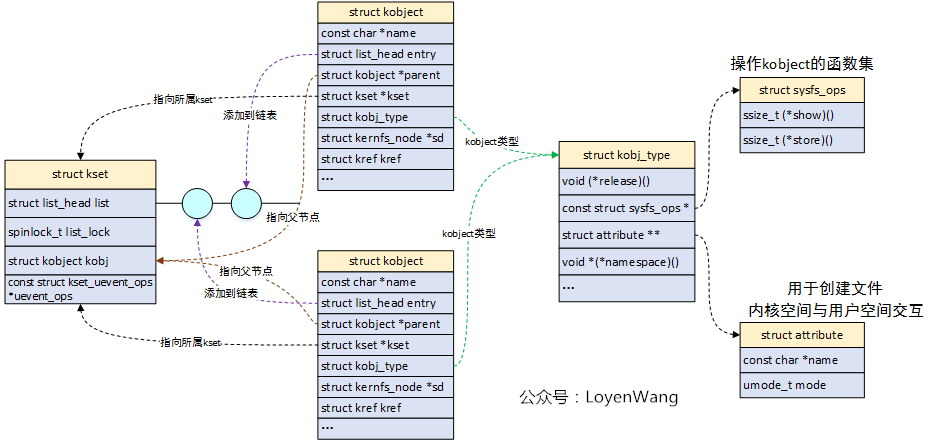
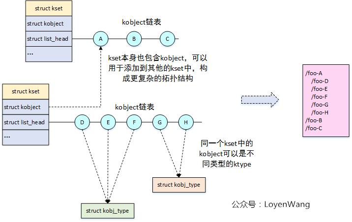
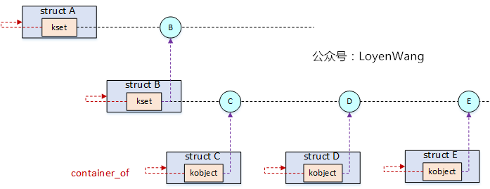
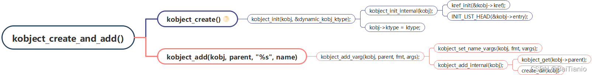
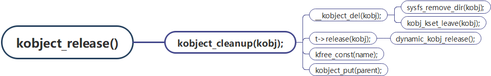
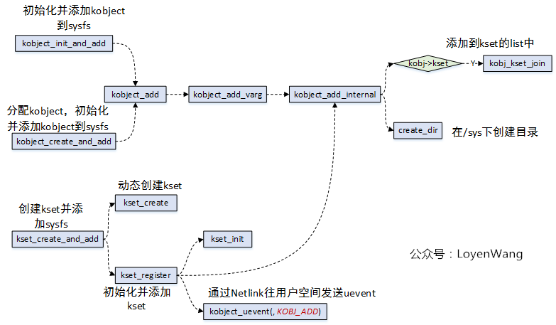
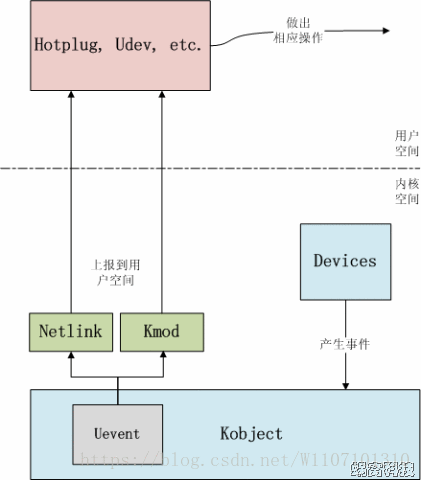

### 介绍

​	以前的文章介绍了platform deivce driver model。但是只是介绍了这个模型本身所蕴含的东西。kernel在涉及这个模型的时候加入了其他很多的扩展。

### kobject

​	在面向对象的世界里，所用事物的起点都是object，在kernel的世界里，也不例外。

内核文档：

```
Documentation/translations/zh_CN/core-api/kobject.rst
```

相关讨论：

```
https://lwn.net/Articles/51437/
```

​	处理kobjects需要理解一些不同的类型，所有这些类型都会相互引用。为了使事情变得更简单，我们将多路并进，从模糊的术语开始，并逐渐增加细节。也就是这个kobject用于许多功能，这个功能相互嵌套造成理解起来复杂。如下给了几点基本的定义。

```
 - 一个kobject是一个kobject结构体类型的对象。Kobjects有一个名字和一个
   引用计数。一个kobject也有一个父指针（允许对象被排列成层次结构），一个
   特定的类型，并且，通常在sysfs虚拟文件系统中表示。

  Kobjects本身通常并不引人关注；相反它们常常被嵌入到其他包含真正引人注目
  的代码的结构体中。

  任何结构体都 **不应该** 有一个以上的kobject嵌入其中。如果有的话，对象的引用计
  数肯定会被打乱，而且不正确，你的代码就会出现错误。所以不要这样做。

 - ktype是嵌入一个kobject的对象的类型。每个嵌入kobject的结构体都需要一个
   相应的ktype。ktype控制着kobject在被创建和销毁时的行为。

 - 一个kset是一组kobjects。这些kobjects可以是相同的ktype或者属于不同的
   ktype。kset是kobjects集合的基本容器类型。Ksets包含它们自己的kobjects，
   但你可以安全地忽略这个实现细节，因为kset的核心代码会自动处理这个kobject。

```

​	总结：kobject本质是一个名字和引用计数，并且拥有一个父指针，允许排列成层次结构。此外，还拥有一个ktype，用于在sysfs中表示。ktype，用于控制kobject在创建和销毁时的行为。多个kobject，组成一个kset。kobjcet本身不被使用，但是经常被嵌入到其他结构体中。任何结构体都不应该有一个以上的kobject，因为kobject本质是引用计数。

​	

​	根据如上定义，那么应该有如下定义。

```
struct kobject {
	const char		*name;
	struct kobject		*parent;
	struct kset		*kset;
	const struct kobj_type	*ktype;
	struct kernfs_node	*sd; /* sysfs directory entry */
	struct kref		kref;
	/* 如上根据上述定义完成的 */
	struct list_head	entry; /*用于将Kobject加入到Kset中的list_head。*/
	/* 可以这样访问 kobj->kset->list*/
	unsigned int state_initialized:1;
	unsigned int state_in_sysfs:1;
	unsigned int state_add_uevent_sent:1;
	unsigned int state_remove_uevent_sent:1;
	unsigned int uevent_suppress:1;

#ifdef CONFIG_DEBUG_KOBJECT_RELEASE
	struct delayed_work	release;
#endif
};
```

​	下面先介绍kobj所用的结构体。

##### kset

​	然后看kset，根据如上定义，kset是kobejct派生的一个类，这个类用于管理kobject，定义了他们的一些uevent。所以其定义如下定义。

```
/**
 * struct kset - a set of kobjects of a specific type, belonging to a specific subsystem.
 *
kset定义了一组kobjects。它们可以是单独的不同“类型”，但总的来说，这些koobject都希望被组合在一起，并以相同的方式进行操作。kset用于定义属性回调和发生在kobject上的其他常见事件。
 */
struct kset {
	struct list_head list; /* 属于kset的kobj队列 */
	spinlock_t list_lock; /* 访问这个队列的锁 */
	struct kobject kobj; /* 代表从kobj派生 */
	const struct kset_uevent_ops *uevent_ops;
	/*此kset的一组uevent操作。只要koobject发生了什么事情，就会调用这些，这样kset就可以添加新的环境变量，或者根据需要过滤掉uevent。
		我们先不讨论uevent，后面会详细介绍
	*/
} __randomize_layout;
```

​	可以看到，这个kset就类似于文件夹，包含一组文件，可以创建一个拓扑结构。

​	如果搞不清kset的list与kobject的entry，请看如下函数。

```
/* add the kobject to its kset's list */
static void kobj_kset_join(struct kobject *kobj)
{
	if (!kobj->kset)
		return;

	kset_get(kobj->kset);
	spin_lock(&kobj->kset->list_lock);
	list_add_tail(&kobj->entry, &kobj->kset->list);
	spin_unlock(&kobj->kset->list_lock);
}
```


##### kref

​	kref很简单，就是一个数字。其所有的定义与操作都在include/linux/kref.h

​	这个数字代表有多少引用该对象，也就是引用这个对象kobj所嵌入的结构体。

```
struct kref {
	refcount_t refcount;
};
```

##### ktype

​	ktype定义了一组回调，每个kobj都有其回调的实现。其中sysfs与attribute先不介绍。

```
struct kobj_type {
	void (*release)(struct kobject *kobj);
	const struct sysfs_ops *sysfs_ops;
	const struct attribute_group **default_groups;
	const struct kobj_ns_type_operations *(*child_ns_type)(const struct kobject *kobj);
	const void *(*namespace)(const struct kobject *kobj);
	void (*get_ownership)(const struct kobject *kobj, kuid_t *uid, kgid_t *gid);
};
```

##### 整体框架








##### 相关接口

###### kobject_create

```
/**
 * kobject_create() - Create a struct kobject dynamically.
 *
 * This function creates a kobject structure dynamically and sets it up
 * to be a "dynamic" kobject with a default release function set up.
 *
 * If the kobject was not able to be created, NULL will be returned.
 * The kobject structure returned from here must be cleaned up with a
 * call to kobject_put() and not kfree(), as kobject_init() has
 * already been called on this structure.
 */
static struct kobject *kobject_create(void)
{
	struct kobject *kobj;
	/* 申请空间 */
	kobj = kzalloc(sizeof(*kobj), GFP_KERNEL);
	if (!kobj)
		return NULL;
	/* 初始化 */
	kobject_init(kobj, &dynamic_kobj_ktype);
	return kobj;
}

默认的ktype
static const struct kobj_type dynamic_kobj_ktype = {
	.release	= dynamic_kobj_release,
	.sysfs_ops	= &kobj_sysfs_ops,
};
```

###### kobject_init

```
/**
 * 初始化koobject结构并将其添加到koobject层次结构中。

 此函数结合了对kobject_init（）和kobject_add（）的调用。如果此函数返回错误，则必须调用kobject_put（）来正确清理与对象关联的内存。这是调用kobject_add（）后的相同类型的错误处理，这里的koobject生存期规则是相同的。
 */
int kobject_init_and_add(struct kobject *kobj, const struct kobj_type *ktype,
			 struct kobject *parent, const char *fmt, ...)
{
	va_list args;
	int retval;

	kobject_init(kobj, ktype);

	va_start(args, fmt);
	retval = kobject_add_varg(kobj, parent, fmt, args);
	va_end(args);

	return retval;
}
```

```
/**
 * kobject_init() - Initialize a kobject structure.
 * @kobj: pointer to the kobject to initialize
 * @ktype: pointer to the ktype for this kobject.
此函数将正确初始化koobject，以便将其传递给kobject_add（）调用。
调用此函数后，必须通过调用kobject_put（）来清理koobject，而不是直接调用kfree来确保所有内存都被正确清理。
 */
void kobject_init(struct kobject *kobj, const struct kobj_type *ktype)
{
	/* check var */

	kobject_init_internal(kobj);
	kobj->ktype = ktype;
	return;
}
```

```
static void kobject_init_internal(struct kobject *kobj)
{
	if (!kobj)
		return;
	/* 初始化ref */
	kref_init(&kobj->kref); 
	/* 初始化entry */
	INIT_LIST_HEAD(&kobj->entry);
	/* set state */
	kobj->state_in_sysfs = 0;
	kobj->state_add_uevent_sent = 0;
	kobj->state_remove_uevent_sent = 0;
	kobj->state_initialized = 1;
}
```

```
static __printf(3, 0) int kobject_add_varg(struct kobject *kobj,
					   struct kobject *parent,
					   const char *fmt, va_list vargs)
{
	int retval;

	retval = kobject_set_name_vargs(kobj, fmt, vargs);
	if (retval) {
		pr_err("can not set name properly!\n");
		return retval;
	}
	kobj->parent = parent;
	return kobject_add_internal(kobj);
}
```

```

/**
 * kobject_add() - The main kobject add function.
 * @kobj: the kobject to add
 * @parent: pointer to the parent of the kobject.
 * @fmt: format to name the kobject with.
 *
在此函数中设置koobject名称并将其添加到koobject层次结构中。
 *

注意，此调用不会创建“add”uevent，调用者应为对象设置所有必要的sysfs文件，然后使用uevent_AD参数调用kobject_uevent（），以确保用户空间正确收到此koobject创建的通知。

 */
int kobject_add(struct kobject *kobj, struct kobject *parent,
		const char *fmt, ...)
{
	...
	va_start(args, fmt);
	retval = kobject_add_varg(kobj, parent, fmt, args);
	va_end(args);

	return retval;
}
```

```
static int kobject_add_internal(struct kobject *kobj)
{
	int error = 0;
	struct kobject *parent;
...
	parent = kobject_get(kobj->parent);

	/* join kset if set, use it as parent if we do not already have one */
	if (kobj->kset) {
		if (!parent)
			parent = kobject_get(&kobj->kset->kobj);
		kobj_kset_join(kobj);
		kobj->parent = parent;
	}
...
	return error;
}
```

​	这个接口会设置kobj的kset与ktype还有parent。



###### kobject/get/set/del

```
增加引用计数
struct kobject *kobject_get(struct kobject *kobj)
{
	if (kobj) {
		if (!kobj->state_initialized)
		kref_get(&kobj->kref);
	}
	return kobj;
}
EXPORT_SYMBOL(kobject_get);
```

```
减少引用计数，如果为0则调用relase函数
void kobject_put(struct kobject *kobj)
{
	if (kobj) {
		if (!kobj->state_initialized)
		kref_put(&kobj->kref, kobject_release);
	}
}

static void kobject_release(struct kref *kref)
{
	struct kobject *kobj = container_of(kref, struct kobject, kref);
...
	kobject_cleanup(kobj);
}
```

```
/*
 * kobject_cleanup - free kobject resources.
 * @kobj: object to cleanup
 */
static void kobject_cleanup(struct kobject *kobj)
{
...	
	/* remove from sysfs if the caller did not do it */
	if (kobj->state_in_sysfs) {
		__kobject_del(kobj);
	} else {
		/* avoid dropping the parent reference unnecessarily */
		parent = NULL;
	}

	if (t && t->release) {
		pr_debug("'%s' (%p): calling ktype release\n",
			 kobject_name(kobj), kobj);
		t->release(kobj);
	}
...
	/* 如果此节点删除了，那么父节点的引用计数也应该减少 */
	kobject_put(parent);
}
```

```
static void __kobject_del(struct kobject *kobj)
{
	struct kernfs_node *sd;
	const struct kobj_type *ktype;

	sd = kobj->sd;
	ktype = get_ktype(kobj);

	if (ktype)
		sysfs_remove_groups(kobj, ktype->default_groups);

	/* send "remove" if the caller did not do it but sent "add" */
	if (kobj->state_add_uevent_sent && !kobj->state_remove_uevent_sent) {
		pr_debug("'%s' (%p): auto cleanup 'remove' event\n",
			 kobject_name(kobj), kobj);
		kobject_uevent(kobj, KOBJ_REMOVE);
	}

	sysfs_remove_dir(kobj);
	sysfs_put(sd);

	kobj->state_in_sysfs = 0;
	kobj_kset_leave(kobj);
	kobj->parent = NULL;
}
```

```
/**
 * kobject_del() - Unlink kobject from hierarchy.
 * @kobj: object.
 *
这是应该调用的函数，用于删除通过kobject_add（）成功添加的对象。
kobject_del
 */
void kobject_del(struct kobject *kobj)
{
	struct kobject *parent;

	if (!kobj)
		return;

	parent = kobj->parent;
	__kobject_del(kobj);
	kobject_put(parent);
}
EXPORT_SYMBOL(kobject_del);

此函数减少了父节点的引用计数，那么对于父节点就是不可见的
```

```
如果kobject_cleanup（）调用kobject_del（）删除目标koobject，则可能会导致其父koobject在调用目标koobject的->release（）方法之前被释放，这实际上意味着在完全处理子对象之前释放父对象。
这充其量是令人困惑的，如果kobject_cleanup（）的调用者对这些调用的顺序不够小心，也可能导致功能问题，因此在调用目标kobject的->release（）方法后，通过使kobject_cleanup。
```




​	在成功将 kobject 注册到 kobject 核心后，必须在代码完成处理后将其清理。为此，请调用 [`kobject_put()`](https://docs.kernel.org/driver-api/basics.html#c.kobject_put)。通过执行此操作，kobject 核心将自动清理此 kobject 分配的所有内存。

​	如果`KOBJ_ADD`已为该对象发送了 uevent，则会发送相应的`KOBJ_REMOVE`uevent，并且将为调用者正确处理任何其他 sysfs 事务。

​	如果您需要对 kobject 进行两阶段删除（比如说，当您需要销毁对象时，不允许休眠），则调用 [`kobject_del()`](https://docs.kernel.org/driver-api/basics.html#c.kobject_del)将从 sysfs 中注销 kobject 的函数。这会使 kobject “不可见”，但不会被清理，并且对象的引用计数仍然相同。稍后调用该函数[`kobject_put()`](https://docs.kernel.org/driver-api/basics.html#c.kobject_put)以完成与 kobject 关联的内存的清理。

​	[`kobject_del()`](https://docs.kernel.org/driver-api/basics.html#c.kobject_del)如果构造了循环引用，则可用于删除对父对象的引用。在某些情况下，父对象引用子对象是有效的。必须通过显式调用来中断循环引用[`kobject_del()`](https://docs.kernel.org/driver-api/basics.html#c.kobject_del)，以便调用释放函数，并且前一个循环中的对象会相互释放。

​	也就是如果删除一个对象，使用put即可，put会自动减少引用计数，然后调用release，然后cleanup，然后del。这个过程可能会休眠（根据上述含义，实际上调度部分我不怎么了解）。然后如果立即删除，则需要调用del，这会从sys中移除，但是并没有释放内存等。随后再次put即可。

###### kset ops




### uevent

##### Uevent的功能

​	Uevent是Kobject的一部分，用于在Kobject状态发生改变时，例如增加、移除等，通知用户空间程序。用户空间程序收到这样的事件后，会做相应的处理。

​	该机制通常是用来支持热拔插设备的，例如U盘插入后，USB相关的驱动软件会动态创建用于表示该U盘的device结构（相应的也包括其中的kobject），并告知用户空间程序，为该U盘动态的创建/dev/目录下的设备节点，更进一步，可以通知其它的应用程序，将该U盘设备mount到系统中，从而动态的支持该设备。



​	当一个kobject被注册到kobject核心后，你需要向全世界宣布它已经被创建了。这可以通 过调用kobject_uevent()来实现:

```
int kobject_uevent(struct kobject *kobj, enum kobject_action action);
```

​	当kobject第一次被添加到内核时，使用 *KOBJ_ADD* 动作。这应该在该kobject的任 何属性或子对象被正确初始化后进行，因为当这个调用发生时，用户空间会立即开始寻 找它们。

​	当kobject从内核中移除时（关于如何做的细节在下面）， **KOBJ_REMOVE** 的uevent 将由kobject核心自动创建，所以调用者不必担心手动操作。

```
struct kobject {
...

/*
	我们将当前状态保存在对象本身中，以便在删除最后一个引用时进行适当的清理。如果删除了初始引用，则该对象将在需要时从sysfs中删除，如果发送了“add”事件，则将发送“remove”，并释放分配的资源。这使我们能够清理一些驱动程序核心的使用情况，并允许我们对内核的其余部分进行其他此类更改。
*/
	unsigned int state_initialized:1;
	unsigned int state_in_sysfs:1;
	unsigned int state_add_uevent_sent:1;
	unsigned int state_remove_uevent_sent:1;
	unsigned int uevent_suppress:1;
};
```

​	在初始化的时候设置对应标志位。

```
static void kobject_init_internal(struct kobject *kobj)
{
...
	kobj->state_in_sysfs = 0;
	kobj->state_add_uevent_sent = 0;
	kobj->state_remove_uevent_sent = 0;
	kobj->state_initialized = 1;
}
```

##### 事件类型

```
/*
 * The actions here must match the index to the string array
 * in lib/kobject_uevent.c
 *
 * Do not add new actions here without checking with the driver-core
 * maintainers. Action strings are not meant to express subsystem
 * or device specific properties. In most cases you want to send a
 * kobject_uevent_env(kobj, KOBJ_CHANGE, env) with additional event
 * specific variables added to the event environment.
 */
enum kobject_action {
	KOBJ_ADD,
	KOBJ_REMOVE,
	KOBJ_CHANGE,
	KOBJ_MOVE,
	KOBJ_ONLINE,
	KOBJ_OFFLINE,
	KOBJ_BIND,
	KOBJ_UNBIND,
};

static const char *kobject_actions[] = {
	[KOBJ_ADD] =		"add",
	[KOBJ_REMOVE] =		"remove",
	[KOBJ_CHANGE] =		"change",
	[KOBJ_MOVE] =		"move",
	[KOBJ_ONLINE] =		"online",
	[KOBJ_OFFLINE] =	"offline",
	[KOBJ_BIND] =		"bind",
	[KOBJ_UNBIND] =		"unbind",
};
```

```
这将更改uevent缓冲区函数，使其使用结构而不是一长串参数。它不再要求调用者进行正确的缓冲区终止和大小计算，而目前在某些地方这是错误的。它修复了一个已知的错误，即由于错误的索引计算而覆盖了uevent环境的部分内容。非常感谢Mathieu Desnoyers发现错误并改进错误处理。
struct kobj_uevent_env {
  // 指针数组，用于保存每个环境变量
	char *argv[3];
	// 用于访问 环境变量指针 数组下标
	char *envp[UEVENT_NUM_ENVP];
	int envp_idx;
	 // 保存环境变量的buffer与长度
	char buf[UEVENT_BUFFER_SIZE];
	int buflen;
};
```

##### ops

```
struct kset {
...
	const struct kset_uevent_ops *uevent_ops;
} __randomize_layout;

此kset的一组uevent操作。只要koobject发生了什么事情，就会调用这些，这样kset就可以添加新的环境变量，或者根据需要过滤掉uevent。
```


```
struct kset_uevent_ops {
	int (* const filter)(const struct kobject *kobj);
	const char *(* const name)(const struct kobject *kobj);
	int (* const uevent)(const struct kobject *kobj, struct kobj_uevent_env *env);
};
```

###### filter

当任何kobject需要上报uevent时，它所属的kset可以通过该接口过滤，阻止不希望上报的event，从而达到从整体上管理的目的。

###### name

该接口可以返回kset的名称。如果一个kset没有合法的名称，则其下的所有Kobject将不允许上报uvent

###### uevent

当任何kobject需要上报uevent时，它所属的kset可以通过该接口统一为这些event添加环境变量。

因为很多时候上报uevent时的环境变量都是相同的，因此可以由kset统一处理，就不需要让每个kobject独自添加了。

​	

​	这几个回调在kernel中只有有限定义。

```
static int bus_uevent_filter(const struct kobject *kobj)
{
	const struct kobj_type *ktype = get_ktype(kobj);

	if (ktype == &bus_ktype)
		return 1;
	return 0;
}

static const struct kset_uevent_ops bus_uevent_ops = {
	.filter = bus_uevent_filter,
};

static const struct kset_uevent_ops device_uevent_ops = {
	.filter =	dev_uevent_filter,
	.name =		dev_uevent_name,
	.uevent =	dev_uevent,
};
```

##### 如何发送，发送API

设备调用：

```
kobject_uevent(&dev->kobj, KOBJ_ADD);
```

```
 通过发送uevent通知用户空间
int kobject_uevent(struct kobject *kobj, enum kobject_action action)
{
	return kobject_uevent_env(kobj, action, NULL);
}
EXPORT_SYMBOL_GPL(kobject_uevent);
```

```
发送包含环境数据的事件
int kobject_uevent_env(struct kobject *kobj, enum kobject_action action,
		       char *envp_ext[])
{
	/*
 无论结果如何，都标记“删除”事件已完成，因为某些子系统不希望通过自动清理重新触发“删除”活动。
	*/
	if (action == KOBJ_REMOVE)
		kobj->state_remove_uevent_sent = 1;
	/* 找到kobj所属的kset */

	/* 如果设置了uevent_suppress，则跳过该事件 */
	if (kobj->uevent_suppress) {
	}
	/* 如果过滤器返回零，则跳过该事件。 */
	if (uevent_ops && uevent_ops->filter)
		if (!uevent_ops->filter(kobj)) {
		}

	/* 处理子系统 */
	if (uevent_ops && uevent_ops->name)
		subsystem = uevent_ops->name(kobj);
	else
		subsystem = kobject_name(&kset->kobj);
		
	/* 构造env buf */
	env = kzalloc(sizeof(struct kobj_uevent_env), GFP_KERNEL);
	if (!env)
		return -ENOMEM;

	/* default keys */
	retval = add_uevent_var(env, "ACTION=%s", action_string);
	retval = add_uevent_var(env, "DEVPATH=%s", devpath);
	retval = add_uevent_var(env, "SUBSYSTEM=%s", subsystem);


	/* 让kset特定函数添加其内容 */
	if (uevent_ops && uevent_ops->uevent) {
		retval = uevent_ops->uevent(kobj, env);
	}

	switch (action) {
	case KOBJ_ADD:
		kobj->state_add_uevent_sent = 1;
		break;

	case KOBJ_UNBIND:
		zap_modalias_env(env);
		break;

	default:
		break;
	}

	/* 我们将发送一个事件，因此请求一个新的序列号 */
	retval = add_uevent_var(env, "SEQNUM=%llu",
				atomic64_inc_return(&uevent_seqnum));
	if (retval)
		goto exit;

	retval = kobject_uevent_net_broadcast(kobj, env, action_string,
					      devpath);

#ifdef CONFIG_UEVENT_HELPER
	/* call uevent_helper, usually only enabled during early boot */
	
	/* 使用uevent_helper处理 */
		info = call_usermodehelper_setup(env->argv[0], env->argv,
						 env->envp, GFP_KERNEL,
						 NULL, cleanup_uevent_env, env);
		if (info) {
			retval = call_usermodehelper_exec(info, UMH_NO_WAIT);
			env = NULL;	/* freed by cleanup_uevent_env */
		}
	}
#endif
}
EXPORT_SYMBOL_GPL(kobject_uevent_env);
```

​	后续东西就交给用户


### attribute与sysfs

​	sysfs是一个基于RAM的文件系统，它和Kobject一起，可以将Kernel的数据结构导出到用户空间，以文件目录结构的形式，提供对这些数据结构（以及数据结构的属性）的访问支持。参考文档：

```
Documentation/translations/zh_TW/filesystems/sysfs.txt
```

​	sysfs具备文件系统的所有属性，本文介绍sysfs在Linux设备模型中的作用和使用方法。具体包括：

- sysfs和Kobject的关系
- attribute的概念
- sysfs的文件系统操作接口

##### attribute

​	属性应为ASCII码文本文件。以一个文件只存储一个属性值为宜。但一个文件只包含一个属性值可能影响效率，所以一个包含相同数据类型的属性值数组也被广泛地接受。混合类型、表达多行数据以及一些怪异的数据格式会遭到强烈反对。这样做是很丢脸的，而且其代码会在未通知作者的情况下被重写。

```
struct attribute {
	const char		*name;
	umode_t			mode;
#ifdef CONFIG_DEBUG_LOCK_ALLOC
	bool			ignore_lockdep:1;
	struct lock_class_key	*key;
	struct lock_class_key	skey;
#endif
};

struct bin_attribute {
	struct attribute	attr;
	size_t			size;
	void			*private;
	struct address_space *(*f_mapping)(void);
	ssize_t (*read)(struct file *, struct kobject *, struct bin_attribute *,
			char *, loff_t, size_t);
	ssize_t (*write)(struct file *, struct kobject *, struct bin_attribute *,
			 char *, loff_t, size_t);
	loff_t (*llseek)(struct file *, struct kobject *, struct bin_attribute *,
			 loff_t, int);
	int (*mmap)(struct file *, struct kobject *, struct bin_attribute *attr,
		    struct vm_area_struct *vma);
};
用于声明属性组的数据结构。
struct attribute_group {
	const char		*name;
	umode_t			(*is_visible)(struct kobject *,
					      struct attribute *, int);
	umode_t			(*is_bin_visible)(struct kobject *,
						  struct bin_attribute *, int);
	struct attribute	**attrs; 指向以NULL结尾的属性列表的指针。
	struct bin_attribute	**bin_attrs; 指向以NULL结尾的二进制属性列表的指针。
	必须提供attrs或bin_attrs或两者都提供。
};
```

​	struct attribute为普通的attribute，使用该attribute生成的sysfs文件，只能用字符串的形式读写（后面会说为什么）。

​	struct bin_attribute在struct attribute的基础上，增加了read、write等函数，因此它所生成的sysfs文件可以用任何方式读写。

##### attribue 与 kobejct

```
struct kobj_type {
	void (*release)(struct kobject *kobj);
	const struct sysfs_ops *sysfs_ops;
	const struct attribute_group **default_groups;
	const struct kobj_ns_type_operations *(*child_ns_type)(const struct kobject *kobj);
	const void *(*namespace)(const struct kobject *kobj);
	void (*get_ownership)(const struct kobject *kobj, kuid_t *uid, kgid_t *gid);
};
```

​	可以看到，kobject通过嵌入ktype结构体来嵌入attribute_group。这样来实现与sysfs的关联。


##### kobject与attribute

可以看到对应的attribue是由调用者设置的。

​	那么kobject用的是那个ktype或者是attribue呢？

```
static struct kobject *kobject_create(void)
{
	struct kobject *kobj;

	kobj = kzalloc(sizeof(*kobj), GFP_KERNEL);
	if (!kobj)
		return NULL;

	kobject_init(kobj, &dynamic_kobj_ktype);
	return kobj;
}

对于kobject
static const struct kobj_type dynamic_kobj_ktype = {
	.release	= dynamic_kobj_release,
	.sysfs_ops	= &kobj_sysfs_ops,
};

对于kset，实际上是对kset中的kobject的ktype
static const struct kobj_type kset_ktype = {
	.sysfs_ops	= &kobj_sysfs_ops,
	.release	= kset_release,
	.get_ownership	= kset_get_ownership,
};
```

​	对于kobject来说，其attribue是通过后期设置。下面看一下例子，以bus为例。

```
struct bus_type {
	const char		*name;
	const char		*dev_name;
	const struct attribute_group **bus_groups;
	const struct attribute_group **dev_groups;
	const struct attribute_group **drv_groups;

	int (*match)(struct device *dev, struct device_driver *drv);
	int (*uevent)(const struct device *dev, struct kobj_uevent_env *env);
	int (*probe)(struct device *dev);
	void (*sync_state)(struct device *dev);
	void (*remove)(struct device *dev);
	void (*shutdown)(struct device *dev);

	int (*online)(struct device *dev);
	int (*offline)(struct device *dev);

	int (*suspend)(struct device *dev, pm_message_t state);
	int (*resume)(struct device *dev);

	int (*num_vf)(struct device *dev);

	int (*dma_configure)(struct device *dev);
	void (*dma_cleanup)(struct device *dev);

	const struct dev_pm_ops *pm;

	bool need_parent_lock;
};

const struct bus_type i2c_bus_type = {
	.name		= "i2c",
	.match		= i2c_device_match,
	.probe		= i2c_device_probe,
	.remove		= i2c_device_remove,
	.shutdown	= i2c_device_shutdown,
};
EXPORT_SYMBOL_GPL(i2c_bus_type);
可以看到指设置了必须的callback函数
int i2c_register_driver(struct module *owner, struct i2c_driver *driver)
{
...
	driver->driver.bus = &i2c_bus_type;
...	
}
struct i2c_client *
i2c_new_client_device(struct i2c_adapter *adap, struct i2c_board_info const *info)
{
...
	client->dev.bus = &i2c_bus_type;
...
}

可以看到所有device和driver都挂载在这个bus上

static struct bus_attribute bus_attr_uevent = __ATTR(uevent, 0200, NULL,
						     bus_uevent_store);

int bus_register(const struct bus_type *bus)
{
...
	retval = bus_create_file(bus, &bus_attr_uevent);
...
	retval = sysfs_create_groups(bus_kobj, bus->bus_groups);
...
}
此时
{
  name = 0x80ba511c "i2c",
  dev_name = 0x0,
  bus_groups = 0x0,
  dev_groups = 0x0,
  drv_groups = 0x0,
  match = 0x8072677c <i2c_device_match>,
  uevent = 0x0,
  probe = 0x80727fa4 <i2c_device_probe>,
  sync_state = 0x0,
  remove = 0x80726700 <i2c_device_remove>,
  shutdown = 0x807266b4 <i2c_device_shutdown>,
  online = 0x0,
  offline = 0x0,
  suspend = 0x0,
  resume = 0x0,
  num_vf = 0x0,
  dma_configure = 0x0,
  dma_cleanup = 0x0,
  pm = 0x0,
  need_parent_lock = false
}
这些attribue还没有被set
但是还有很多默认attribute
static struct attribute *i2c_adapter_attrs[] = {
    &dev_attr_name.attr,
    &dev_attr_new_device.attr,
    &dev_attr_delete_device.attr,
    NULL
};

类似的宏由类似如下的宏定义
#define BUS_ATTR_RW(_name) \
	struct bus_attribute bus_attr_##_name = __ATTR_RW(_name)
#define BUS_ATTR_RO(_name) \
	struct bus_attribute bus_attr_##_name = __ATTR_RO(_name)
#define BUS_ATTR_WO(_name) \
	struct bus_attribute bus_attr_##_name = __ATTR_WO(_name)

所以检索代码可能检索不到
```

​	创建属性文件最终都是通过sysfs_create_file()或sysfs_create_group()来完成的。其中sysfs_create_group(kobj, grp)用来创建一组属性文件，需要定义struct attribute_group结构的属性集，这里需要说明的是，其中name成员如果为NULL，则直接在kobj目录下创建各个属性文件，如果name不为NULL，则会创建一个名为name的目录，然后在该目录下创建各个属性文件。


##### kobject与sysfs

​	这两个的联系也是ktype。

```
struct kobj_type {
...
	const struct sysfs_ops *sysfs_ops;
	const struct attribute_group **default_groups;
...
};
```

​	可以看到，kobjetc关联ktype，ktype联系sysfs_ops。

```
struct sysfs_ops {
	ssize_t	(*show)(struct kobject *, struct attribute *, char *);
	ssize_t	(*store)(struct kobject *, struct attribute *, const char *, size_t);
};
```

​	这两个回调也就是各自设置，例如bus。

```
static const struct kobj_type bus_ktype = {
	.sysfs_ops	= &bus_sysfs_ops,
	.release	= bus_release,
};
int bus_register(const struct bus_type *bus)
{
...
	bus_kobj->ktype = &bus_ktype;
...
}

static const struct sysfs_ops bus_sysfs_ops = {
	.show	= bus_attr_show,
	.store	= bus_attr_store,
};
这两个指针分别在sysfs文件读和文件写时调用。
 * sysfs bindings for buses
 */
static ssize_t bus_attr_show(struct kobject *kobj, struct attribute *attr,
			     char *buf)
{
	struct bus_attribute *bus_attr = to_bus_attr(attr);
	struct subsys_private *subsys_priv = to_subsys_private(kobj);
	ssize_t ret = 0;

	if (bus_attr->show)
		ret = bus_attr->show(subsys_priv->bus, buf);
	return ret;
}

```

​	总结一下，bus的设置是将sysfs的read/write转到attribute的show/store中，当然这只是普通attribue不是binattribue。

```
ok，看一下driver的attribute的设置
struct driver_attribute {
	struct attribute attr;
	ssize_t (*show)(struct device_driver *driver, char *buf);
	ssize_t (*store)(struct device_driver *driver, const char *buf,
			 size_t count);
};

static DRIVER_ATTR_WO(uevent);

#define DRIVER_ATTR_WO(_name) \
	struct driver_attribute driver_attr_##_name = __ATTR_WO(_name)

#define __ATTR_WO(_name) {						\
	.attr	= { .name = __stringify(_name), .mode = 0200 },		\
	.store	= _name##_store,					\
}

static ssize_t uevent_store(struct device_driver *drv, const char *buf,
			    size_t count)
{
	int rc;

	rc = kobject_synth_uevent(&drv->p->kobj, buf, count);
	return rc ? rc : count;
}

然后是driver的sysfsops
static const struct kobj_type driver_ktype = {
	.sysfs_ops	= &driver_sysfs_ops,
	.release	= driver_release,
};
static const struct sysfs_ops driver_sysfs_ops = {
	.show	= drv_attr_show,
	.store	= drv_attr_store,
};
static ssize_t drv_attr_show(struct kobject *kobj, struct attribute *attr,
			     char *buf)
{
	struct driver_attribute *drv_attr = to_drv_attr(attr);
	struct driver_private *drv_priv = to_driver(kobj);
	ssize_t ret = -EIO;

	if (drv_attr->show)
		ret = drv_attr->show(drv_priv->driver, buf);
	return ret;
}
好吧也是attribue的属性。

ok，当访问sysfs的show/store的时候，会被转到attribute的show/store。
```

​	个人理解为什么这部分代码显得如此割裂，为什么用户使用read/write的时候透过fs之后不能直接调用attribute提供的回调。根据kobj的定义，其拥有一个ktype，ktype是配对sysfsops与attribue的桥梁。attribute是可以重复的，是可以组合的，就像设备与驱动一样。所以使用ktype的方式当使用sysfs_create_file，在ktype上绑定attribue与sysops，而不是直接写死。

##### sysfs 接口

​	sysfs提供了对外的通用接口，只要提供kobject与attr，便可以当外部读写该文件系统是使用提供的attr中的回调进行操作。

```
sysfs_create_bin_file
sysfs_remove_file_ns
sysfs_create_file
```

​	注意只要是继承直kobject的对象都可以。

```
bus创建文件并且绑定属性
int bus_create_file(const struct bus_type *bus, struct bus_attribute *attr)
{
	struct subsys_private *sp = bus_to_subsys(bus);
	int error;

	if (!sp)
		return -EINVAL;

	error = sysfs_create_file(&sp->subsys.kobj, &attr->attr);

	subsys_put(sp);
	return error;
}
```

```
driver创建并绑定
int driver_create_file(struct device_driver *drv,
		       const struct driver_attribute *attr)
{
	int error;

	if (drv)
		error = sysfs_create_file(&drv->p->kobj, &attr->attr);
	else
		error = -EINVAL;
	return error;
}
EXPORT_SYMBOL_GPL(driver_create_file);
```

​	然后如何实现？上述介绍了attribue的实现，attribute与ktype/kobject与sysfsops之间的关系。

```
static const struct kernfs_ops sysfs_bin_kfops_mmap = {
	.read		= sysfs_kf_bin_read,
	.write		= sysfs_kf_bin_write,
	.mmap		= sysfs_kf_bin_mmap,
	.open		= sysfs_kf_bin_open,
	.llseek		= sysfs_kf_bin_llseek,
};
```

​	可以看到是通过注册一个kernfs_ops结构体（以前直接是file_operations，估计这个又是一个中间转换层）。然后注册的时候与kernfs_node关联起来。例如。

```

int sysfs_add_bin_file_mode_ns(struct kernfs_node *parent,
		const struct bin_attribute *battr, umode_t mode,
		kuid_t uid, kgid_t gid, const void *ns)
{
...
	if (battr->mmap)
		ops = &sysfs_bin_kfops_mmap;
	else if (battr->read && battr->write)
		ops = &sysfs_bin_kfops_rw;
	else if (battr->read)
		ops = &sysfs_bin_kfops_ro;
	else if (battr->write)
		ops = &sysfs_bin_kfops_wo;
	else
		ops = &sysfs_file_kfops_empty;
...
}
```

​	当外部read函数发生时，透过fs子系统到达kernfs，之后根据注册时设置的kernfs_ops来到如下函数。这个是普通的attribue，不是bin attribute。

```
/* kernfs read callback for regular sysfs files with pre-alloc */
static ssize_t sysfs_kf_read(struct kernfs_open_file *of, char *buf,
			     size_t count, loff_t pos)
{
	/* 获得sysfs接口 */
	const struct sysfs_ops *ops = sysfs_file_ops(of->kn);
	struct kobject *kobj = of->kn->parent->priv;
	/* 访问该接口的show函数 */
	len = ops->show(kobj, of->kn->priv, buf);
	
	memmove(buf, buf + pos, len);
	return min_t(ssize_t, count, len);
}
```

​	如果是bin attribute，直接调用的bin的read函数。

```

static ssize_t sysfs_kf_bin_read(struct kernfs_open_file *of, char *buf,
				 size_t count, loff_t pos)
{
	struct bin_attribute *battr = of->kn->priv;
	struct kobject *kobj = of->kn->parent->priv;
	loff_t size = file_inode(of->file)->i_size;
...
	return battr->read(of->file, kobj, battr, buf, pos, count);
}

```

##### 子类扩展

​	每个继承kobject的对象，都有一个xxx_create_file,例如class_create_file,driver__create_file等。

```
/**
 * driver_create_file - create sysfs file for driver.
 * @drv: driver.
 * @attr: driver attribute descriptor.
 */
int driver_create_file(struct device_driver *drv,
		       const struct driver_attribute *attr)
{
	int error;

	if (drv)
		error = sysfs_create_file(&drv->p->kobj, &attr->attr);
	else
		error = -EINVAL;
	return error;
}
EXPORT_SYMBOL_GPL(driver_create_file);
```

### CLASS

​	类是从device低级实现中抽象出来的更高级的一个视图。驱动程序可能会看到SCSI磁盘或ATA磁盘，但在类级别上，它们都只是磁盘。类允许用户空间根据设备的功能而不是连接方式或工作方式来使用设备。

```
struct class {
	/* name，class的名称，会在“/sys/class/”目录下体现。 */
	const char		*name;

	const struct attribute_group	**class_groups;
	/* 类本身的attribute */
	const struct attribute_group	**dev_groups; 
	/* 这个类中所有设备都拥有的attribue */

	/* 一堆回调函数 */
	/* dev_uevent，当该class下有设备发生变化时，会调用class的uevent回调函数。 */
	int (*dev_uevent)(const struct device *dev, struct kobj_uevent_env *env);
	char *(*devnode)(const struct device *dev, umode_t *mode);
	void (*class_release)(const struct class *class);
	void (*dev_release)(struct device *dev);
	int (*shutdown_pre)(struct device *dev);
	const void *(*namespace)(const struct device *dev);
	void (*get_ownership)(const struct device *dev, kuid_t *uid, kgid_t *gid);


	const struct kobj_ns_type_operations *ns_type;
	const struct dev_pm_ops *pm;
};
```

###### class_interface

​	它允许class driver在class下有设备添加或移除的时候，调用预先设置好的回调函数（add_dev和remove_dev）。那调用它们做什么呢？想做什么都行（例如修改设备的名称），由具体的class driver实现。

```
struct class_interface {
	struct list_head	node;
	const struct class	*class;

	int (*add_dev)		(struct device *dev);
	void (*remove_dev)	(struct device *dev);
};
```

### sysfs userspace


```
.
├── block // 历史遗留问题，存放块设备，提供以设备名到 / sys/devices 的符号链接
├── bus   // 重点，后续介绍
├── class // 重点，后续介绍
├── dev   // 重点，后续介绍
├── devices // 重点，后续介绍
├── firmware //启动的参数例如efi等
├── fs //按照设计是用于描述系统中的所有文件系统
├── hypervisor // 虚拟机相关的，暂时不管
├── kernel //这里是内核所有可调整参数的位置，但仍有一部分可调整参数于/proc/sys/kernel中
├── module //这里有系统中的所有模块的信息，包括编译到内核中的以及编译为外部模块的(ko)
└── power //这里是系统中的电源选项文件，可以写入控制命令使系统关机或重启
```

##### block

​	这里是系统中当前所有的块设备所在，按照功能来说放置在/sys/class之下会更合适，但只是由于历史遗留因素而一直存在于/sys/block。 块设备现在是已经移到/sys/class/block, 旧的接口/sys/block为了向后兼容保留存在，现在该目录下的都是链接文件

##### dev

​	按字符设备或者快设备连接到的device。

```
root@iZ2ze8v7gwyiz6if5f420lZ:/sys/dev# tree -L 1
.
├── block
└── char

2 directories, 0 files
root@iZ2ze8v7gwyiz6if5f420lZ:/sys/dev# tree -L 2
.
├── block
│   ├── 252:3 -> ../../devices/pci0000:00/0000:00:04.0/virtio1/block/vda/vda3
│   └── 7:7 -> ../../devices/virtual/block/loop7
└── char
     ├── 10:231 -> ../../devices/virtual/misc/snapshot

```

##### power

​	该目录下是系统中电源选项，包含电源管理子系统提供的统一接口文件。 一些属性文件可以用于控制整个机器的电源状态，如可以向其中写入控制命令进行关机、重启等操作。

##### module

​	编译为外部模块(.ko文件)在加载后，会/sys/module/出现对应的模块文件夹,在这个文件夹下会出现一些属性文件和属性目录， 表示此外部模块的一些信息，如版本号、加载状态、所提供的驱动程序等。

​	编译进内核的模块则只在当它有非0属性的模块参数时会出现对应的/sys/module/, 这些模块的可用参数会出现在/sys/modules/parameters/中， 如：/sys/module/printk/parameters/time 这个可读写参数控制着内联模块printk在打印内核消息时是否加上时间前缀。

```
/sys/module/nvidia_uvm ls
coresize  initsize   notes       refcnt    srcversion  uevent
holders   initstate  parameters  sections  taint       version
```

##### kernel

```
root@:/sys/kernel/irq/0# cat chip_name
IO-APIC

/sys/kernel/irq/10 cat chip_name 
IR-IO-APIC
```

##### fs

​	这里按照设计是用于描述系统中所有文件系统，包括文件系统本身和按文件系统分类存放的已挂载点，描述已注册的文件系统视图， 但目前只有 fuse,ext4 等少数文件系统支持 sysfs 接口，一些传统的虚拟文件系统(VFS)层次控制参数仍然在sysctl(/proc/sys/fs) 接口中。 目录结构如下：

```
.
├── bpf
├── btrfs
├── cgroup
├── ecryptfs
├── ext4
├── fuse
└── pstore
```

##### firmware

```
.
├── acpi
├── dmi
├── efi
├── memmap
└── qemu_fw_cfg
```

##### device

在Linux服务器中，该`/sys/devices`目录专门包含系统识别的设备信息。这些设备可以是物理硬件设备或逻辑、虚拟设备。下面的目录层次结构`/sys/devices`反映了设备层次结构，子目录代表设备、它们的子系统以及每个设备的各个组件。

在`/sys/devices`目录中，您可以收集有关系统上的设备、它们的属性和当前状态的信息。您还可以通过写入特定文件来与某些设备进行交互，从而允许您修改某些设置或以各种方式控制设备。

###### platform

- `platform`：此目录包含平台设备，这些设备是特定于系统的设备，不一定属于任何特定总线。平台设备的示例包括 GPIO 控制器、LED 或为特定系统构建的自定义设备。

```
.
├── efivars.0
├── eisa.0
├── Fixed MDIO bus.0
├── i8042
├── intel_rapl_msr.0
├── kgdboc
├── pcspkr
├── power
├── reg-dummy
├── rtc-efi.0
├── serial8250
└── uevent
```

###### pci

- `pci0000:00`：此目录代表 PCI（外围组件互连）总线及其设备。PCI 是将网卡、显卡和声卡等高速设备连接到主板的标准。

```
root@iZ2ze8v7gwyiz6if5f420lZ:/sys/devices/pci0000:00# tree -L 1
.
├── 0000:00:00.0
├── 0000:00:01.0
├── 0000:00:01.1
├── 0000:00:01.2
├── 0000:00:01.3
├── 0000:00:02.0
├── 0000:00:03.0
├── 0000:00:04.0
├── 0000:00:05.0
├── 0000:00:06.0
├── firmware_node -> ../LNXSYSTM:00/LNXSYBUS:00/PNP0A03:00
├── pci_bus
├── power
├── QEMU0002:00
├── uevent
└── waiting_for_supplier
```

###### system

- `system`：此目录包含有关各种系统组件的信息，例如 CPU、内存和固件。例如，`/sys/devices/system/cpu`包含有关系统上可用 CPU 的信息，包括它们的频率、核心数和其他属性。

```
root@iZ2ze8v7gwyiz6if5f420lZ:/sys/devices/system# tree -L 1
.
├── clockevents
├── clocksource
├── container
├── cpu
├── edac
├── machinecheck
├── memory
└── node
```

###### virtual

- `virtual`：该目录包含不是物理硬件组件而是由内核或其他软件组件创建和管理的虚拟设备

```
root@iZ2ze8v7gwyiz6if5f420lZ:/sys/devices/virtual# tree -L 1
.
├── bdi
├── block
├── dma_heap
├── dmi
├── fc
├── graphics
├── input
├── mem
├── misc
├── msr
├── net
├── nvme-fabrics
├── powercap
├── ppp
├── thermal
├── tty
├── vc
├── vtconsole
└── workqueue
```

###### 功能：

- **设备表示**：`/sys/devices`提供系统中设备的分层表示，反映它们的物理或逻辑组织。这允许用户、管理员和软件更好地理解和导航设备及其子系统之间的关系。
- **设备属性**：其中的文件和目录`/sys/devices`公开设备的各种属性和特性，例如它们的当前状态、配置和操作参数。通过阅读这些文件，用户和软件可以获得有关设备及其功能的宝贵信息。
- **用户空间交互**：`/sys/devices`使用户和用户空间应用程序能够通过 sysfs 接口与设备进行交互。通过读取或写入目录中的特定文件`/sys/devices`，用户和应用程序可以更改设备设置、控制其行为或收集诊断信息。
- **热插拔和设备事件**：该`/sys/devices`目录在处理热插拔事件方面起着至关重要的作用，例如在运行时从系统中添加或删除设备。添加或删除设备时，内核会`/sys/devices`相应地更新目录，用户空间工具（如 udev）可以监视这些更改以执行加载适当的驱动程序或设置设备节点等操作。
- **简化的设备管理**：通过将设备信息和交互整合到一个统一的文件系统中，`/sys/devices`它简化了 Linux 中的设备管理。它为使用设备提供了一致的界面，无论其底层硬件或通信协议如何，使用户、管理员和开发人员更容易管理设备和排除故障。


https://www.binss.me/blog/sysfs-udev-and-Linux-Unified-Device-Model/


### example for kobj kset

```
//sample/kobject/kobject-example.c

// SPDX-License-Identifier: GPL-2.0
/*
 * Sample kobject implementation
 *
 * Copyright (C) 2004-2007 Greg Kroah-Hartman <greg@kroah.com>
 * Copyright (C) 2007 Novell Inc.
 */
#include <linux/kobject.h>
#include <linux/string.h>
#include <linux/sysfs.h>
#include <linux/module.h>
#include <linux/init.h>

/*
 * This module shows how to create a simple subdirectory in sysfs called
 * /sys/kernel/kobject-example  In that directory, 3 files are created:
 * "foo", "baz", and "bar".  If an integer is written to these files, it can be
 * later read out of it.
 */

static int foo;
static int baz;
static int bar;

/*
 * The "foo" file where a static variable is read from and written to.
 */
static ssize_t foo_show(struct kobject *kobj, struct kobj_attribute *attr,
			char *buf)
{
	return sprintf(buf, "%d\n", foo);
}

static ssize_t foo_store(struct kobject *kobj, struct kobj_attribute *attr,
			 const char *buf, size_t count)
{
	int ret;

	ret = kstrtoint(buf, 10, &foo);
	if (ret < 0)
		return ret;

	return count;
}

/* Sysfs attributes cannot be world-writable. */
static struct kobj_attribute foo_attribute =
	__ATTR(foo, 0664, foo_show, foo_store);

/*
 * More complex function where we determine which variable is being accessed by
 * looking at the attribute for the "baz" and "bar" files.
 */
static ssize_t b_show(struct kobject *kobj, struct kobj_attribute *attr,
		      char *buf)
{
	int var;

	if (strcmp(attr->attr.name, "baz") == 0)
		var = baz;
	else
		var = bar;
	return sprintf(buf, "%d\n", var);
}

static ssize_t b_store(struct kobject *kobj, struct kobj_attribute *attr,
		       const char *buf, size_t count)
{
	int var, ret;

	ret = kstrtoint(buf, 10, &var);
	if (ret < 0)
		return ret;

	if (strcmp(attr->attr.name, "baz") == 0)
		baz = var;
	else
		bar = var;
	return count;
}

static struct kobj_attribute baz_attribute =
	__ATTR(baz, 0664, b_show, b_store);
static struct kobj_attribute bar_attribute =
	__ATTR(bar, 0664, b_show, b_store);


/*
 * Create a group of attributes so that we can create and destroy them all
 * at once.
 */
 这个文件夹有三个属性分别是foo baz 和 bar上述是其声明和callback
static struct attribute *attrs[] = {
	&foo_attribute.attr,
	&baz_attribute.attr,
	&bar_attribute.attr,
	NULL,	/* need to NULL terminate the list of attributes */
};

/*
 * An unnamed attribute group will put all of the attributes directly in
 * the kobject directory.  If we specify a name, a subdirectory will be
 * created for the attributes with the directory being the name of the
 * attribute group.
 */
static struct attribute_group attr_group = {
	.attrs = attrs,
};

static struct kobject *example_kobj;

/* 驱动入口 使用insmod加载 */
static int __init example_init(void)
{
	int retval;

	/*
	 * Create a simple kobject with the name of "kobject_example",
	 * located under /sys/kernel/
	 *
	 * As this is a simple directory, no uevent will be sent to
	 * userspace.  That is why this function should not be used for
	 * any type of dynamic kobjects, where the name and number are
	 * not known ahead of time.
	 */
	
	/* 这个函数用于创建并初始化kobj */
	/* 第一个参数是name 是这个obj的name也是sys name */
	/* 第二个是他的父节点，kernel_kobj是个全局符号 */
	/*
	struct kobject *kernel_kobj;
	EXPORT_SYMBOL_GPL(kernel_kobj);
	kernel/ksysfs.c
	*/
	example_kobj = kobject_create_and_add("kobject_example", kernel_kobj);
	if (!example_kobj)
		return -ENOMEM;

	/* Create the files associated with this kobject */
	/* 创建文件根据这个obj并添加这个属性 */
	retval = sysfs_create_group(example_kobj, &attr_group);
	if (retval)
		/* 如果失败自动减少引用，如果为0put会自动释放 */
		kobject_put(example_kobj);

	return retval;
}

static void __exit example_exit(void)
{
	kobject_put(example_kobj);
}

module_init(example_init);
module_exit(example_exit);
MODULE_LICENSE("GPL v2");
MODULE_AUTHOR("Greg Kroah-Hartman <greg@kroah.com>");
```

​	上述结果如下“

```
./kobject_example/
├── bar
├── baz
└── foo
```

​	如果sysfs_create_group变成了sysfs_create_file会怎么样？

```
	retval = sysfs_create_file(example_kobj,baz_attribute.attr);
```

```
./kobject_example/
└── baz
```

​	ok，可以看出来kobject在sysfs中是文件夹存在，而sysfs_create_file，其中file是值得是attribue file不是kobjcte file。kobject被映射成文件当初始化完成的时候便完成，后期可以通过sysfs接口添加attribue。


​	

参考链接：

https://www.cnblogs.com/LoyenWang/p/13334196.html

https://www.cnblogs.com/wwang/archive/2010/12/16/1902721.html

https://www.cnblogs.com/schips/p/linux_device_model_4.html

http://www.wowotech.net/device_model/dm_sysfs.html

https://gist.github.com/carloscn/3f0179ecfa599969556e86eb80555266