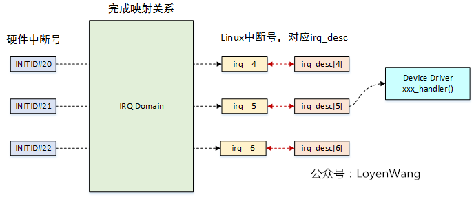

## Linux Kernel IRQ interrupt request 


### 硬件部分

#### 硬件部分

##### 整体框架

​	中断硬件系统主要有三种器件参与，**各个外设**、**中断控制器**和**CPU**。

​	**外设**：提供irq request line，在发生中断事件的时候，通过irq request line上的电气信号向CPU系统请求处理。

​	**controller**：外设的irq request line太多，CPU需要一个小伙伴帮他，这就是Interrupt controller。Interrupt Controller是连接外设中断系统和CPU系统的桥梁。根据外设irq request line的多少，Interrupt Controller可以级联。

​	**CPU：**CPU的主要功能是运算，因此CPU并不处理中断优先级，那是Interrupt controller的事情。对于CPU而言，一般有两种中断请求。

对于ARM，是IRQ和FIQ信号线，分别让ARM进入IRQ mode和FIQ mode。

对于X86，有可屏蔽中断和不可屏蔽中断。

对于RISCV来说，每个CPU核都有一个RISC-V Hart-Level Interrupt Controller (HLIC)。外部的interrupt controller 挂载到HLIC上。关于这个controller的代码在drivers/irqchip/irq-riscv-intc.c。相关文档在：

Documentation/devicetree/bindings/interrupt-controller/riscv%2Ccpu-intc.txt


​	系统中有若干个CPU block用来接收中断事件并进行处理，若干个Interrupt controller形成树状的结构，汇集系统中所有外设的irq request line，并将中断事件分发给某一个CPU block进行处理。

​	从接口层面看，主要有两类接口，一种是中断接口。有的实现中，具体中断接口的形态就是一个硬件的信号线，通过电平信号传递中断事件（ARM以及GIC组成的中断系统就是这么设计的）。

​	有些系统采用了其他的方法来传递中断事件，比如x86＋APIC（Advanced Programmable Interrupt Controller）组成的系统，每个x86的核有一个Local APIC，这些Local APIC们通过ICC（Interrupt Controller Communication）bus连接到IO APIC上。

​	IO APIC收集各个外设的中断，并翻译成总线上的message，传递给某个CPU上的Local APIC。因此，上面的红色线条也是逻辑层面的中断信号，可能是实际的PCB上的铜线（或者SOC内部的铜线），也可能是一个message而已。除了中断接口，CPU和Interrupt Controller之间还需要有控制信息的交流。Interrupt Controller会开放一些寄存器让CPU访问、控制。

##### **级连**

​	Interrupt controller有的是支持多个CPU core的（例如GIC、APIC等），有的不支持（例如S3C2410的中断控制器，X86平台的PIC等）。如果硬件平台中只有一个GIC的话，那么通过控制该GIC的寄存器可以将所有的外设中断，分发给连接在该interrupt controller上的CPU。

**如果有多个GIC呢（或者级联的interrupt controller都支持multi cpu core）？**

​	假设我们要设计一个非常复杂的系统，系统中有8个CPU，有2000个外设中断要处理，这时候你如何设计系统中的interrupt controller？如果使用GIC的话，我们需要两个GIC（一个GIC最多支持1024个中断源），一个是root GIC，另外一个是secondary GIC。这时候，你有两种方案：

​	（1）把8个cpu都连接到root GIC上，secondary GIC不接CPU。这时候原本挂接在secondary GIC的外设中断会输出到某个cpu，现在，只能是（通过某个cpu interface的irq signal）输到root GIC的某个SPI上。对于软件而言，这是一个比较简单的设计，secondary GIC的cpu interface的设定是固定不变的，永远是从一个固定的CPU interface输出到root GIC。这种方案的坏处是：这时候secondary GIC的PPI和SGI都是没有用的了。此外，在这种设定下，所有连接在secondary GIC上的外设中断要送达的target CPU是统一处理的，要么送去cpu0，要么cpu 5，不能单独控制。

​	（2）当然，你也可以让每个GIC分别连接4个CPU core，root GIC连接CPU0~CPU3，secondary GIC连接CPU4~CPU7。这种状态下，连接在root GIC的中断可以由CPU0~CPU3分担处理，连接在secondary GIC的中断可以由CPU4~CPU7分担处理。但这样，在中断处理方面看起来就体现不出8核的威力了。

注：上一节中的逻辑block示意图采用的就是方案一。

**Interrupt controller把中断事件送给哪个CPU？**

​	毫无疑问，只有支持multi cpu core的中断控制器才有这种幸福的烦恼。一般而言，中断控制器可以把中断事件上报给一个CPU或者一组CPU（包括广播到所有的CPU上去）。

​	对于外设类型的中断，当然是送到一个cpu上就OK了，我看不出来要把这样的中断送给多个CPU进行处理的必要性。如果送达了多个cpu，实际上，也应该只有一个handler实际和外设进行交互，另外一个cpu上的handler的动作应该是这样的：发现该irq number对应的中断已经被另外一个cpu处理了，直接退出handler，返回中断现场。IPI的中断不存在这个限制，IPI更像一个CPU之间通信的机制，对这种中断广播应该是毫无压力。

实际上，从用户的角度看，其需求是相当复杂的，我们的目标可能包括：

（1）让某个IRQ number的中断由某个特定的CPU处理

（2）让某个特定的中断由几个CPU轮流处理

……

​	当然，具体的需求可能更加复杂，但是如何区分软件和硬件的分工呢？让硬件处理那么复杂的策略其实是不合理的，复杂的逻辑如果由硬件实现，那么就意味着更多的晶体管，更多的功耗。

​	因此，最普通的做法就是为Interrupt Controller支持的每一个中断设定一个target cpu的控制接口（当然应该是以寄存器形式出现，对于GIC，这个寄存器就是Interrupt processor target register）。系统有多个cpu，这个控制接口就有多少个bit，每个bit代表一个CPU。如果该bit设定为1，那么该interrupt就上报给该CPU，如果为0，则不上报给该CPU。这样的硬件逻辑比较简单，剩余的控制内容就交给软件好了。

​	例如如果系统有两个cpu core，某中断想轮流由两个CPU处理。那么当CPU0相应该中断进入interrupt handler的时候，可以将Interrupt processor target register中本CPU对应的bit设定为0，另外一个CPU的bit设定为1。这样，在下次中断发生的时候，interupt controller就把中断送给了CPU1。对于CPU1而言，在执行该中断的handler的时候，将Interrupt processor target register中CPU0的bit为设置为1，disable本CPU的比特位，这样在下次中断发生的时候，interupt controller就把中断送给了CPU0。这样软件控制的结果就是实现了特定中断由2个CPU轮流处理的算法。

​	相关硬件还是需要根据具体设计而来。

#### DTS IRQ

​	那么这些中断在dts中如何表述出来？以arch/riscv/boot/dts/sifive/fu740-c000.dtsi为例子。

```
cpus {
		#address-cells = <1>;
		#size-cells = <0>;
		cpu0: cpu@0 {
			...
			cpu0_intc: interrupt-controller {
				#interrupt-cells = <1>;
				compatible = "riscv,cpu-intc";
				interrupt-controller;
			};
		};
...
		};
	};
```

​	可以看到每个CPU都有一个interrupt-controller。

```
soc {
		plic0: interrupt-controller@c000000 {
			#interrupt-cells = <1>;
			#address-cells = <0>;
			compatible = "sifive,fu540-c000-plic", "sifive,plic-1.0.0";
			reg = <0x0 0xc000000 0x0 0x4000000>;
			riscv,ndev = <69>;
			interrupt-controller;
			interrupts-extended =
				<&cpu0_intc 0xffffffff>,
				<&cpu1_intc 0xffffffff>, <&cpu1_intc 9>,
				<&cpu2_intc 0xffffffff>, <&cpu2_intc 9>,
				<&cpu3_intc 0xffffffff>, <&cpu3_intc 9>,
				<&cpu4_intc 0xffffffff>, <&cpu4_intc 9>;
		};
...
}
```

​	soc上挂载了一个plic。如果后续有设备需要使用中断，那么应该如下写。

```
uart1: serial@10011000 {
...
			interrupt-parent = <&plic0>;
			interrupts = <40>;
...
};
```

​	可以看到，这个中断挂载了plic，然后中断号是40。

​	上述dts中各个字段有各自的意思，具体还得看dts的标准。

**系统中HW interrupt ID和IRQ number的mapping DB是在整个系统初始化的过程中建立起来的，过程如下：**

（1）DTS文件描述了系统中的interrupt controller以及外设IRQ的拓扑结构，在linux kernel启动的时候，由bootloader传递给kernel（实际传递的是DTB）。

（2）在Device Tree初始化的时候，形成了系统内所有的device node的树状结构，当然其中包括所有和中断拓扑相关的数据结构（所有的interrupt controller的node和使用中断的外设node）

（3）在machine driver初始化的时候会调用of_irq_init函数，在该函数中会扫描所有interrupt controller的节点，并调用适合的interrupt controller driver进行初始化。毫无疑问，初始化需要注意顺序，首先初始化root，然后first level，second level，最后是leaf node。在初始化的过程中，一般会调用上节中的接口函数向系统增加irq domain。有些interrupt controller会在其driver初始化的过程中创建映射

（4）在各个driver初始化的过程中，创建映射

#### dts device 加载过程

​	在较早的版本中，加载过程是这样的。

```
of_platform_default_populate_init
    ---> of_platform_default_populate
        ---> of_platform_populate
            ---> of_platform_bus_create
                ---> of_platform_device_create_pdata
                    ---> of_device_alloc  // 为设备节点（Device Node）动态分配一个platform_device结构体
                        ---> of_irq_to_resource_table
                            ---> of_irq_to_resource
                                ---> irq_of_get
                                    ---> of_irq_parse_one
                                    ---> irq_create_of_mapping                                           ---> irq_create_fwspec_mapping
                                            ---> irq_domain_translate  
                                                ---> s3c24xx_irq_xlate_of
                                            ---> irq_create_mapping    // 创建hwirq到virq的映射
                                                ---> irq_domain_associate
                                                    ---> s3c24xx_irq_map_of
```

```
arch_initcall_sync(of_platform_default_populate_init);
```

​	可以看到这个函数是在arch install完成的。在解析设备树的时候完成的。但是在最新版本的kernel中发生了更改。

```
Now that we've split the pdev and DT probing logic from the runtime
management, let's move the former into its own file. We gain a few lines
due to the copyright header and includes, but this should keep the logic
clearly separated, and paves the way for adding ACPI support in a
similar fashion.
```

```
现在我们已经将pdev和DT探测逻辑从运行时管理中分离出来，让我们将前者移动到自己的文件中。由于版权标头和包含，我们获得了一些行，但这应该使逻辑保持清晰的分离，并为以类似的方式添加ACPI支持铺平了道路。
```

```
int arm_pmu_device_probe(struct platform_device *pdev,
			 const struct of_device_id *of_table,
			 const struct pmu_probe_info *probe_table)
{
	pmu = armpmu_alloc();
	if (!pmu)
		return -ENOMEM;

	pmu->plat_device = pdev;

	ret = pmu_parse_irqs(pmu);
	if (ret)
		goto out_free;

...
}
```

​	实际上是在driver probe的时候调用platform_get_irq函数然后跳转到这个地方完成加载。

```
#0  gic_irq_domain_alloc (domain=0x81006800, virq=2692881652, nr_irqs=2692881492, arg=0xa0821c58) at ../drivers/irqchip/irq-gic.c:1141
#1  0x8017ff70 in irq_domain_alloc_irqs_hierarchy (arg=<optimized out>, nr_irqs=<optimized out>, irq_base=<optimized out>, domain=<optimized out>) at ../kernel/irq/irqdomain.c:1471
#2  irq_domain_alloc_irqs_locked (domain=0x81006800, irq_base=30, nr_irqs=1, node=-1602085800, arg=0xa0821cf4, realloc=false, affinity=0x0) at ../kernel/irq/irqdomain.c:1498
#3  0x80180418 in irq_create_fwspec_mapping (fwspec=0xa0821cf4) at ../kernel/irq/irqdomain.c:867
#4  0x8018059c in irq_create_of_mapping (irq_data=0x81006800) at ../kernel/irq/irqdomain.c:902
#5  0x8077e20c in of_irq_get (dev=0x81006800, index=-1602085644) at ../drivers/of/irq.c:446
#6  0x80638260 in platform_get_irq_optional (dev=0x8128a400, num=0) at ../drivers/base/platform.c:185
#7  0x806383a8 in platform_get_irq (dev=0x8128a400, num=0) at ../drivers/base/platform.c:264
#8  0x806ddd6c in smsc911x_drv_probe (pdev=0x8128a400) at ../drivers/net/ethernet/smsc/smsc911x.c:2432
#9  0x80638e10 in platform_probe (_dev=0x8128a410) at ../drivers/base/platform.c:1404
#10 0x80636568 in call_driver_probe (drv=<optimized out>, dev=<optimized out>) at ../drivers/base/dd.c:578
#11 really_probe (dev=0x8128a410, drv=0x80e7cba4 <smsc911x_driver+24>) at ../drivers/base/dd.c:656
#12 0x80636828 in __driver_probe_device (drv=0x80e7cba4 <smsc911x_driver+24>, dev=0x8128a410) at ../drivers/base/dd.c:798
#13 0x806368fc in driver_probe_device (drv=0x81006800, dev=0x8128a410) at ../drivers/base/dd.c:828
#14 0x80636b18 in __driver_attach (dev=0x8128a410, data=0x80e7cba4 <smsc911x_driver+24>) at ../drivers/base/dd.c:1214
#15 0x806348b0 in bus_for_each_dev (bus=0x81006800, start=0x0, data=0x80e7cba4 <smsc911x_driver+24>, fn=0x80636a30 <__driver_attach>) at ../drivers/base/bus.c:368
#16 0x80635768 in bus_add_driver (drv=0x80e7cba4 <smsc911x_driver+24>) at ../drivers/base/bus.c:673
#17 0x8063765c in driver_register (drv=0x80e7cba4 <smsc911x_driver+24>) at ../drivers/base/driver.c:246
#18 0x80101f50 in do_one_initcall (fn=0x80d22bcc <smsc911x_init_module>) at ../init/main.c:1245
#19 0x80d01370 in do_initcall_level (command_line=<optimized out>, level=<optimized out>) at ../include/linux/init.h:130
#20 do_initcalls () at ../init/main.c:1323
#21 do_basic_setup () at ../init/main.c:1342
#22 kernel_init_freeable () at ../init/main.c:1555
#23 0x80939cac in kernel_init (unused=0x81006800) at ../init/main.c:1444
#24 0x8010010c in ret_from_fork () at ../arch/arm/kernel/entry-common.S:134
```


### 软件部分

#### 系统加载流程

##### 早期初始化

```
void start_kernel(void)
{
...
  early_irq_init();
  init_IRQ();
...
}
```

```
early_irq_init();

int __init early_irq_init(void)
{
...
	/* Let arch update nr_irqs and return the nr of preallocated irqs */
	initcnt = arch_probe_nr_irqs();
	...
	for (i = 0; i < initcnt; i++) {
		desc = alloc_desc(i, node, 0, NULL, NULL);
		irq_insert_desc(i, desc);
	}
	return arch_early_irq_init(); //此函数只有x86在引用，其余是0
}
这个函数分配了desc数组，这个数组是全局的
struct irq_desc irq_desc[NR_IRQS] __cacheline_aligned_in_smp = {
	[0 ... NR_IRQS-1] = {
		.handle_irq	= handle_bad_irq,
		.depth		= 1,
		.lock		= __RAW_SPIN_LOCK_UNLOCKED(irq_desc->lock),
	}
};
先记住这有个irq_desc，很重要。

我也看不太懂这部分，和硬件关系很大。可以参考这篇文章。
https://blog.csdn.net/weixin_41028621/article/details/101753159
```

```
void __init init_IRQ(void)
{
/* 下面两个函数是关于栈的设置，展示先不仔细看 */
	init_irq_scs();
	init_irq_stacks();
/* 最主要的函数 */
	irqchip_init();
	if (!handle_arch_irq)
		panic("No interrupt controller found.");
	sbi_ipi_init();
}
```

```
void __init irqchip_init(void)
{
/* 这个函数在drivers/of/irq.c 所以是设备树关于中断的处理 */
	of_irq_init(__irqchip_of_table);
/* 
Add probing infrastructure for ACPI-based irqchips

DT enjoys a rather nice probing infrastructure for irqchips, while
ACPI is so far stuck into a very distant past.

This patch introduces a declarative API, allowing irqchips to be
self-contained and be called when a particular entry is matched
in the MADT table.
应该是兼容性的接口，不太清楚
*/
	acpi_probe_device_table(irqchip);
}
```

```
/**
扫描并初始化DT中的匹配中断控制器
 * @matches: 0 terminated array of nodes to match and init function to call
 *
此函数扫描设备树以查找匹配的中断控制器节点，并首先按父节点的顺序调用它们的初始化函数。
 */
void __init of_irq_init(const struct of_device_id *matches)
{
	const struct of_device_id *match;

	INIT_LIST_HEAD(&intc_desc_list);
	INIT_LIST_HEAD(&intc_parent_list);

	for_each_matching_node_and_match(np, matches, &match) {
...
		/* 找到匹配的interrupt controller */
		/* 将match的data转为desc的irq_init_cb */
		/* 可以看到desc与chip是匹配的 */
		desc->irq_init_cb = match->data;
		desc->dev = of_node_get(np);
	}

	/* 处理每个interrupt controller */
	while (!list_empty(&intc_desc_list)) {
			/* 使用chip的注册回调  */
			ret = desc->irq_init_cb(desc->dev,
						desc->interrupt_parent);
   }
...
}

```

​	ok，现在就开始看of_device_id的回调了。先看如何声明的。

```
IRQCHIP_DECLARE(gic_v3, "arm,gic-v3", gic_of_init);

/*
不同的irqchip驱动程序必须使用此宏来声明其DT兼容字符串与其初始化函数之间的关联。
 *
 * @name: name that must be unique across all IRQCHIP_DECLARE of the
 * same file.
 * @compat: compatible string of the irqchip driver
 * @fn: initialization function
 */
#define IRQCHIP_DECLARE(name, compat, fn)	\
	OF_DECLARE_2(irqchip, name, compat, typecheck_irq_init_cb(fn))


#define _OF_DECLARE(table, name, compat, fn, fn_type)			\
	_OF_DECLARE_STUB(table, name, compat, fn, fn_type)
#endif

#define OF_DECLARE_2(table, name, compat, fn) \
		_OF_DECLARE(table, name, compat, fn, of_init_fn_2)
		
		
#define _OF_DECLARE_STUB(table, name, compat, fn, fn_type)		\
	static const struct of_device_id __of_table_##name		\
		__attribute__((unused))					\
		 = { .compatible = compat,				\
		     .data = (fn == (fn_type)NULL) ? fn : fn }
```

​	所以，只要controller声明了IRQCHIP_DECLARE即可。剩下的就是各个chip的事情了。

```
drivers/irqchip/irq-gic.c

IRQCHIP_DECLARE(gic_400, "arm,gic-400", gic_of_init);
```

```
drivers/irqchip/irq-riscv-intc.c

IRQCHIP_DECLARE(riscv, "riscv,cpu-intc", riscv_intc_init);
```

**调用过程**

```
#0  gic_init_bases at ../drivers/irqchip/irq-gic.c:1193 
#1  0x80d1d7d0 in __gic_init_bases  at ../drivers/irqchip/irq-gic.c:1260
#2  gic_of_init  at ../drivers/irqchip/irq-gic.c:1491
//chip层次了
#3  0x80d27cd8 in of_irq_init at ../drivers/of/irq.c:598
#4  0x80d00f78 in start_kernel at ../init/main.c:984
```

**在arm中：**

```
int __init
gic_of_init(struct device_node *node, struct device_node *parent)
{
...
	if (!gic_cnt) {
		gic_init_physaddr(node);
		gic_of_setup_kvm_info(node);
	}

	if (parent) {
	/*
	被所有支持OF的平台使用；但SPARC的实现方式不同。但是，原型对所有人都是一样的，因此无论CONFIG_of_IRQ设置如何，都在这里声明它。
	*/
		irq = irq_of_parse_and_map(node, 0);
		gic_cascade_irq(gic_cnt, irq);
	}
...
}
```

​		之后流程有大佬总结。


**在riscv中：**

```
static int __init riscv_intc_init(struct device_node *node,
				  struct device_node *parent)
{
	struct irq_chip *chip = &riscv_intc_chip;
	unsigned long hartid;
	int rc;

	rc = riscv_of_parent_hartid(node, &hartid);
	if (rc < 0) {
		pr_warn("unable to find hart id for %pOF\n", node);
		return 0;
	}

	/*
	DT在每个CPU（或HART）DT节点下都有一个INTC DT节点，因此riscv_INTC_init（）函数将为每个INTC DT结点调用一次。我们只需要对属于引导CPU（或引导HART）的INTC DT节点进行INTC初始化。
  */
	if (riscv_hartid_to_cpuid(hartid) != smp_processor_id()) {
		每个CPU的INTC节点都是下游中断控制器（如PLIC、IMSIC和APLIC直接模式）的供应商，因此如果我们没有为INTC节点创建IRQ域，我们应该将其标记为已初始化。
		fwnode_dev_initialized(of_fwnode_handle(node), true);
		return 0;
	}

	if (of_device_is_compatible(node, "andestech,cpu-intc")) {
		riscv_intc_custom_base = ANDES_SLI_CAUSE_BASE;
		riscv_intc_custom_nr_irqs = ANDES_RV_IRQ_LAST;
		chip = &andes_intc_chip;
	}

	return riscv_intc_init_common(of_node_to_fwnode(node), chip);
}

IRQCHIP_DECLARE(riscv, "riscv,cpu-intc", riscv_intc_init);
IRQCHIP_DECLARE(andes, "andestech,cpu-intc", riscv_intc_init);

static int __init riscv_intc_init_common(struct fwnode_handle *fn, struct irq_chip *chip)
{
	int rc;
	/* 建立domain */
	intc_domain = irq_domain_create_tree(fn, &riscv_intc_domain_ops, chip);
	if (!intc_domain) {
		pr_err("unable to add IRQ domain\n");
		return -ENXIO;
	}
...
	return 0;
}

```

​	每个irq controller的下一步都是创建自己的irq domain，但是由于极连关系，所以parent需要创建跟irq domain，如果是child那么需要创建mapping即可。接口不一样，但是本质都是创建domain然后映射到irq desc上。下面是IRQ domain的建立。

##### IRQ Domain初始化

###### 概念

**IRQ number：**CPU需要为每一个外设中断编号，我们称之IRQ Number。这个IRQ number是一个虚拟的interrupt ID，和硬件无关，仅仅是被CPU用来标识一个外设中断。在kernel中有时候叫virq

**HW interrupt ID**：对于interrupt controller而言，它收集了多个外设的interrupt request line并向上传递，因此，interrupt controller需要对外设中断进行编码。

​	Interrupt controller用HW interrupt ID来标识外设的中断。在interrupt controller级联的情况下，仅仅用HW interrupt ID已经不能唯一标识一个外设中断，还需要知道该HW interrupt ID所属的interrupt controller（HW interrupt ID在不同的Interrupt controller上是会重复编码的）。

​	对于整体来说，我们并不关心HW interrupt，因为当HW interrupt改变的时候我们希望上层依赖中断的部分不需要改变，所以在HW interrupt基础上抽象出来一个IRQ number，上层只需要使用IRQ number而无需关心HW interrupt。这样一个好处是在中断相关的硬件发生变化的时候，驱动软件不需要修改。因此，linux kernel中的中断子系统需要提供一个将HW interrupt ID映射到IRQ number上来的机制。

​	关于HW interrupt ID映射到IRQ number上这事，在过去系统只有一个interrupt controller的时候还是很简单的，中断控制器上实际的HW interrupt line的编号可以直接变成IRQ number。

​	例如我们大家都熟悉的SOC内嵌的interrupt controller，这种controller多半有中断状态寄存器，这个寄存器可能有64个bit（也可能更多），每个bit就是一个IRQ number，可以直接进行映射。

​	这时候，GPIO的中断在中断控制器的状态寄存器中只有一个bit，因此所有的GPIO中断只有一个IRQ number，在该通用GPIO中断的irq handler中进行deduplex，将各个具体的GPIO中断映射到其相应的IRQ number上。如果你是一个足够老的工程师，应该是经历过这个阶段的。

​	随着linux kernel的发展，将interrupt controller抽象成irqchip这个概念越来越流行，甚至GPIO controller也可以被看出一个interrupt controller chip，这样，系统中至少有两个中断控制器了，一个传统意义的中断控制器，一个是GPIO controller type的中断控制器。随着系统复杂度加大，外设中断数据增加，实际上系统可以需要多个中断控制器进行级联，面对这样的趋势，linux kernel工程师如何应对？答案就是irq domain这个概念。

​	我们听说过很多的domain，power domain，clock domain等等，所谓domain，就是领域，范围的意思，也就是说，任何的定义出了这个范围就没有意义了。系统中所有的interrupt controller会形成树状结构，对于每个interrupt controller都可以连接若干个外设的中断请求（我们称之interrupt source），interrupt controller会对连接其上的interrupt source（根据其在Interrupt controller中物理特性）进行编号（也就是HW interrupt ID了）。但这个编号仅仅限制在本interrupt controller范围内。



###### fw_node

​	代表实际从设备树或ACPI发现的设备节点。by the way，处理设备树的函数都以of开头，代表open Firmware。

https://blog.csdn.net/likezhou/article/details/133995887

https://blog.csdn.net/qq_40937426/article/details/107706460

###### irq_domain表示

​	这个结构体用于转换hw interrupt。

```
 Hardware interrupt number translation object
 
 struct irq_domain {
	struct list_head		link; //有个 global irq_domain list
	const char			*name; // name
	const struct irq_domain_ops	*ops; //
	void				*host_data; //供所有者使用的私有数据指针。未被irq_domain核心代码触及。
	unsigned int			flags; //每个irq_domain标志
	
	/* Irq domain doesn't translate anything */
	IRQ_DOMAIN_FLAG_NO_MAP		= (1 << 6),
	
	
	unsigned int			mapcount; //映射的中断数量
	struct mutex			mutex; //锁
	struct irq_domain		*root;
	// 指向根域的指针，如果不是层次结构，则包含结构
...
#ifdef	CONFIG_IRQ_DOMAIN_HIERARCHY
	struct irq_domain		*parent;
#endif

	/* 映射方式 */
	/* 线性映射方式被附加到irq_domain */
	/* tree的方式是 依靠 radix_tree_root */
	/* reverse map data. The linear map gets appended to the irq_domain */
	irq_hw_number_t			hwirq_max;
	unsigned int			revmap_size;
	struct radix_tree_root		revmap_tree;
	/* 以前是 linear_revmap */
	struct irq_data __rcu		*revmap[] __counted_by(revmap_size);
};


```

###### irq_domain_ops

```
struct irq_domain_ops {
//将中断控制器设备节点与主机匹配，匹配时返回1
	int (*match)(struct irq_domain *d, struct device_node *node,
		     enum irq_domain_bus_token bus_token);
	
	int (*select)(struct irq_domain *d, struct irq_fwspec *fwspec,
		      enum irq_domain_bus_token bus_token);
//创建或更新虚拟irq号和硬件irq号之间的映射。对于给定的映射，只调用一次。
	int (*map)(struct irq_domain *d, unsigned int virq, irq_hw_number_t hw);
	void (*unmap)(struct irq_domain *d, unsigned int virq);
	int (*xlate)(struct irq_domain *d, struct device_node *node,
		     const u32 *intspec, unsigned int intsize,
		     unsigned long *out_hwirq, unsigned int *out_type);
};
```

​	**xlate函数**，语义是翻译（translate）的意思，那么到底翻译什么呢？在DTS文件中，各个使用中断的device node会通过一些属性（例如interrupts和interrupt-parent属性）来提供中断信息给kernel以便kernel可以正确的进行driver的初始化动作。

​	这里，interrupts属性所表示的interrupt specifier只能由具体的interrupt controller（也就是irq domain）来解析。而xlate函数就是将指定的设备（node参数）上若干个（intsize参数）中断属性（intspec参数）翻译成HW interrupt ID（out_hwirq参数）和trigger类型（out_type）。

​	这个结构体由irq controller的driver提供，在创建的时候传入。

```
drivers/irqchip/irq-gic.c
static const struct irq_domain_ops gic_irq_domain_hierarchy_ops = {
	.translate = gic_irq_domain_translate,
	.alloc = gic_irq_domain_alloc,
	.free = irq_domain_free_irqs_top,
};

gic->domain = irq_domain_create_linear(handle, gic_irqs,
					       &gic_irq_domain_hierarchy_ops,
					       gic);
```

```
static const struct irq_domain_ops riscv_intc_domain_ops = {
	.map	= riscv_intc_domain_map,
	.xlate	= irq_domain_xlate_onecell,
	.alloc	= riscv_intc_domain_alloc
};
	intc_domain = irq_domain_create_tree(fn, &riscv_intc_domain_ops, chip);

```


###### irq_domain 创建与映射

**HW interrupt如何映射为IRQ number**

​	kernel给了三种方式，本质上就是设置domain的某几个字段来设置。

**线性映射**

```
	其实就是一个lookup table，HW interrupt ID作为index，通过查表可以获取对应的IRQ number。对于Linear map而言，interrupt controller对其HW interrupt ID进行编码的时候要满足一定的条件：hw ID不能过大，而且ID排列最好是紧密的。
static inline struct irq_domain *irq_domain_add_linear(struct device_node *of_node,
					 unsigned int size,
					 const struct irq_domain_ops *ops,
					 void *host_data)
{
	return __irq_domain_add(of_node_to_fwnode(of_node), size, size, 0, ops, host_data);
}
```

**Radix Tree map**

```
建立一个Radix Tree来维护HW interrupt ID到IRQ number映射关系。HW interrupt ID作为lookup key，在Radix Tree检索到IRQ number。如果的确不能满足线性映射的条件，可以考虑Radix Tree map。实际上，内核中使用Radix Tree map的只有powerPC和MIPS的硬件平台。

static inline struct irq_domain *irq_domain_add_tree(struct device_node *of_node,
					 const struct irq_domain_ops *ops,
					 void *host_data)
{
	return __irq_domain_add(of_node_to_fwnode(of_node), 0, ~0, 0, ops, host_data);
}
```

**no map**

```
有些中断控制器很强，可以通过寄存器配置HW interrupt ID而不是由物理连接决定的。例如PowerPC 系统使用的MPIC (Multi-Processor Interrupt Controller)。在这种情况下，不需要进行映射，我们直接把IRQ number写入HW interrupt ID配置寄存器就OK了，这时候，生成的HW interrupt ID就是IRQ number，也就不需要进行mapping了。

static inline struct irq_domain *irq_domain_add_nomap(struct device_node *of_node,
					 unsigned int max_irq,
					 const struct irq_domain_ops *ops,
					 void *host_data)
{
	return __irq_domain_add(of_node_to_fwnode(of_node), 0, max_irq, max_irq, ops, host_data);
}

```

​	上述三个函数都依赖于如下函数

```
分配新的irq_domain数据结构

 * @size: Size of linear map; 0 for radix mapping only
 * @hwirq_max: Maximum number of interrupts supported by controller
 * @direct_max: Maximum value of direct maps; Use ~0 for no limit; 0 for no
 *              direct mapping
struct irq_domain *__irq_domain_add(struct fwnode_handle *fwnode, unsigned int size,
				    irq_hw_number_t hwirq_max, int direct_max,
				    const struct irq_domain_ops *ops,
				    void *host_data)
{
	struct irq_domain *domain;

	domain = __irq_domain_create(fwnode, size, hwirq_max, direct_max,
				     ops, host_data);
	if (domain)
		__irq_domain_publish(domain);

	return domain;
}
EXPORT_SYMBOL_GPL(__irq_domain_add);

static void __irq_domain_publish(struct irq_domain *domain)
{
...
	/* 所谓发布就是放到全局链表中irq_domain_list，这个在domain结构体中指出 */
	list_add(&domain->link, &irq_domain_list);
...
}

static struct irq_domain *__irq_domain_create(struct fwnode_handle *fwnode,
					      unsigned int size,
					      irq_hw_number_t hwirq_max,
					      int direct_max,
					      const struct irq_domain_ops *ops,
					      void *host_data)
{
...
	/* 将fwnode转为domain */

	/* Fill structure */
	INIT_RADIX_TREE(&domain->revmap_tree, GFP_KERNEL);
	domain->ops = ops;
	domain->host_data = host_data;
	domain->hwirq_max = hwirq_max;

	if (direct_max)
		domain->flags |= IRQ_DOMAIN_FLAG_NO_MAP;

	domain->revmap_size = size;

...
	mutex_init(&domain->mutex);
	domain->root = domain;

	irq_domain_check_hierarchy(domain);

	return domain;
}
```

​	上述是向系统注册一个irq domain，具体HW interrupt ID和IRQ number的映射关系都是空的，因此，具体各个irq domain如何管理映射所需要的database还是需要建立的。

​	例如：对于线性映射的irq domain，我们需要建立线性映射的lookup table，对于Radix Tree map，我们要把那个反应IRQ number和HW interrupt ID的Radix tree建立起来。

```
static inline unsigned int irq_create_mapping(struct irq_domain *host,
					      irq_hw_number_t hwirq)
{
	return irq_create_mapping_affinity(host, hwirq, NULL);
}
```

```
/**
 将硬件中断映射到linux irq空间
 * @domain: domain owning this hardware interrupt or NULL for default domain
 * @hwirq: 该域空间中的硬件irq数
 * @affinity: irq affinity
 *
	每个硬件中断只允许一个映射。返回一个linux irq编号。
	如果要指定感测/触发器，则应在该调用返回的数字上调用set_irq_type（）。
 */
unsigned int irq_create_mapping_affinity(struct irq_domain *domain,
					 irq_hw_number_t hwirq,
					 const struct irq_affinity_desc *affinity)
{
	int virq;
	
	mutex_lock(&domain->root->mutex);

	/* Check if mapping already exists */
	virq = irq_find_mapping(domain, hwirq);

	virq = irq_create_mapping_affinity_locked(domain, hwirq, affinity);
out:
	mutex_unlock(&domain->root->mutex);

	return virq;
}
EXPORT_SYMBOL_GPL(irq_create_mapping_affinity);

static unsigned int irq_create_mapping_affinity_locked(struct irq_domain *domain,
						       irq_hw_number_t hwirq,
						       const struct irq_affinity_desc *affinity)
{
	struct device_node *of_node = irq_domain_get_of_node(domain);
	int virq;


	/* Allocate a virtual interrupt number */
	virq = irq_domain_alloc_descs(-1, 1, hwirq, of_node_to_nid(of_node),
				      affinity);

	if (irq_domain_associate_locked(domain, virq, hwirq)) {
		irq_free_desc(virq);
		return 0;
	}

	return virq;
}


static int irq_domain_associate_locked(struct irq_domain *domain, unsigned int virq,
				       irq_hw_number_t hwirq)
{
	struct irq_data *irq_data = irq_get_irq_data(virq);
	int ret;

	irq_data->hwirq = hwirq;
	irq_data->domain = domain;
	if (domain->ops->map) { /* 调用domain的ops的map函数 */
		ret = domain->ops->map(domain, virq, hwirq);
		if (ret != 0) 
		如果map（）返回-EPERM，则此中断受固件或其他服务的保护，不应被映射。
    不要费心告诉用户这件事。
	}

	domain->mapcount++;
	/* 具体map */
	irq_domain_set_mapping(domain, hwirq, irq_data);

	irq_clear_status_flags(virq, IRQ_NOREQUEST);

	return 0;
}

static void irq_domain_set_mapping(struct irq_domain *domain,
				   irq_hw_number_t hwirq,
				   struct irq_data *irq_data)
{
	/*
	这也确保了当从层次结构中每个域的irq_domain_insert_irq（）调用时，所有域都指向同一根。
  */
	lockdep_assert_held(&domain->root->mutex);

	/* 
	直接映射完全排除了普通映射，这意味着我们可以稍微重构代码，这样我们就可以摆脱revmap_Direct_max_irq字段，转而使用revmap_size字段，从而减小irqdomain结构的大小。
	*/
	if (irq_domain_is_nomap(domain))
		return;

	if (hwirq < domain->revmap_size)
		rcu_assign_pointer(domain->revmap[hwirq], irq_data);
	else
		radix_tree_insert(&domain->revmap_tree, hwirq, irq_data);
}
```

###### 三种存放方式以及find mapping

​	看如下几个函数：

```
struct irq_desc irq_desc[NR_IRQS] __cacheline_aligned_in_smp = {
	[0 ... NR_IRQS-1] = {
		.handle_irq	= handle_bad_irq,
		.depth		= 1,
		.lock		= __RAW_SPIN_LOCK_UNLOCKED(irq_desc->lock),
	}
};

/* irq_desc是一个全局数组，如果是线性映射那么irq就是数组的index */
/* 所以此函数会返回一个irq_desc */
struct irq_desc *irq_to_desc(unsigned int irq)
{
	return (irq < NR_IRQS) ? irq_desc + irq : NULL;
}
EXPORT_SYMBOL(irq_to_desc);

/* 从上述数组中和irq_desc的结构体的描述知道 */
/* 一个irq_desc与一个irq_data对应起来 */
/* 所以直接返回irq_desc的irq_data就可以 */
struct irq_data *irq_get_irq_data(unsigned int irq)
{
	struct irq_desc *desc = irq_to_desc(irq);

	return desc ? &desc->irq_data : NULL;
}
EXPORT_SYMBOL_GPL(irq_get_irq_data);


/* 在start_kernel中初始化完成 */
int __init early_irq_init(void)
{
	int count, i, node = first_online_node;
	int ret;

	init_irq_default_affinity();

	printk(KERN_INFO "NR_IRQS: %d\n", NR_IRQS);

	count = ARRAY_SIZE(irq_desc);

	for (i = 0; i < count; i++) {
		ret = init_desc(irq_desc + i, i, node, 0, NULL, NULL);
		if (unlikely(ret))
			goto __free_desc_res;
	}
...
}
```

​	ok，返回来看上述domain的建立。

```
static unsigned int irq_create_mapping_affinity_locked(struct irq_domain *domain,
						       irq_hw_number_t hwirq,
						       const struct irq_affinity_desc *affinity)
{
	/* 可以看到是根据hwirq分配一个virq */
	virq = irq_domain_alloc_descs(-1, 1, hwirq, of_node_to_nid(of_node),
				      affinity);
	/* 然后去设置domain */
	if (irq_domain_associate_locked(domain, virq, hwirq)) {
		irq_free_desc(virq);
		return 0;
	}
...
}
```

```
static int irq_domain_associate_locked(struct irq_domain *domain, unsigned int virq,
				       irq_hw_number_t hwirq)
{
	/* 由virq找到对应的irq_data	 */
	struct irq_data *irq_data = irq_get_irq_data(virq);
	int ret;
...
	irq_data->hwirq = hwirq;
	irq_data->domain = domain;
...
	domain->mapcount++;
	/* 添加hwirq 与 virq的映射 */
	irq_domain_set_mapping(domain, hwirq, irq_data);

	irq_clear_status_flags(virq, IRQ_NOREQUEST);

}
```

```
static void irq_domain_set_mapping(struct irq_domain *domain,
				   irq_hw_number_t hwirq,
				   struct irq_data *irq_data)
{
	/* 如果是no map形式那么直接获得，不用设置 */
	/* if (irq_domain_is_nomap(domain)) {
		if (hwirq < domain->hwirq_max) {
			/* 可以看到这个函数要求是virq，传入的hwirq，所以是在no map形式是hwirq=virq */
			data = irq_domain_get_irq_data(domain, hwirq);
			if (data && data->hwirq == hwirq)
				desc = irq_data_to_desc(data);
			if (irq && desc)
				*irq = hwirq;
		}
		return desc;
	} */
	if (irq_domain_is_nomap(domain))
		return;

	if (hwirq < domain->revmap_size)
		/* 可以看到将irq_data指针放到了revmap数组 */
		rcu_assign_pointer(domain->revmap[hwirq], irq_data);
	else
		/* radix只是index组织方式不同 */
		radix_tree_insert(&domain->revmap_tree, hwirq, irq_data);
}

struct irq_data *irq_domain_get_irq_data(struct irq_domain *domain,
					 unsigned int virq)
{
	struct irq_data *irq_data = irq_get_irq_data(virq);

	return (irq_data && irq_data->domain == domain) ? irq_data : NULL;
}
```

###### 从hw irq转为irq no

```
/**
 * irq_find_mapping() - Find a linux irq from a hw irq number.
 * @domain: domain owning this hardware interrupt
 * @hwirq: hardware irq number in that domain space
 */
static inline unsigned int irq_find_mapping(struct irq_domain *domain,
					    irq_hw_number_t hwirq)
{
	unsigned int irq;

	if (__irq_resolve_mapping(domain, hwirq, &irq))
		return irq;

	return 0;
}
```

```
/**
 * __irq_resolve_mapping() - Find a linux irq from a hw irq number.
 * @domain: domain owning this hardware interrupt
 * @hwirq: hardware irq number in that domain space
 * @irq: optional pointer to return the Linux irq if required
 *
 * Returns the interrupt descriptor.
 */
struct irq_desc *__irq_resolve_mapping(struct irq_domain *domain,
				       irq_hw_number_t hwirq,
				       unsigned int *irq)
{
	struct irq_desc *desc = NULL;
	struct irq_data *data;
...

	/* 如果是no map的方式 */
	if (irq_domain_is_nomap(domain)) {
		/* 如果请求查询的hwirq 比允许的最大值小 */
		if (hwirq < domain->hwirq_max) {
			/* 如果是no map 那么virq和hwirq就一样 */
			/* 根据hwirq也就是virq寻找irq_desc然后返回irq_data */
			data = irq_domain_get_irq_data(domain, hwirq);
			/* 如果data存在且irq_desc的hwirq与查找的hwirq一样 */
			/* 那么直接返回desc */
			if (data && data->hwirq == hwirq)
				desc = irq_data_to_desc(data);
			/* 如果desc和irq同时存在设置irq */
			if (irq && desc)
				*irq = hwirq;
		}
		/* 不然就是null */
		return desc;
	}
/* 可以看到no map的方式 存放的位置是irq_desc */


	rcu_read_lock();
	/* Check if the hwirq is in the linear revmap. */
	/* 线性映射 可以看到放在了revmap */
	if (hwirq < domain->revmap_size)
		data = rcu_dereference(domain->revmap[hwirq]);
	/* radix map方式是revmap_tree */
	else
		data = radix_tree_lookup(&domain->revmap_tree, hwirq);

	if (likely(data)) {
		desc = irq_data_to_desc(data);
		if (irq)
			*irq = data->irq;
	}

	rcu_read_unlock();
	return desc;
}
EXPORT_SYMBOL_GPL(__irq_resolve_mapping);
```

###### irq_chip关联irq_domain

```
void irq_domain_set_info(struct irq_domain *domain, unsigned int virq,
			 irq_hw_number_t hwirq, const struct irq_chip *chip,
			 void *chip_data, irq_flow_handler_t handler,
			 void *handler_data, const char *handler_name)
{
	irq_domain_set_hwirq_and_chip(domain, virq, hwirq, chip, chip_data);
	__irq_set_handler(virq, handler, 0, handler_name);
	irq_set_handler_data(virq, handler_data);
}
EXPORT_SYMBOL(irq_domain_set_info);
```

```
int irq_domain_set_hwirq_and_chip(struct irq_domain *domain, unsigned int virq,
				  irq_hw_number_t hwirq,
				  const struct irq_chip *chip,
				  void *chip_data)
{
	struct irq_data *irq_data = irq_domain_get_irq_data(domain, virq);

	if (!irq_data)
		return -ENOENT;

	irq_data->hwirq = hwirq;
	irq_data->chip = (struct irq_chip *)(chip ? chip : &no_irq_chip);
	irq_data->chip_data = chip_data;

	return 0;
}
EXPORT_SYMBOL_GPL(irq_domain_set_hwirq_and_chip);

```

###### irq_desc关联irq_domain

​	irq_desc关联irq_domain是什么时候发生的？如何匹配的？

​	上述，介绍了irq_domian的创建，mapping的三种映射方式，如何查找mapping，以及简单的desc, data,domain关系。


###### 总结

​	首先是有一个全局的irq_desc数组，如果是配置了CONFIG_SPARSE_IRQ那么irq_desc的组织形式就是一个树，否则就是数组。在start_kernel初始化的时候注册irq_desc，而这个irq_desc中有个irq_data成员，这个是实际存储的而不是指针，所以分配irq_desc的时候也申请了irq_data空间。所以irq_desc与irq_data是一对一的关系。在启动的时候，也就是IRQCHIP_DECLARE被调用的时候，domian开始被初始化，此块代码也就是interrupt controller的代码需提供domain ops。随后在domain的建立过程中，首先根据hwirq，分配一个irq_data，随之关联一个irq_desc，然后这个domian通过liner no-map  radix的方式关联起来，irq_data去转irq_domain很容易，因为irq_data包含了对应的irq_domain指针。如果domain转irq_data就需要no-map liner radix的方式去寻找了。然后irq_chip是与interrupt controller强绑定，每个芯片必须提供这些回调函数。然后关联起来。如下所示。

#### 外部中断触发流程

##### 中断处理过程

​	我们从操作系统的课程中学过，当外部某个中断发生时，会给CPU一个信号，在每个指令的末期（寻址 间址，执行，中断）都会检查一下对应的寄存器是否被置位，如果置位则跳转到中断向量表中。那么操作系统对中断的起始都应该是中断向量表中的中断处理程序。当然中间会有一些语句用于保存中断的栈。那么kernel怎么做的？或者说kernel留给CPU关于IRQ的接口是什么？

​	很多大佬说是如下函数。

```
arm/arm/kernel/entry-armv.S

/*
 * Interrupt handling.
 */
	.macro	irq_handler
#ifdef CONFIG_MULTI_IRQ_HANDLER
	ldr	r1, =handle_arch_irq
	mov	r0, sp
	badr	lr, 9997f
	ldr	pc, [r1]
#else
	arch_irq_handler_default
#endif
```

​	但是看提交记录，确实是发生了更改。id是`a7b0872e964cf306fe26d9d49585a90486e32fdf`，有兴趣可以看一下。变成了如下函数。

```
/*
 * Interrupt handling.
 */
	.macro	irq_handler, from_user:req
...
	bl	generic_handle_arch_irq
	b	1f
0:
```

​	riscv也是这么做的。

```
/* arch/riscv/kernel/entry.S: 113 */
/* 5.17版本 */
#ifdef CONFIG_CONTEXT_TRACKING
	/* If previous state is in user mode, call context_tracking_user_exit. */
	li   a0, SR_PP
	and a0, s1, a0
	bnez a0, skip_context_tracking
	call context_tracking_user_exit
skip_context_tracking:
#endif
	/*
* MSB of cause differentiates between
* interrupts and exceptions
*/
	bge s4, zero, 1f
	la ra, ret_from_exception
	/* Handle interrupts */
	move a0, sp /* pt_regs */
	la a1, generic_handle_arch_irq
	jr a1
```

​	但是其他版本还是

```
...
	bge s4, zero, 1f

	/* Handle interrupts */
	tail do_irq
...
```

​	从`generic_handle_arch_irq` 入手

```
asmlinkage void noinstr generic_handle_arch_irq(struct pt_regs *regs)
{
	struct pt_regs *old_regs;

	irq_enter();
	old_regs = set_irq_regs(regs);
	handle_arch_irq(regs); /* 这个函数是一个callback由irq chip 设置的 如下所示 */
	set_irq_regs(old_regs);
	irq_exit();
}

int __init set_handle_irq(void (*handle_irq)(struct pt_regs *))
{
	if (handle_arch_irq)
		return -EBUSY;

	handle_arch_irq = handle_irq;
	return 0;
}

drivers/irqchip/irq-riscv-intc.c
static int __init riscv_intc_init_common(struct fwnode_handle *fn, struct irq_chip *chip)
{
...
	if (riscv_isa_extension_available(NULL, SxAIA)) {
		rc = set_handle_irq(&riscv_intc_aia_irq);
	} else {
		rc = set_handle_irq(&riscv_intc_irq);
	}
...
}
static asmlinkage void riscv_intc_irq(struct pt_regs *regs)
{
	unsigned long cause = regs->cause & ~CAUSE_IRQ_FLAG;
...
	if (generic_handle_domain_irq(intc_domain, cause))
		pr_warn_ratelimited("Failed to handle interrupt (cause: %ld)\n", cause);
}

drivers/irqchip/irq-gic.c
static void __exception_irq_entry gic_handle_irq(struct pt_regs *regs)
{
...
	do {
...
		generic_handle_domain_irq(gic->domain, irqnr);
	} while (1);
}
static int __init __gic_init_bases(struct gic_chip_data *gic,
				   struct fwnode_handle *handle)
{
...
		set_handle_irq(gic_handle_irq);
...
}
```

​	所以说最后到了generic_handle_domain_irq这个函数。

```
/**
 * generic_handle_domain_irq - Invoke the handler for a HW irq belonging
 *                             to a domain.
 * @domain:	The domain where to perform the lookup
 * @hwirq:	The HW irq number to convert to a logical one
 *
 * Returns:	0 on success, or -EINVAL if conversion has failed
 *
 * 		This function must be called from an IRQ context with irq regs
 * 		initialized.
 */
int generic_handle_domain_irq(struct irq_domain *domain, unsigned int hwirq)
{
	return handle_irq_desc(irq_resolve_mapping(domain, hwirq));
}
EXPORT_SYMBOL_GPL(generic_handle_domain_irq);

首先根据irq_domain和hw irq转为irq_desc，这个irq_domain是全局符号，在init中被设置。
这个也是root domain，如果这个controller下面还有controller会递归遍历
irq_resolve_mapping在上述irq domain中介绍了
```

​	chip对应的domain，然后根据hwirq和domain可以获得desc和data，如何获得的？上述一节介绍的很清楚了。

```
int handle_irq_desc(struct irq_desc *desc)
{
	struct irq_data *data;

	if (!desc)
		return -EINVAL;

	data = irq_desc_get_irq_data(desc);
	if (WARN_ON_ONCE(!in_hardirq() && handle_enforce_irqctx(data)))
		return -EPERM;

	generic_handle_irq_desc(desc);
	return 0;
}

/*
 * Architectures call this to let the generic IRQ layer
 * handle an interrupt.
 */
static inline void generic_handle_irq_desc(struct irq_desc *desc)
{
	desc->handle_irq(desc);
}
```

​	那么这个irq什么时候设置的？通过如下接口设置。

```
/**
 * irq_domain_set_info - Set the complete data for a @virq in @domain
 * @domain:		Interrupt domain to match
 * @virq:		IRQ number
 * @hwirq:		The hardware interrupt number
 * @chip:		The associated interrupt chip
 * @chip_data:		The associated interrupt chip data
 * @handler:		The interrupt flow handler
 * @handler_data:	The interrupt flow handler data
 * @handler_name:	The interrupt handler name
 */
void irq_domain_set_info(struct irq_domain *domain, unsigned int virq,
			 irq_hw_number_t hwirq, const struct irq_chip *chip,
			 void *chip_data, irq_flow_handler_t handler,
			 void *handler_data, const char *handler_name)
{
	irq_set_chip_and_handler_name(virq, chip, handler, handler_name);
	irq_set_chip_data(virq, chip_data);
	irq_set_handler_data(virq, handler_data);
}

void
irq_set_chip_and_handler_name(unsigned int irq, const struct irq_chip *chip,
			      irq_flow_handler_t handle, const char *name)
{
	irq_set_chip(irq, chip);
	__irq_set_handler(irq, handle, 0, name);
}
EXPORT_SYMBOL_GPL(irq_set_chip_and_handler_name);

void
__irq_set_handler(unsigned int irq, irq_flow_handler_t handle, int is_chained,
		  const char *name)
{
	unsigned long flags;
	struct irq_desc *desc = irq_get_desc_buslock(irq, &flags, 0);

	if (!desc)
		return;

	__irq_do_set_handler(desc, handle, is_chained, name);
	irq_put_desc_busunlock(desc, flags);
}
EXPORT_SYMBOL_GPL(__irq_set_handler);

static void
__irq_do_set_handler(struct irq_desc *desc, irq_flow_handler_t handle,
		     int is_chained, const char *name)
{
	if (!handle) {
		handle = handle_bad_irq;
	} else {
		struct irq_data *irq_data = &desc->irq_data;
#ifdef CONFIG_IRQ_DOMAIN_HIERARCHY
		/*
		 * With hierarchical domains we might run into a
		 * situation where the outermost chip is not yet set
		 * up, but the inner chips are there.  Instead of
		 * bailing we install the handler, but obviously we
		 * cannot enable/startup the interrupt at this point.
		 */
		while (irq_data) {
			if (irq_data->chip != &no_irq_chip)
				break;
			/*
			 * Bail out if the outer chip is not set up
			 * and the interrupt supposed to be started
			 * right away.
			 */
			if (WARN_ON(is_chained))
				return;
			/* Try the parent */
			irq_data = irq_data->parent_data;
		}
#endif
		if (WARN_ON(!irq_data || irq_data->chip == &no_irq_chip))
			return;
	}

	/* Uninstall? */
	if (handle == handle_bad_irq) {
		if (desc->irq_data.chip != &no_irq_chip)
			mask_ack_irq(desc);
		irq_state_set_disabled(desc);
		if (is_chained) {
			desc->action = NULL;
			WARN_ON(irq_chip_pm_put(irq_desc_get_irq_data(desc)));
		}
		desc->depth = 1;
	}
	desc->handle_irq = handle;
	desc->name = name;

	if (handle != handle_bad_irq && is_chained) {
		unsigned int type = irqd_get_trigger_type(&desc->irq_data);

		/*
		 * We're about to start this interrupt immediately,
		 * hence the need to set the trigger configuration.
		 * But the .set_type callback may have overridden the
		 * flow handler, ignoring that we're dealing with a
		 * chained interrupt. Reset it immediately because we
		 * do know better.
		 */
		if (type != IRQ_TYPE_NONE) {
			__irq_set_trigger(desc, type);
			desc->handle_irq = handle;
		}

		irq_settings_set_noprobe(desc);
		irq_settings_set_norequest(desc);
		irq_settings_set_nothread(desc);
		desc->action = &chained_action;
		WARN_ON(irq_chip_pm_get(irq_desc_get_irq_data(desc)));
		irq_activate_and_startup(desc, IRQ_RESEND);
	}
}
```

​	还有个地方是handler设置，使用这个函数set_handle_irq在上述有介绍。

```
static int __init riscv_intc_init_common(struct fwnode_handle *fn, struct irq_chip *chip)
{
...
	intc_domain = irq_domain_create_tree(fn, &riscv_intc_domain_ops, chip);
	if (riscv_isa_extension_available(NULL, SxAIA)) {
		riscv_intc_nr_irqs = 64;
		rc = set_handle_irq(&riscv_intc_aia_irq);
	} else {
		rc = set_handle_irq(&riscv_intc_irq);
	}
...
}
```

​	ok，然后怎么处理的？在arm的gic中set_hanler中`set_handle_irq(gic_handle_irq);`

```
gic中处理参考如下链接。
https://blog.csdn.net/qq_38131812/article/details/130141450
```

​	riscv如何处理的？如下是`riscv,cpu-intc`，plic中有另外设置。

```
irq_domain_set_info(d, irq, hwirq, chip, NULL, handle_percpu_devid_irq,
			    NULL, NULL);
```

​	arm中也在调用这个函数。此外对NMI中断，中断处理函数为gic_handle_nmi()；对于SGI/PPI中断，中断处理函数为handle_percpu_devid_irq()；对于SPI/LPI中断，中断处理函数为handle_fastoi_irq()；

​	gic的硬件我不是很熟悉，所以关于硬件的暂时略过。无论如何现在到了，action的handler中。


​	这就是所谓的中断上半部分。


#### 驱动开发流程

​	开发驱动的时候首先得获得dts的硬件中断号。

```
static int cdns_spi_probe(struct platform_device *pdev)
{
...	
	irq = platform_get_irq(pdev, 0);
	if (irq < 0) {
		ret = irq;
		goto clk_dis_all;
	}

	ret = devm_request_irq(&pdev->dev, irq, cdns_spi_irq,
			       0, pdev->name, ctlr);
...
}
```

​	platform_get_irq参考上述dts的加载过程，最终会到irq domain的alloc函数完成hwirq与virq的映射。这样就可以完成了virq与hwirq的映射。且中间的过程参考上述的dts的bt。以前这个部分是在arch install的时候对dt node irq的加载。

​	在驱动开发过程中，假设你有个设备挂载在某个irq controller上。你该如何注册中断处理函数？

```
uart1: serial@10011000 {
...
			interrupt-parent = <&plic0>;
			interrupts = <40>;
...
};
```

​	大多数是使用下面系列接口。

```
static int sifive_serial_probe(struct platform_device *pdev)
{
...
	r = request_irq(ssp->port.irq, sifive_serial_irq, ssp->port.irqflags,
			dev_name(&pdev->dev), ssp);
...
}
```

```
int bmi160_probe_trigger(struct iio_dev *indio_dev, int irq, u32 irq_type)
{
...
	ret = devm_request_irq(&indio_dev->dev, irq,
			       &iio_trigger_generic_data_rdy_poll,
			       irq_type, "bmi160", data->trig);
	if (ret)
		return ret;
...
}
```

```
static inline int __must_check
devm_request_irq(struct device *dev, unsigned int irq, irq_handler_t handler,
		 unsigned long irqflags, const char *devname, void *dev_id)
{
	return devm_request_threaded_irq(dev, irq, handler, NULL, irqflags,
					 devname, dev_id);
}
```

```
static inline int __must_check
request_irq(unsigned int irq, irq_handler_t handler, unsigned long flags,
	    const char *name, void *dev)
{
	return request_threaded_irq(irq, handler, NULL, flags, name, dev);
}
```

```
int devm_request_threaded_irq(struct device *dev, unsigned int irq,
			      irq_handler_t handler, irq_handler_t thread_fn,
			      unsigned long irqflags, const char *devname,
			      void *dev_id)
{
	struct irq_devres *dr;
	int rc;

	dr = devres_alloc(devm_irq_release, sizeof(struct irq_devres),
			  GFP_KERNEL);
	if (!dr)
		return -ENOMEM;

	if (!devname)
		devname = dev_name(dev);
	/*  thread_fn null */
	rc = request_threaded_irq(irq, handler, thread_fn, irqflags, devname,
				  dev_id);
	if (rc) {
		devres_free(dr);
		return rc;
	}

	dr->irq = irq;
	dr->dev_id = dev_id;
	devres_add(dev, dr);

	return 0;
}
EXPORT_SYMBOL(devm_request_threaded_irq);
```

​	ok，归根到底还是request_threaded_irq函数。

```
/**
分配中断线路
中断线路分配
 *	@handler: 当IRQ发生时调用的函数。线程中断的主处理程序。如果处理程序为NULL并且thread_fn！=NULL表示安装了默认的主处理程序。
 *	@thread_fn: 从irq处理程序线程调用的函数如果为NULL，则不创建irq线程
 *	@irqflags: 中断类型标志

此调用分配中断资源并启用中断线和IRR处理。从此调用开始，您的处理程序函数就可以被调用。由于您的处理程序功能必须清除棋盘引发的任何中断，因此您必须注意初始化您的硬件并以正确的顺序设置中断处理程序。

如果你想为你的设备设置一个线程化的irq处理程序，那么你需要提供@handler和@thread_fn@处理程序仍然在硬中断上下文中被调用，并且必须检查中断是否来自设备。如果是，则需要禁用设备上的中断并返回IRQ_WAKE_THREAD，这将唤醒处理程序线程并运行
 *
 *	Dev_id must be globally unique. Normally the address of the
 *	device data structure is used as the cookie. Since the handler
 *	receives this value it makes sense to use it.
 *
如果您的中断是共享的，则必须传递一个非NULL的dev_id，因为这是释放中断时所必需的。
 *
 *	Flags:
 *
 *	IRQF_SHARED		Interrupt is shared
 *	IRQF_TRIGGER_*		Specify active edge(s) or level
 *	IRQF_ONESHOT		Run thread_fn with interrupt line masked
 */
int request_threaded_irq(unsigned int irq, irq_handler_t handler,
			 irq_handler_t thread_fn, unsigned long irqflags,
			 const char *devname, void *dev_id)
{
	struct irqaction *action;
	struct irq_desc *desc;
	int retval;

	if (irq == IRQ_NOTCONNECTED)
		return -ENOTCONN;

/*

*/
	if (((irqflags & IRQF_SHARED) && !dev_id) ||
	    ((irqflags & IRQF_SHARED) && (irqflags & IRQF_NO_AUTOEN)) ||
	    (!(irqflags & IRQF_SHARED) && (irqflags & IRQF_COND_SUSPEND)) ||
	    ((irqflags & IRQF_NO_SUSPEND) && (irqflags & IRQF_COND_SUSPEND)))
		return -EINVAL;

	desc = irq_to_desc(irq);
	if (!desc)
		return -EINVAL;

	if (!irq_settings_can_request(desc) ||
	    WARN_ON(irq_settings_is_per_cpu_devid(desc)))
		return -EINVAL;

	if (!handler) {
		if (!thread_fn)
			return -EINVAL;
		handler = irq_default_primary_handler;
	}

	action = kzalloc(sizeof(struct irqaction), GFP_KERNEL);
	if (!action)
		return -ENOMEM;

	action->handler = handler;
	action->thread_fn = thread_fn;
	action->flags = irqflags;
	action->name = devname;
	action->dev_id = dev_id;

	retval = irq_chip_pm_get(&desc->irq_data);
	if (retval < 0) {
		kfree(action);
		return retval;
	}

	retval = __setup_irq(irq, desc, action);

	if (retval) {
		irq_chip_pm_put(&desc->irq_data);
		kfree(action->secondary);
		kfree(action);
	}

#ifdef CONFIG_DEBUG_SHIRQ_FIXME
	if (!retval && (irqflags & IRQF_SHARED)) {
		/*
		 * It's a shared IRQ -- the driver ought to be prepared for it
		 * to happen immediately, so let's make sure....
		 * We disable the irq to make sure that a 'real' IRQ doesn't
		 * run in parallel with our fake.
		 */
		unsigned long flags;

		disable_irq(irq);
		local_irq_save(flags);

		handler(irq, dev_id);

		local_irq_restore(flags);
		enable_irq(irq);
	}
#endif
	return retval;
}
EXPORT_SYMBOL(request_threaded_irq);
```

##### devid作用

​	对于那些需要共享的中断，在request irq的时候需要给出dev id，否则会出错退出。为何对于IRQF_SHARED的中断必须要给出dev id呢？实际上，在共享的情况下，一个IRQ number对应若干个irqaction，当操作irqaction的时候，仅仅给出IRQ number就不是非常的足够了，这时候，需要一个ID表示具体的irqaction，这里就是dev_id的作用了。我们举一个例子：

```
void free_irq(unsigned int irq, void *dev_id)
```

​	当释放一个IRQ资源的时候，不但要给出IRQ number，还要给出device ID。只有这样，才能精准的把要释放的那个irqaction 从irq action list上移除。

​	dev_id在中断处理中有没有作用呢？我们来看看source code：

```
irqreturn_t handle_irq_event_percpu(struct irq_desc *desc, struct irqaction *action)
{

    do {
        irqreturn_t res; 
        res = action->handler(irq, action->dev_id);

……
        action = action->next;
    } while (action);

……
}
```

​	linux interrupt framework虽然支持中断共享，但是它并不会协助解决识别问题，它只会遍历该IRQ number上注册的irqaction的callback函数，这样，虽然只是一个外设产生的中断，linux kernel还是把所有共享的那些中断handler都逐个调用执行。

​	为了让系统的performance不受影响，irqaction的callback函数必须在函数的最开始进行判断，是否是自己的硬件设备产生了中断（读取硬件的寄存器），如果不是，尽快的退出。

​	需要注意的是，这里dev_id并不能在中断触发的时候用来标识需要调用哪一个irqaction的callback函数，通过上面的代码也可以看出，dev_id有些类似一个参数传递的过程，可以把具体driver的一些硬件信息，组合成一个structure，在触发中断的时候可以把这个structure传递给中断处理函数。

​	所以说，上述request irq的时候需要提供dev id。

##### 参数irq是virq还是hwirq

​	这里的irq是hwirq，通过设备树和platform总线获得。然后在request_threaded_irq中irq_to_desc这个函数获得irq desc。如何获得irq desc？上述已经介绍了。

##### irq_settings_can_request

​	并非系统中所有的IRQ number都可以request，有些中断描述符被标记为IRQ_NOREQUEST，标识该IRQ number不能被其他的驱动request。一般而言，这些IRQ number有特殊的作用，例如用于级联的那个IRQ number是不能request。irq_settings_can_request函数就是判断一个IRQ是否可以被request。

##### irq_settings_is_per_cpu_devid

​	此函数用来判断一个中断描述符是否需要传递per cpu的device ID。per cpu的中断上面已经描述的很清楚了，这里不再细述。如果一个中断描述符对应的中断 ID是per cpu的，那么在申请其handler的时候就有两种情况，一种是传递统一的dev_id参数（传入request_threaded_irq的最后一个参数），另外一种情况是针对每个CPU，传递不同的dev_id参数。在这种情况下，我们需要调用request_percpu_irq接口函数而不是request_threaded_irq。

##### primary handler和threaded handler参数

​	这里primary handler与threaded handler是handler，thread_fn。

| primary handler | threaded handler | 描述                                                         |
| --------------- | ---------------- | ------------------------------------------------------------ |
| NULL            | NULL             | 函数出错，返回-EINVAL                                        |
| 设定            | 设定             | 正常流程。中断处理被合理的分配到primary handler和threaded handler中。 |
| 设定            | NULL             | 中断处理都是在primary handler中完成                          |
| NULL            | 设定             | 这种情况下，系统会帮忙设定一个default的primary handler：irq_default_primary_handler，协助唤醒threaded handler线程 |

##### __setup_irq

​	这部分的代码很简单，分配`struct irqaction`，赋值，调用`__setup_irq`进行实际的注册过程。这里要罗嗦几句的是锁的操作，在内核中，有很多函数，有的是需要调用者自己加锁保护的，有些是不需要加锁保护的。对于这些场景，linux kernel采取了统一的策略：基本函数名字是一样的，只不过需要调用者自己加锁保护的那个函数需要增加`__` 的前缀，例如内核有有下面两个函数：`setup_irq`和`__setup_irq`。这里，我们在`setup irq`的时候已经调用`chip_bus_lock`进行保护，因此使用`lock free`的版本`__setup_irq`。`__setup_irq()`首先做参数检查，然后根据需要创建中断内核线程，这期间处理nested irq、oneshot、中断共享等问题。代码太长了，以后有时间再去研究吧。其中有个概念就是cascade IRQ和nested IRQ。请看参考链接。

##### irq action 注册

​	如果一个IRQ编号被若干个设备共享，那么一个IRQ编号对应着若干个irqaction，在编写设备驱动时，进行设备中断注册和释放的时候我们需要通过dev_id区分具体是哪一个irqaction。

​	同样当中断发生的会后，linux中断子系统会去遍历IRQ编号上注册的irqaction的handler回调函数，这样，虽然只是一个外设产生的中断，linux kernel还是把所有共享的那些中断handler都逐个调用执行。为了让系统的performance不受影响，irqaction的handler函数必须在函数的最开始进行判断，是否是自己的硬件设备产生了中断（读取硬件的寄存器），如果不是，尽快的退出。

​	代码通过判断desc->action来识别这是不是一个共享中断。如果desc->action不为空，说名这个中断已经被其他设备申请过，也就是这是一个共享中断。

​	接下来会判断这个新申请的中断与已经申请的旧中断的以下几个标志是否一致：

- 一定要设置了IRQF_SHARED标志(共享中断必须设置该函数)；
- 电气触发方式要完全一样（IRQF_TRIGGER_XXXX）；
- IRQF_PERCPU要一致；
- IRQF_ONESHOT要一致；


### 以RISCV为例分析

​	todo

https://blog.csdn.net/m0_46525308/article/details/114986240

https://www.cnblogs.com/harrypotterjackson/p/17548837.html#_label12

https://www.cnblogs.com/LoyenWang/p/12996812.html

https://blog.csdn.net/zhoutaopower/article/details/90648475

https://www.cnblogs.com/zyly/p/15991595.html

https://www.kernel.org/doc/Documentation/IRQ-domain.txt