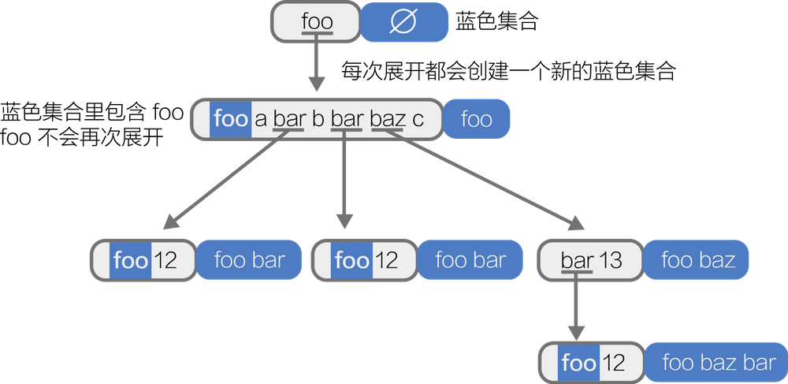
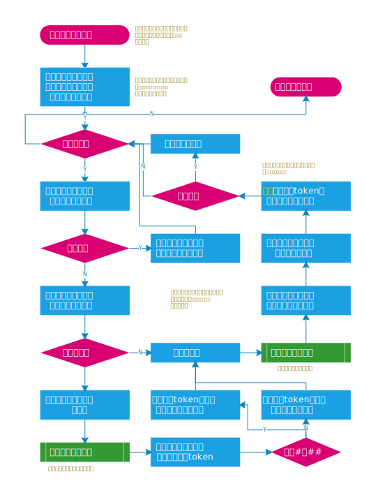

## Linux Macro

### 基本知识

#### 宏的定义

```
A macro is a fragment of code which has been given a name. Whenever the name is used, it is replaced by the contents of the macro. There are two kinds of macros. They differ mostly in what they look like when they are used. Object-like macros resemble data objects when used, function-like macros resemble function calls.																										gun-gcc
```

​	总的来说，宏是一种特定的语法格式，用以完成gcc预处理阶段的文本替换。

##### object-macro

```
#define N 42

#define 宏名 替换列表 换行符
```

​	采用如上定义形式的宏称为object-macro

##### function-macro

```
#define ADD(x, y) x + y

#define 宏名 ([标识符列表]) 替换列表 换行符
```

##### token

​	token 在编译原理中只语法符号或者语法标记。可以看做是用来标记某个语法成分的抽象，一般由 token 名和一些属性组成。

​	比如说数字 1 可以认为是一个整数常量，token 名为`integer-constant`，且其属性值为 1。

​	对于宏来说共有这么几种：

- identifier 标识符，这个和 C 语言的标识符定义一致
- pp-number 预处理数字，其实和 C 语言中的数字也是类似的，区别在于多了一种情况，就是某种数字开头后跟非数字标识符的情况，比如 12aa，1.2bc 这种
- character-constant 字符常量，就是`'a'`, `'\n'` 等
- string-literal 字符串字面量 `"hello world"`
- punctuator 标点符号 `+ - -> >>` 等
- 除了上边所列情况以外的所有非空白字符

​	在宏中token被分为六类，一个字符串按照上述六类进行token化。

```
#define foo(x) x ## 12
{"foo","(","x",")","space","x","space","##","space","12"}
参考：https://nju-projectn.github.io/ics-pa-gitbook/ics2022/1.5.html
好吧，我没学过编译原理，或许是上述这样？不对的话请指正。
```

##### 宏操作符 #

​	#var 的作用是将var这个token转为字符串。

```
#define WARN_IF(EXP) \
    if (EXP) \
    {\
        fprintf (stderr, "Warning: " #EXP "\n"); \
    }\
WARN_IF (x/* const char* */ == "0")
// ->
if (x == "0") { fprintf (stderr, "Warning: " "x == \"0\"" "\n"); }
```

1. ​	由于是将变量转为字符串所以只能在function-macro中使用
2. ​	如上，并不是简单的添加双引号，而是会自动添加转义字符
3. ​	由于参数会转化为 token 列表，所以前后的空白符都会被忽略，中间的空白符会被压缩为一个，注释会被忽略并变成一个空白符。

##### 宏操作符 ##

​	a##b会将两个token合并在一起。

```
#define GETTER(x, T) T get_ ## x() {return this->x;}
GETTER(foo， const int)
//->
const int get_foo() {return this->foo;}
```

##### __VA_ARGS__

​	va_args会替换...占位的所有标识符。

```
#define FOO(x, ...) __VA_ARGS__
FOO(1, (1, 2), (1,2,3))
-> (1, 2), (1,2,3)
```

##### 可变参数宏

在Linux kernel里面有如下定义：

```
#define COUNT_ARGS(X...) __COUNT_ARGS(, ##X, 12, 11, 10, 9, 8, 7, 6, 5, 4, 3, 2, 1, 0)
```

或者有人使用

```
#define printf(format, args...) \ 
    printk(KERN_ERR "BFS-fs: %s(): " format, __FUNCTION__, ## args)
```

​	这个`xxx...`代表着什么？

​	If your macro is complicated, you may want a more descriptive name for the variable argument than `__VA_ARGS__`. CPP permits this, as an extension. You may write an argument name immediately before the ‘...’; that name is used for the variable argument. The `eprintf` macro above could be written

​	意思就是如果变量参数比较复杂，允许使用`var_name...`的形式自定义`__VA_ARGS__`。

​	所以如下是等价的

```
#define eprintf(...) fprintf (stderr, __VA_ARGS__)
#define eprintf(args...) fprintf (stderr, args)
```

​	为了保证格式化的正确性，可以如下定义。

```
#define eprintf(format, ...) fprintf (stderr, format , __VA_ARGS__)
#define eprintf(format, args...) fprintf (stderr, format ,args)
```

​	这就强制性的要求第一个参数是格式化字符串。但是这样会有一个问题，就是可变参数最少有一个。不然，如下。

```
eprintf(format, args...) fprintf (stderr, format ,args)

eprintf("hello"); ->
fprintf (stderr, "hello" ,);
这样编译器就会报错。（但是在cpp20已经修复，但是有很多远古代码还是老样子）
在cpp20中引入了__VA_OPT__函数宏，但是这不是这次讨论的重点。有兴趣可以参考文末链接
```

​	**如何解决前`,`的问题？**

​	如果传入的参数为空，##var_name可以删除前`,`。

参考链接：

https://gcc.gnu.org/onlinedocs/cpp/Variadic-Macros.html

##### object-macro展开

​	在替换列表中出现的宏会被展开，这一过程将递归的进行下去，且是深度优先的。有如下规则。

1. 更进一步的，在展开的过程中，任何嵌套的展开过程中出现了被展开宏，该被展开宏也不会被展开。
2. 递归进行，深度优先

​	每次展开的时候会创建一个「蓝色集合」（一般将标记过的 token 称作 painted-blue），这个蓝色集合由本次展开的父级展开的蓝色集合加上当前展开的宏组成。

例如：

```
#define foo foo a bar b bar baz c
#define bar foo 12
#define baz bar 13
foo
```



定义三个宏 `foo`, `bar`, `baz`，展开过程如上图所示：

展开步骤为：

1. 对于宏 `foo` 的展开，一开始蓝色集合是空集，没有禁止展开的宏名。所以我们对 `foo` 进行展开。展开结果是 `foo a bar b bar baz c`，每次展开都会创建一个新的蓝色集合，该蓝色集合继承自父级的蓝色集合并添加本次展开的宏名。于是新的蓝色集合就是`空集`+`foo`。
2. 逐个 token 向后检查，此时蓝色集合为`{foo}`，所以第一个 `foo` 不展开。`a`不是一个宏，放着不管就行。`bar`不在蓝色集合里，展开为`foo 12`。展开的同时创建新的蓝色集合`{foo, bar}`。
3. 对 `bar` 展开的结果继续展开。此时的蓝色集合为`{foo, bar}`，`foo` 在集合内，不展开。`12`保持不变。到此 `bar`完全展开，回退至上一层。注意，展开的顺序是，当一个宏完全展开后，才会去展开下一个宏，这一点很重要。
4. `b` 不变。处理`bar`。注意，每一层展开的蓝色集合是不变的，和子展开无关。此时蓝色集合为`{foo}`。而不是`{foo bar}`。所以 `bar` 可以继续展开。展开过程和上一个 `bar` 一致，略去。
5. 处理`baz`。`baz` 不在蓝色集合里，展开为`bar 13` 创建蓝色集合`{foo baz}`。
6. 展开`bar`。注意，此处蓝色集合中并没有 `bar`，所以`bar`可以继续展开。因为蓝色集合只继承自己的父级，和其他的无关。展开过程与之前的 bar 展开过程一致，略去。但需注意和之前不同的是，展开后蓝色集合变为`{foo, baz, bar}`如果 `bar` 中有`baz`，则 `baz`不会继续展开。

例子与图片来自：

https://feng.zone

##### function-macro展开

**展开规则**

1. identifier-list 也就是参数列表里的参数会被完全展开。但如果该参数在替换列表中被 `#` 或 `##` 所调用，那么该参数不展开。
2. 使用展开后的结果替换替换列表中的相关内容。
3. 执行 `#` 和 `##` 的结果，并替换相关内容。
4. 将得到的新的替换列表重新扫描找到可替换的宏名并展开。
5. 在整个过程中遵循上一节中提到的关于自指的规则。约束参数列表的起始蓝色集合与约束宏名的起始蓝色集合一致。

**两个特性**

1. 如果一个 func-like 的宏的宏名后边没有参数列表（括号和 identifier-list）那么这个宏名将不被视作一个宏。 #define func() xxxx
2. 每次展开结束以后会向后看一个 token 是否能够与上次展开的结果形成一个 func-like 的宏。如果有就展开这个新形成的宏。

例子如下：[链接](https://feng.zone/2017/05/20/%E5%AE%8F%E5%AE%9A%E4%B9%89%E9%BB%91%E9%AD%94%E6%B3%95-%E4%BB%8E%E5%85%A5%E9%97%A8%E5%88%B0%E5%A5%87%E6%8A%80%E6%B7%AB%E5%B7%A7-3/)

如下是关键：1.参数先展开。2. 替换后重扫描。3. 蓝色集合中不展开。4. `#`, `##` 不展开。 5. 最后的括号要检查。

#### 宏展开存在的问题

##### 操作符优先级

```
#define MIN(a,b) a<b?a:b

MIN(1,2) 正常运行
3*MIN(1,2)->
3*1<2?1:2->
2
```

​	解决方案：给每个参数和整体都加上括号

##### 拷贝副作用

​	宏的本质是替换。这就引入一个问题，每一个参数都会在字面上被拷贝一份，并替换到相应的位置。这会导致有副作用的函数被调用多次。

```
例如有个函数每次被调用都会自动加一
static count=0;
int count(){
	count++;
}

#define MIN(a,b) a<b?a:b
如果count数目小于10次就打印
printf("%d ",MIN(count(),10));
因为MIN展开后会是如下情况
count()<10?count():10 count()调用两次。
```

​	所以如果宏中涉及到外部全局变量的操作需要定义局部变量进行操作：

```
#define MIN(X, Y) ({  \
    typeof(X) X_ = (X); \ //定义局部变量X_
    typeof(Y) Y_ = (Y); \ //定义局部变量Y_
    ((X_ < Y_) ? (X_) : (Y_)); \ // ({}) GUN扩展将最后一个语句的值作为返回值。
})
```

​	这样做可能会出现变量名称冲突。

##### 吞分号

​	一般使用function-macro的时候，当作一个函数来使用，最后会加上分号。例如

```
MIN(1,2);
```

​	但是如果有一些复杂的宏。

```
#define SKIP_SPACES(p, limit)  \
{ char *lim = (limit);         \
  while (p < lim) {            \
    if (*p++ != ' ') {         \
      p--; break; }\
    }\
}\
```

​	如果这样使用

```
if(cond)
    SKIP_SPACE(p, limit);
else
    //something
    
    
if(cond)
{
    char *lim = (limit);         
    while (p < lim) {            
        if (*p++ != ' ') {         
          p--;
          break;
        }
    }
};  /* 这里破坏了if语句的完整性 */
else
    // something
```

​	所以为了解决分号的问题，都使用do-while进行包装一层。

```
#define SKIP_SPACES(p, limit)  \
do{ char *lim = (limit);         \
  while (p < lim) {            \
    if (*p++ != ' ') {         \
      p--; break; }\
    }\
}while(0)
```

​	编译器会自动将一层do while优化掉。不需要担心。

##### 自指

```
#define FOO_ 0
#define FOO_1 1
#define CAT(x, y) x ## y
```

​	上述宏，因为调用了##所以不会展开而是直接拼接。

```
CAT(FOO_, 1)
-> FOO_1
-> 1
```

​	但是我们希望先展开，在拼接要如何操作？

```
#define FOO_ 0
#define FOO_1 1
#define PRIMITIVE_CAT(x, y) x ## y
#define CAT(x, y) PRIMITIVE_CAT(x, y)
CAT(FOO_, 1)
-> PRIMITIVE_CAT(0, 1)
-> 01
```



上述参考链接：

https://gaomf.cn/2017/10/06/C_Macro/

[宏定义黑魔法-从入门到奇技淫巧 (1) —— 基本概念](https://feng.zone/2017/05/17/宏定义黑魔法-从入门到奇技淫巧-1/)
[宏定义黑魔法-从入门到奇技淫巧 (2) —— object-like宏的展开](https://feng.zone/2017/05/18/宏定义黑魔法-从入门到奇技淫巧-2/)
[宏定义黑魔法-从入门到奇技淫巧 (3) —— function-like宏的展开](https://feng.zone/2017/05/20/宏定义黑魔法-从入门到奇技淫巧-3/)
[宏定义黑魔法-从入门到奇技淫巧 (4) —— 一些宏的高级用法](https://feng.zone/2017/05/21/宏定义黑魔法-从入门到奇技淫巧-4/)
[宏定义黑魔法-从入门到奇技淫巧 (5) —— 图灵完备](https://feng.zone/2017/05/21/宏定义黑魔法-从入门到奇技淫巧-5/)
[宏定义黑魔法-从入门到奇技淫巧 (6) —— 宏的一些坑](https://feng.zone/2017/05/28/宏定义黑魔法-从入门到奇技淫巧-6/)


### LInux 宏

#### [compiler.h](https://elixir.bootlin.com/linux/latest/source/include/linux/compiler.h)

##### 常量表达式

常量表达式在编译时而不是运行时进行求值，并且可以在任何可以使用常量的地方使用。常量表达式的求值结果必须是该类型可表示值范围内的常量。常量表达式的操作数可以是整数常量、字符常量、浮点常量、枚举常量、类型转换、**`sizeof`**表达式和其他常量表达式。

##### __must_be_array

```
/* &a[0] degrades to a pointer: a different type from an array */
#define __must_be_array(a)	BUILD_BUG_ON_ZERO(__same_type((a), &(a)[0]))
```

​	这个宏判断，a是否与&(a)[0]是否具有相同的数据类型，并产生build bug。从而判断a是不是array。

##### __builtin_choose_expr

`__builtin_choose_expr` 是 GCC 提供的一个内建函数，允许在编译时根据一个常量表达式选择不同的代码路径。这在某些情况下比使用标准的三元运算符（`?:`）更为灵活和高效。

**语法**

```
c
复制代码
__builtin_choose_expr(const_exp, exp1, exp2)
```

- `const_exp`：一个编译时可确定的常量表达式。
- `exp1`：如果 `const_exp` 为真，则选择并返回 `exp1`。
- `exp2`：如果 `const_exp` 为假，则选择并返回 `exp2`。

```
判断一个x是不是一个常量表达式

#define __is_constexpr(x) \
	(sizeof(int) == sizeof(*(8 ? ((void *)((long)(x) * 0l)) : (int *)8)))
```

> 值为 0 的整型常量表达式，或者转换为**void \***类型的表达式，称为*空指针常量*

​	如果x是一个常量表达式，那么任何常量表达式与0（0L不是01）相乘，都是0，然后`((void *)((long)(x) * 0l))`就是一个空指针常量。如果不是常量表达式，那么上述部分不为空指针常量。

​	ok，三元表达式还有一个特点。

> [...] if one operand is a null pointer constant, the result has the type of the other operand; otherwise, one operand is a pointer to **void** or a qualified version of **void**, in which case the result type is a pointer to an appropriately qualified version of **void**.

​	当操作数2与操作数3其中有一个是空指针常量的时候返回另一个。

```
printf("%ld %ld \n",sizeof(*(8 ? ((void *)(1)) : (int *)8)),sizeof(*(8 ? ((void *)(0)) : (int *)8)));
```

​	可以自己试一下这个特性。

​	所以根据是否为常量表达式会出现如下两种情况。

```
sizeof(int) == sizeof(*((int *) (NULL))) // if `x` was an integer constant expression
sizeof(int) == sizeof(*((void *)(....))) // otherwise
```

​	按照[GNU C 扩展](https://gcc.gnu.org/onlinedocs/gcc/Pointer-Arith.html)，`sizeof(void) == 1`。因此，如果`x`是*整型常量表达式*，则该宏的结果为`1`；否则`0`。

详细解释：https://stackoverflow.com/questions/49481217/linux-kernels-is-constexpr-macro

##### ____builtin_expect__

```
long __builtin_expect(long exp, long c);
```

​	GCC的内建方法会判断 EXP == C 是否成立，成立则将if分支中的执行语句紧跟放在汇编跳转指令之后，否则将else分支中的执行语句紧跟汇编跳转指令之后。

​	这样cache在预取数据时就可以将分支后的执行语句放在cache中，提高cache的命中率。

##### likely/unlikely

```
/*
 * Using __builtin_constant_p(x) to ignore cases where the return
 * value is always the same.  This idea is taken from a similar patch
 * written by Daniel Walker.
 */
# ifndef likely
#  define likely(x)	(__branch_check__(x, 1, __builtin_constant_p(x)))
# endif
# ifndef unlikely
#  define unlikely(x)	(__branch_check__(x, 0, __builtin_constant_p(x)))
# endif
```

​	这是最新版本的宏定义，有些复杂。下面是古老版本的实现，原理都是一样的。

```
#define likely(x) __builtin_expect(!!(x), 1) 如果x==1则将优先执行if后面的，不成立则执行else后面的，那么写代码时判断概率大的放在if后面。
#define unlikely(x) __builtin_expect(!!(x), 0)同上相反。
```

​	为什么是`!!`，避免是非0，1值。

#### args.h

##### **COUNT_ARGS **

​	这个宏用以计算参数的个数。

```
/*
 * How do these macros work?
 *
 * In __COUNT_ARGS() _0 to _12 are just placeholders from the start
 * in order to make sure _n is positioned over the correct number
 * from 12 to 0 (depending on X, which is a variadic argument list).
 * They serve no purpose other than occupying a position. Since each
 * macro parameter must have a distinct identifier, those identifiers
 * are as good as any.
 *
 * In COUNT_ARGS() we use actual integers, so __COUNT_ARGS() returns
 * that as _n.
 */

/* This counts to 12. Any more, it will return 13th argument. */
#define __COUNT_ARGS(_0, _1, _2, _3, _4, _5, _6, _7, _8, _9, _10, _11, _12, _n, X...) _n
#define COUNT_ARGS(X...) __COUNT_ARGS(, ##X, 12, 11, 10, 9, 8, 7, 6, 5, 4, 3, 2, 1, 0)
```

​	如下分析如何工作。

```
#define __COUNT_ARGS(_0, _1, _2, _3, _4, _5, _6, _7, _8, _9, _10, _11, _12, _n, X...) _n

#define COUNT_ARGS(X...) __COUNT_ARGS(, ##X, 12, 11, 10, 9, 8, 7, 6, 5, 4, 3, 2, 1, 0)

关于 X... 参考上述可变参数宏

假设使用 COUNT_ARGS(a,b,c,d) ->

__COUNT_ARGS(, a,b,c,d, 12, 11, 10, 9, 8, 7, 6, 5, 4, 3, 2, 1, 0)
__COUNT_ARGS(_0, _1, _2, _3, _4, _5, _6, _7, _8, _9, _10, _11, _12, _n, X...) _n
a->_1 b->_2 c->_3 d->_4 12->_5 ... 5->_12 4->_n
所以会返回_n 也就是 4 相当于将对应数字挤出来
所以根据这个特性知道最多有12个参数，如果有超过12个参数，那么_n应该就是第13个参数的值。

如果传入的参数为空，##x将会删除前"," 那么##X的位置对应的_0
##x -> _0 12->_1 1->_12 0->_n也就是_n=0
```

##### CONCATENATE

​	此宏的作用是两个两个参数并继续允许展开。

```
/* Concatenate two parameters, but allow them to be expanded beforehand. */
#define __CONCAT(a, b) a ## b
#define CONCATENATE(a, b) __CONCAT(a, b)
```

​	请看linux kernel的strscpy函数

```
/**
 * strscpy - Copy a C-string into a sized buffer
 * @dst: Where to copy the string to
 * @src: Where to copy the string from
 * @...: Size of destination buffer (optional) 可选项 选择buffer的size
 *
 * Copy the source string @src, or as much of it as fits, into the
 * destination @dst buffer. The behavior is undefined if the string
 * buffers overlap. The destination @dst buffer is always NUL terminated,
 * unless it's zero-sized.
 *
 * The size argument @... is only required when @dst is not an array, or
 * when the copy needs to be smaller than sizeof(@dst).
 * 可选参数 当目的不是数组的时候 或者需要拷贝的字节数小于目的空间大小的时候可选。
 * Preferred to strncpy() since it always returns a valid string, and
 * doesn't unnecessarily force the tail of the destination buffer to be
 * zero padded. If padding is desired please use strscpy_pad().
 *
 * Returns the number of characters copied in @dst (not including the
 * trailing %NUL) or -E2BIG if @size is 0 or the copy from @src was
 * truncated.
 */
#define strscpy(dst, src, ...)	\
	CONCATENATE(__strscpy, COUNT_ARGS(__VA_ARGS__))(dst, src, __VA_ARGS__)

当...为空的时候。
COUNT_ARGS(__VA_ARGS__) 是 0
CONCATENATE(__strscpy,0)(dst ,src,__VA_ARGS__)
__strscpy0(dst ,src,__VA_ARGS__); 这个函数有如下定义
/*
 * The 2 argument style can only be used when dst is an array with a
 * known size.
 */
#define __strscpy0(dst, src, ...)	\

sized_strscpy(dst, src, sizeof(dst) + __must_be_array(dst))

当...不为空的时候，由注释可知，这个参数只能是一个，而且代表size
COUNT_ARGS(__VA_ARGS__) 是 1
CONCATENATE(__strscpy,1)(dst ,src,__VA_ARGS__)
__strscpy1(dst ,src,__VA_ARGS__); 这个函数有如下定义
#define __strscpy1(dst, src, size)	sized_strscpy(dst, src, size)

sized_strscpy(dst, src, size)

当optional不为空的时候很好理解，拷贝size大小即可。
但是当size为空的时候发生了什么？
上述文档上说，2个参数仅适用于dst是个array并且已知大小
__must_be_array(dst)确保dst是个数组
```

#### [typecheck.h](https://elixir.bootlin.com/linux/latest/source/include/linux/typecheck.h)

##### typecheck

```
/*
 * Check at compile time that something is of a particular type.
 * Always evaluates to 1 so you may use it easily in comparisons.
 */
#define typecheck(type,x) \
({	type __dummy; \
	typeof(x) __dummy2; \
	(void)(&__dummy == &__dummy2); \
	1; \
})
```

​	这个宏用于判断某个变量是否是某个类型。这里有两个点。

1. `({})` 是GUN的一个扩展，他总是返回最后一条语句的值，在本例中就是1
2. 因为这是个宏，在预编译阶段处理，在编译阶段，如果比较两个不同类型的指针会报warning，所以利用这个特点进行判断。

参考链接：https://blog.csdn.net/m0_47696151/article/details/118684985

##### typecheck_fn

```
#define typecheck_fn(type,function) \ #检查fun的返回值是不是type类型
({	typeof(type) __tmp = function; \ #如果类型不一样，强制赋值会报警告
	(void)__tmp; \#消除 _tmp unused警告
})
```

##### typecheck_pointer

```
#define typecheck_pointer(x) \ 检查x是不是一个指针
({	typeof(x) __dummy; \ #定义一个与x类型相同的_dummy 
	(void)sizeof(*__dummy); \ #如果__不是指针，那么尝试解引用就会报错 ，void消除未使用变量的警告
	1; \
})
```

##### 	**为什么要用sizeof？**

#### [minmax.h](https://elixir.bootlin.com/linux/latest/source/include/linux/minmax.h)

```
/*
 * min()/max()/clamp() macros must accomplish three things:
 * 这三个宏完成了三件事情
 * - Avoid multiple evaluations of the arguments (so side-effects like
 *   "x++" happen only once) when non-constant.
	如上述所言，采用重新变量的方式避免拷贝副作用
 * - Retain result as a constant expressions when called with only
 *   constant expressions (to avoid tripping VLA warnings in stack
 *   allocation usage).
	当仅使用常数表达式调用时，将结果保留为常数表达式（以避免在堆栈分配使用中触发VLA警告）。通过__is_constexpr宏来实现。
 * - Perform signed v unsigned type-checking (to generate compile
 *   errors instead of nasty runtime surprises).
 	执行有符号与无符号类型检查（以生成编译错误，而不是令人讨厌的运行时意外）。
 * - Unsigned char/short are always promoted to signed int and can be
 *   compared against signed or unsigned arguments.
 	无符号的char/Short始终升级为有符号int，并且可以与有符号或无符号参数进行比较
 * - Unsigned arguments can be compared against non-negative signed constants.
 	无符号参数可以与非负符号常数进行比较。
 * - Comparison of a signed argument against an unsigned constant fails
 *   even if the constant is below __INT_MAX__ and could be cast to int.
	即使该常数低于__INT_MAX__并且可以被转换为int，将有符号参数与无符号常数进行比较也会失败。
 */
```


##### min/max

```
/**
 * min - return minimum of two values of the same or compatible types
 * @x: first value
 * @y: second value
 */
#define min(x, y)	__careful_cmp(min, x, y)

#define __careful_cmp(op, x, y)					\
	__builtin_choose_expr(__is_constexpr((x) - (y)),	\
		__cmp(op, x, y),				\
		__cmp_once(op, x, y, __UNIQUE_ID(__x), __UNIQUE_ID(__y)))
		

#define __cmp_op_min <
#define __cmp_op_max >

因为是常量表达式，所以不同担心拷贝副作用，直接走简单路径即可
#define __cmp(op, x, y)	((x) __cmp_op_##op (y) ? (x) : (y))

不是常量表达式，必须使用变量的方式计算
#define __cmp_once(op, x, y, unique_x, unique_y) ({	\
	typeof(x) unique_x = (x);			\
	typeof(y) unique_y = (y);			\
	static_assert(__types_ok(x, y),			\
		#op "(" #x ", " #y ") signedness error, fix types or consider u" #op "() before " #op "_t()"); \
	__cmp(op, unique_x, unique_y); })
	
	
#define min_t(type, x, y)	__careful_cmp(min, (type)(x), (type)(y))
#define max_t(type, x, y)	__careful_cmp(max, (type)(x), (type)(y))
```

##### swap

```
/**
 * swap - swap values of @a and @b
 * @a: first value
 * @b: second value
 */
#define swap(a, b) \
	do { typeof(a) __tmp = (a); (a) = (b); (b) = __tmp; } while (0)
```

​	采用了do-while的形势解决吞分号的问题。然后正常使用临时变量交换。

##### in_range

​	判断val是否在 [start,start+len)内

```
static inline bool in_range64(u64 val, u64 start, u64 len)
{
	return (val - start) < len;
}

static inline bool in_range32(u32 val, u32 start, u32 len)
{
	return (val - start) < len;
}

#define in_range(val, start, len)					\
#如果三个数字小于等于32 则进入in_range32。否则进入in_range64。
	((sizeof(start) | sizeof(len) | sizeof(val)) <= sizeof(u32) ?	\
		in_range32(val, start, len) : in_range64(val, start, len))
```

##### clamp系列

```
 clamp -通过严格的类型检查返回固定在给定范围内的值
 此宏对@lo/@hi进行严格的类型检查，以确保它们属于与@val类型相同。查看不必要的指针比较。
#define clamp(val, lo, hi) __careful_clamp(val, lo, hi)

#define clamp_val(val, lo, hi) clamp_t(typeof(val), val, lo, hi)

返回以给定类型为单位的值
#define clamp_t(type, val, lo, hi) __careful_clamp((type)(val), (type)(lo), (type)(hi))

#define __careful_clamp(val, lo, hi) ({					\
	__builtin_choose_expr(__is_constexpr((val) - (lo) + (hi)),	\
	同样分为快速路径和慢速路径
		__clamp(val, lo, hi),					\
		__clamp_once(val, lo, hi, __UNIQUE_ID(__val),		\
			     __UNIQUE_ID(__lo), __UNIQUE_ID(__hi))); })

如果是常量表达式，直接比较
#define __clamp(val, lo, hi)	\
	((val) >= (hi) ? (hi) : ((val) <= (lo) ? (lo) : (val)))

#采用变量的形式，防止拷贝副作用
#检查值的范围，确保lo<=hi
#define __clamp_once(val, lo, hi, unique_val, unique_lo, unique_hi) ({		\
	typeof(val) unique_val = (val);						\
	typeof(lo) unique_lo = (lo);						\
	typeof(hi) unique_hi = (hi);						\
	static_assert(__builtin_choose_expr(__is_constexpr((lo) > (hi)), 	\
			(lo) <= (hi), true),					\
		"clamp() low limit " #lo " greater than high limit " #hi);	\
	static_assert(__types_ok(val, lo), "clamp() 'lo' signedness error");	\
	static_assert(__types_ok(val, hi), "clamp() 'hi' signedness error");	\
	__clamp(unique_val, unique_lo, unique_hi); })
```

​	从上述知道,linux kernel以_t结尾的宏，都会进行强制类型转换，在进行普通函数的运算。

#### [container_of.h](https://elixir.bootlin.com/linux/v6.9.6/source/include/linux/container_of.h)

##### offsetof

```
#define offsetof(type, member) (size_t)&(((type*)0)->member)
```

offsetof是返回结构体TYPE中MEMBER成员相对于结构体首地址的偏移量，以字节为单位。

##### container_of

```
/**
 * container_of - cast a member of a structure out to the containing 
 structure
根据一个结构体变量中的成员变量来获取整个结构体变量的指针。
 * @ptr:	the pointer to the member. 
 成员的结构 
 * @type:	the type of the container struct this is embedded in.
 成员的类型
 * @member:	the name of the member within the struct.
 结构中成员的名称
 * WARNING: any const qualifier of @ptr is lost.
 修饰ptr的const的限定符将会丢掉
 */
#define container_of(ptr, type, member) ({				\
	void *__mptr = (void *)(ptr);					\
	//将ptr转为void *
	static_assert(__same_type(*(ptr), ((type *)0)->member) ||	\
		      __same_type(*(ptr), void),			\
		      "pointer type mismatch in container_of()");	\
	// 判断*ptr是不是void类型的 和 *ptr与structure->member与*ptr是不是相同类型的
  // 对0强制类型转换，只要不访存即可。上述只是判断类型。
  // 上述offsetof也是参与0转为对应类型的技巧。
  ｜-----------------------------------------------------------｜
  ｜			offsetof	｜																					｜
  ｜								｜                                          ｜
  ｜-----------------------------------------------------------｜
  addr						ptr
  所以ptr-offsetof就是首地址。
	((type *)(__mptr - offsetof(type, member))); })
```

​	#define offsetof(type, member) (size_t)&(((type*)0)->member)

**为什么是*ptr？**

​	如果原本structure的成员不是指针类型例如int，那么传入的应该就是&int，那么接引用就是int。

​	如果原来structure的成员是指针类型例如int *，那么传入的就是int **，接引用就是int *。

```
#include <stdio.h>
#include <stdlib.h>

#define NAME_STR_LEN  32

#define offsetof(type, member) (size_t)&(((type*)0)->member)

#define container_of(ptr, type, member) ({ \
        const typeof( ((type *)0)->member ) *__mptr = (ptr); \
        (type *)( (char *)__mptr - offsetof(type,member) );})

typedef struct student_info
{
    int  id;
    char name[NAME_STR_LEN];
    int  age;
}student_info;

int main()
{
    size_t off_set = 0;
    off_set = offsetof(student_info, id);
    printf("id offset: %u\n",off_set);
    off_set = offsetof(student_info, name);
    printf("name offset: %u\n",off_set);
    off_set = offsetof(student_info, age);
    printf("age offset: %u\n",off_set);
    student_info *stu = (student_info *)malloc(sizeof(student_info));
    stu->age = 10;
    student_info *ptr = container_of(&(stu->age), student_info, age);
    printf("age:%d\n", ptr->age);
    printf("stu address:%p\n", stu);
    printf("ptr address:%p\n", ptr);
    return 0;
}
```

```
id offset: 0
name offset: 4
age offset: 36
age:10
stu address:0x18c8420
ptr address:0x18c8420
```

参考资料：https://juniorprincewang.github.io/2018/11/20/Linux%E5%86%85%E6%A0%B8%E5%AE%8Foffsetof%E4%B8%8Econtainer-of/

##### container_of_const

```
/**
 * container_of_const - cast a member of a structure out to the containing
 *			structure and preserve the const-ness of the pointer
 * @ptr:		the pointer to the member
 * @type:		the type of the container struct this is embedded in.
 * @member:		the name of the member within the struct.
 */
#define container_of_const(ptr, type, member)				\
	_Generic(ptr,							\
		const typeof(*(ptr)) *: ((const type *)container_of(ptr, type, member)),\
		default: ((type *)container_of(ptr, type, member))	\
	)
```

​	与上述不加const的区别，此宏会放回const属性，如果原本的结构体变量拥有const，那么应该用这个宏。

##### typeof_member

```
#define typeof_member(T, m)	typeof(((T*)0)->m)
```

​	这个宏会返回一个类型，必须保证m是T的一个成员，此宏会返回m的类型。

#### [math.h](https://elixir.bootlin.com/linux/latest/source/include/linux/math.h)

##### abs

##### round_up

##### do-div

##### [stringify.h](https://elixir.bootlin.com/linux/v6.9.6/source/include/linux/stringify.h)

```
#define __stringify_1(x...)	#x
#define __stringify(x...)	__stringify_1(x)
```

由于`__stringify`中不涉及`#`,`##`，所以会先把x展开后在转为字符串。

##### [export.h](https://elixir.bootlin.com/linux/v6.9.6/source/include/linux/export.h)

##### EXPORT_SYMBOL

```
#define EXPORT_SYMBOL(sym)		_EXPORT_SYMBOL(sym, "")
#define EXPORT_SYMBOL_GPL(sym)		_EXPORT_SYMBOL(sym, "GPL")
#define EXPORT_SYMBOL_NS(sym, ns)	__EXPORT_SYMBOL(sym, "", __stringify(ns))
#define EXPORT_SYMBOL_NS_GPL(sym, ns)	__EXPORT_SYMBOL(sym, "GPL", __stringify(ns))
```

​	上述是`EXPORT_SYMBOL`及其变体，都直接或间接调用`__EXPORT_SYMBOL`，其中ns代表namespace，不是纳秒过期时间的意思。

```
#ifdef DEFAULT_SYMBOL_NAMESPACE
#define _EXPORT_SYMBOL(sym, license)	__EXPORT_SYMBOL(sym, license, __stringify(DEFAULT_SYMBOL_NAMESPACE))
#else
#define _EXPORT_SYMBOL(sym, license)	__EXPORT_SYMBOL(sym, license, "")
#endif
```

​	区别是，如果定义了`DEFAULT_SYMBOL_NAMESPACE`，直接使用`DEFAULT_SYMBOL_NAMESPACE`字符串，否者使用给定字符串。最终会调用到如下宏。

```
#define ___EXPORT_SYMBOL(sym, license, ns)		\
	.section ".export_symbol","a"		ASM_NL	\
	__export_symbol_##sym:			ASM_NL	\
		.asciz license			ASM_NL	\
		.asciz ns			ASM_NL	\
		__EXPORT_SYMBOL_REF(sym)	ASM_NL	\
	.previous
	
#ifdef CONFIG_64BIT
#define __EXPORT_SYMBOL_REF(sym)			\
	.balign 8				ASM_NL	\
	.quad sym
#else
#define __EXPORT_SYMBOL_REF(sym)			\
	.balign 4				ASM_NL	\
	.long sym
#endif

ASM_NL用以标记新行在一些工具链中，所以可以暂时忽略。
/* Some toolchains use other characters (e.g. '`') to mark new line in macro */
#ifndef ASM_NL
#define ASM_NL		 ;
#endif

假设是32bit
```

​	假设是32bit，那么最终得到如下代码。

```
#define ___EXPORT_SYMBOL(sym, license, ns)		\
	.section ".export_symbol","a"		ASM_NL	\
	__export_symbol_##sym:			ASM_NL	\
		.asciz license			ASM_NL	\
		.asciz ns			ASM_NL	\
		.balign 4				ASM_NL	\
		.long sym
		.previous
```

​	这段代码在名为`.export_symbol`的`section`定义了一个名为`__export_symbol_##sym`	的符号，有下面哪些属性。


#### [init.h](https://elixir.bootlin.com/linux/latest/source/include/linux/init.h)

##### __define_initcall

```
#define __define_initcall(fn, id) ___define_initcall(fn, id, .initcall##id)

#define __unique_initcall(fn, id, __sec, __iid)			\
	____define_initcall(fn,					\
		__initcall_stub(fn, __iid, id),			\
		__initcall_name(initcall, __iid, id),		\
		__initcall_section(__sec, __iid))

#define ___define_initcall(fn, id, __sec)			\
	__unique_initcall(fn, id, __sec, __initcall_id(fn))

#ifdef CONFIG_HAVE_ARCH_PREL32_RELOCATIONS
#define ____define_initcall(fn, __stub, __name, __sec)		\
	__define_initcall_stub(__stub, fn)			\
	asm(".section	\"" __sec "\", \"a\"		\n"	\
	    __stringify(__name) ":			\n"	\
	    ".long	" __stringify(__stub) " - .	\n"	\
	    ".previous					\n");	\
	static_assert(__same_type(initcall_t, &fn));
#else
#define ____define_initcall(fn, __unused, __name, __sec)	\
	static initcall_t __name __used 			\
		__attribute__((__section__(__sec))) = fn;
#endif

#define __initcall_id(fn)					\
	__PASTE(__KBUILD_MODNAME,				\
	__PASTE(__,						\
	__PASTE(__COUNTER__,					\
	__PASTE(_,						\
	__PASTE(__LINE__,					\
	__PASTE(_, fn))))))
```

与上述宏一样，调用许多辅助宏，最终会编译出来如下：

```
    __ADDRESSABLE(fun)
    asm(
    ".section	\""
    ".initcall6" 
    ".init" "\", \"a\"		\n" 
    "__initcall____KBUILD_MODNAME__0_49_fun6" ":\n" ".long	" 
    "fun" " - .	\n" 
    ".previous\n");
    
    static_assert(__same_type(initcall_t, &fun));;
```

意思就是将这个fun放到.init段，然后由外部调用。

##### xxx__install

```
#define early_initcall(fn)		__define_initcall(fn, early)
#define pure_initcall(fn)		__define_initcall(fn, 0)

#define core_initcall(fn)		__define_initcall(fn, 1)
#define core_initcall_sync(fn)		__define_initcall(fn, 1s)
#define postcore_initcall(fn)		__define_initcall(fn, 2)
#define postcore_initcall_sync(fn)	__define_initcall(fn, 2s)
#define arch_initcall(fn)		__define_initcall(fn, 3)
#define arch_initcall_sync(fn)		__define_initcall(fn, 3s)
#define subsys_initcall(fn)		__define_initcall(fn, 4)
#define subsys_initcall_sync(fn)	__define_initcall(fn, 4s)
#define fs_initcall(fn)			__define_initcall(fn, 5)
#define fs_initcall_sync(fn)		__define_initcall(fn, 5s)
#define rootfs_initcall(fn)		__define_initcall(fn, rootfs)
#define device_initcall(fn)		__define_initcall(fn, 6)
#define device_initcall_sync(fn)	__define_initcall(fn, 6s)
#define late_initcall(fn)		__define_initcall(fn, 7)
#define late_initcall_sync(fn)		__define_initcall(fn, 7s)

#define __initcall(fn) device_initcall(fn)

#define __exitcall(fn)						\
	static exitcall_t __exitcall_##fn __exit_call = fn

#define console_initcall(fn)	___define_initcall(fn, con, .con_initcall)
```

​	这里还有各式各样的xxx_install，具体调用过程请参考如下链接，有机会研究链接的过程在深入看一下。

https://blog.csdn.net/enlaihe/article/details/123904759

#### [module.h](https://elixir.bootlin.com/linux/latest/source/include/linux/module.h)

##### module_init

​	在驱动模块的加载方式由两种，一种是静态加载，一种是动态加载。

​	静态加载：静态编译链接进内核，在系统启动过程中进行初始化；`.o`文件最终放在内核文件中

​	动态加载：将驱动编译成可动态加载的module，通过insmod动态加载重定位到内核;`.ko`文件

```
静态加载方式，静态加载方式通过上述init.h中的方式编译到.init中
#ifndef MODULE

#define module_init(x)	__initcall(x);
#define module_exit(x)	__exitcall(x);

动态加载方式
#else /* MODULE */

/* Each module must use one module_init(). */
#define module_init(initfn)					\
	static inline initcall_t __maybe_unused __inittest(void)		\
	{ return initfn; }					\
	int init_module(void) __copy(initfn)			\
		__attribute__((alias(#initfn)));		\
	___ADDRESSABLE(init_module, __initdata);

/* This is only required if you want to be unloadable. */
#define module_exit(exitfn)					\
	static inline exitcall_t __maybe_unused __exittest(void)		\
	{ return exitfn; }					\
	void cleanup_module(void) __copy(exitfn)		\
		__attribute__((alias(#exitfn)));		\
	___ADDRESSABLE(cleanup_module, __exitdata);

#endif
```


##### 动态加载分析

​	动态模块的加载入口是`insmod`.

```
int insmod_main(int argc UNUSED_PARAM, char **argv)
{
...
	rc = bb_init_module(filename, parse_cmdline_module_options(argv, /*quote_spaces:*/ 0));
...
	return rc;
}

int FAST_FUNC bb_init_module(const char *filename, const char *options)
{
...
	init_module(image, image_size, options);
...
	return rc;
}

init_module是一个系统调用
include/uapi/asm-generic/unistd.h
#define __NR_init_module 105
__SYSCALL(__NR_init_module, sys_init_module)

struct module {
...
  /* Startup function. */
    int (*init)(void);
...
}

系统调用如下
SYSCALL_DEFINE3(init_module, void __user *, umod,
		unsigned long, len, const char __user *, uargs)
{
	int err;
	struct load_info info = { };

	err = may_init_module();
	if (err)
		return err;

	pr_debug("init_module: umod=%p, len=%lu, uargs=%p\n",
	       umod, len, uargs);

	err = copy_module_from_user(umod, len, &info);
	if (err) {
		mod_stat_inc(&failed_kreads);
		mod_stat_add_long(len, &invalid_kread_bytes);
		return err;
	}

	return load_module(&info, uargs, 0);
}

load_module
这个函数相当的长 参考：https://blog.csdn.net/zhoudengqing/article/details/130835513

最后会调用return do_init_module(mod);


static noinline int do_init_module(struct module *mod)
{
	int ret = 0;

	do_mod_ctors(mod);
	/* Start the module */
	/* 终于到这了 */
	if (mod->init != NULL)
		ret = do_one_initcall(mod->init);
	return ret;
}

int __init_or_module do_one_initcall(initcall_t fn)
{
	do_trace_initcall_start(fn);
	ret = fn();
	do_trace_initcall_finish(fn, ret);
}


动态加载方式会把驱动编译成一个elf文件，然后根据如下，module_init的fun会放置在对应段中，随后上述insmod会调用这个函数，其中过程很复杂。

#define module_init(initfn)					\
	static inline initcall_t __maybe_unused __inittest(void)		\
	{ return initfn; }					\
	int init_module(void) __copy(initfn)			\ 
	定义了一个函数 init_module，其实现为 initfn 的别名。__copy(initfn) 是个内部宏，用来处理函数属性。
		__attribute__((alias(#initfn)));		\
	___ADDRESSABLE(init_module, __initdata);

#define __initdata	__section(".init.data")

	首先将fn定义别名为init_module，然后将 init_module 标记为可寻址的，并将其放在 .init.data 段。___ADDRESSABLE 是一个宏，用于确保特定的符号在特定的数据段中。
```

​	我们编译出来一个ko文件，观察其结构。

```
qiu@qiu-RESCUER-R720-15IKBN:~/riscv/driver$ riscv64-linux-gnu-objdump -x -j .init.data ./ModuleName.ko 

./ModuleName.ko:     file format elf64-littleriscv
./ModuleName.ko
architecture: riscv:rv64, flags 0x00000011:
HAS_RELOC, HAS_SYMS
start address 0x0000000000000000

Sections:
Idx Name          Size      VMA               LMA               File off  Algn
  9 .init.data    00000008  0000000000000000  0000000000000000  000001d0  2**3
                  CONTENTS, ALLOC, LOAD, RELOC, DATA
SYMBOL TABLE:
0000000000000000 l    d  .init.data     0000000000000000 .init.data
0000000000000000 l     O .init.data     0000000000000008 __UNIQUE_ID___addressable_init_module253


RELOCATION RECORDS FOR [.init.data]:
OFFSET           TYPE              VALUE 
0000000000000000 R_RISCV_64        init_module
```

​	可以看到果然有一个`init_module`，在`insmod`的最后调用`do_one_initcall`中被调用。

##### 静态加载分析

```
#define module_init(x)	__initcall(x);
静态加载过程是将其定义成__initcall(x)，最终我们知道会变成如下形式
然后在每种编译器上的实现都不一样，例如最普遍的gcc

#define module_init(x)	__initcall(x);

#define __initcall(fn) device_initcall(fn)

#define device_initcall(fn)		__define_initcall(fn, 6)

#define __define_initcall(fn, id) ___define_initcall(fn, id, .initcall##id)

#define ____define_initcall(fn, __unused, __name, __sec)	\
	static initcall_t __name __used 			\
		__attribute__((__section__(__sec))) = fn;
会放到内核的.initcall6中，然后调用。
```

​	使用readelf打印section header并没有找到对应的段。

```
There are 31 section headers, starting at offset 0x12ca558:

Section Headers:
  [Nr] Name              Type             Address           Offset
       Size              EntSize          Flags  Link  Info  Align
  [ 0]                   NULL             0000000000000000  00000000
       0000000000000000  0000000000000000           0     0     0
  [ 1] .head.text        PROGBITS         ffffffff80000000  00001000
       0000000000001e9c  0000000000000000  AX       0     0     4096
  [ 2] .text             PROGBITS         ffffffff80002000  00003000
       0000000000936dd8  0000000000000000  AX       0     0     4
  [ 3] .init.text        PROGBITS         ffffffff80a00000  00a00000
       0000000000047678  0000000000000000  AX       0     0     2097152
  [ 4] .exit.text        PROGBITS         ffffffff80a47678  00a47678
       00000000000025bc  0000000000000000  AX       0     0     2
  [ 5] .init.data        PROGBITS         ffffffff80c00000  00a4a000
       000000000001d840  0000000000000000  WA       0     0     4096
  [ 6] .init.pi          PROGBITS         ffffffff80c1d840  00a67840
       00000000000024a3  0000000000000000 WAX       0     0     8
  [ 7] .init.bss         NOBITS           ffffffff80c1fce8  00a69ce3
       0000000000000048  0000000000000000  WA       0     0     8
  [ 8] .data..percpu     PROGBITS         ffffffff80c20000  00a6a000
       000000000000c0f8  0000000000000000  WA       0     0     64
  [ 9] .alternative      PROGBITS         ffffffff80c2c0f8  00a760f8
       00000000000014f0  0000000000000000   A       0     0     1
  [10] .rodata           PROGBITS         ffffffff80e00000  00a78000
       000000000028c378  0000000000000000  WA       0     0     256
  [11] .pci_fixup        PROGBITS         ffffffff8108c378  00d04378
       0000000000004020  0000000000000000   A       0     0     8
  [12] __ksymtab         PROGBITS         ffffffff81090398  00d08398
       000000000001d310  0000000000000000   A       0     0     8
  [13] __ksymtab_gpl     PROGBITS         ffffffff810ad6a8  00d256a8
       00000000000240f0  0000000000000000   A       0     0     8
  [14] __ksymtab_strings PROGBITS         ffffffff810d1798  00d49798
       0000000000034f73  0000000000000001 AMS       0     0     1
  [15] __param           PROGBITS         ffffffff81106710  00d7e710
       00000000000032a0  0000000000000000   A       0     0     8
  [16] __modver          PROGBITS         ffffffff811099b0  00d819b0
       0000000000000240  0000000000000000  WA       0     0     8
  [17] __ex_table        PROGBITS         ffffffff81109bf0  00d81bf0
       0000000000002004  0000000000000000   A       0     0     4
  [18] .notes            NOTE             ffffffff8110bbf4  00d83bf4
       0000000000000054  0000000000000000   A       0     0     4
  [19] .srodata          PROGBITS         ffffffff81200000  00d84000
       0000000000001488  0000000000000000   A       0     0     8
  [20] .data             PROGBITS         ffffffff81400000  00d86000
       00000000000ecec0  0000000000000000  WA       0     0     4096
  [21] __bug_table       PROGBITS         ffffffff814ecec0  00e72ec0
       000000000001a1f0  0000000000000000  WA       0     0     1
  [22] .sdata            PROGBITS         ffffffff815070b0  00e8d0b0
       00000000000016c4  0000000000000000  WA       0     0     8
  [23] .got              PROGBITS         ffffffff81508778  00e8e778
       0000000000000020  0000000000000008  WA       0     0     8
  [24] .pecoff_edata_pad PROGBITS         ffffffff81508798  00e8e798
       0000000000000068  0000000000000000  WA       0     0     1
  [25] .sbss             NOBITS           ffffffff81509000  00e8e800
       00000000000026fd  0000000000000000  WA       0     0     64
  [26] .bss              NOBITS           ffffffff8150c000  00e8e800
       0000000000079ff0  0000000000000000  WA       0     0     4096
  [27] .comment          PROGBITS         0000000000000000  00e8e800
       0000000000000029  0000000000000001  MS       0     0     1
  [28] .symtab           SYMTAB           0000000000000000  00e8e830
       00000000002492d0  0000000000000018          29   75932     8
  [29] .strtab           STRTAB           0000000000000000  010d7b00
       00000000001f2939  0000000000000000           0     0     1
  [30] .shstrtab         STRTAB           0000000000000000  012ca439
       000000000000011b  0000000000000000           0     0     1
Key to Flags:
  W (write), A (alloc), X (execute), M (merge), S (strings), I (info),
  L (link order), O (extra OS processing required), G (group), T (TLS),
  C (compressed), x (unknown), o (OS specific), E (exclude),
  p (processor specific)
```

​	是因为ld脚本做了一些东西，有兴趣请看参考链接。ld部分暂时我还不熟悉。

​	函数调用过程如下：

```
start_kernel  
	-> rest_init();
		-> kernel_thread(kernel_init, NULL, CLONE_FS);
			-> kernel_init()
				-> kernel_init_freeable();
					-> do_basic_setup();
						-> do_initcalls();  
```

参考链接：

https://www.cnblogs.com/downey-blog/p/10486653.html

https://www.cnblogs.com/schips/p/linux_kernel_initcall_and_module_init.html

#### platform_device.h

##### module_platform_driver

```
#define module_platform_driver(__platform_driver) \
	module_driver(__platform_driver, platform_driver_register, \
			platform_driver_unregister)
			
			
#define platform_driver_register(drv) \
	__platform_driver_register(drv, THIS_MODULE)

extern int __platform_driver_register(struct platform_driver *,
					struct module *);

int __platform_driver_register(struct platform_driver *drv,
				struct module *owner)
{
	drv->driver.owner = owner;
	drv->driver.bus = &platform_bus_type;

	return driver_register(&drv->driver);
}
```

```
#define module_driver(__driver, __register, __unregister, ...) \
static int __init __driver##_init(void) \
{ \
	return __register(&(__driver) , ##__VA_ARGS__); \
} \
module_init(__driver##_init); \
static void __exit __driver##_exit(void) \
{ \
	__unregister(&(__driver) , ##__VA_ARGS__); \
} \
module_exit(__driver##_exit);
```

​	那么复杂的宏如何展开？

​	首先`module_platform_driver`没有`#`，`##`，所以先展开这个，而不是`platform_driver_register`等。

```
#define module_platform_driver(__platform_driver) \
	module_driver(__platform_driver, platform_driver_register, \
			platform_driver_unregister)

#define module_driver(__driver, __register, __unregister, ...) \
static int __init __driver##_init(void) \
{ \
	return __register(&(__driver) , ##__VA_ARGS__); \
} \
module_init(__driver##_init); \
static void __exit __driver##_exit(void) \
{ \
	__unregister(&(__driver) , ##__VA_ARGS__); \
} \
module_exit(__driver##_exit);
```

​	变成如下

```
static int __init __platform_driver_init(void) \
{ \
	return platform_driver_register(&(__platform_driver)); \
} \
module_init(__platform_driver_init); \
static void __exit __platform_driver_exit(void) \
{ \
	platform_driver_unregister(&(__platform_driver)); \
} \
module_exit(__platform_driver_exit);
```

​	随后调用

```
#define platform_driver_register(drv) \
	__platform_driver_register(drv, THIS_MODULE)

extern int __platform_driver_register(struct platform_driver *,
					struct module *);

int __platform_driver_register(struct platform_driver *drv,
				struct module *owner)
{
	drv->driver.owner = owner;
	drv->driver.bus = &platform_bus_type;

	return driver_register(&drv->driver);
}
```

​	总结：此helper宏，定义了一个函数，这个函数调用`__platform_driver_register`去注册设备，并将其作为`module_init/exit`函数的入口。

​	上述搞那么多还是传统驱动注册那一套，那么`probe`函数如何被调用的？

​	我们知道到`module_init`的时候最终是`driver_register`,在此完成了`probe`.从传入的参数来看，是device_driver。可以知道在register的过程中完成了match.

```
int driver_register(struct device_driver *drv)
{
	int ret;
	struct device_driver *other;

	if (!bus_is_registered(drv->bus)) {
		pr_err("Driver '%s' was unable to register with bus_type '%s' because the bus was not initialized.\n",
			   drv->name, drv->bus->name);
		return -EINVAL;
	}

	if ((drv->bus->probe && drv->probe) ||
	    (drv->bus->remove && drv->remove) ||
	    (drv->bus->shutdown && drv->shutdown))
		pr_warn("Driver '%s' needs updating - please use "
			"bus_type methods\n", drv->name);

	other = driver_find(drv->name, drv->bus);
	if (other) {
		pr_err("Error: Driver '%s' is already registered, "
			"aborting...\n", drv->name);
		return -EBUSY;
	}

	ret = bus_add_driver(drv);
	if (ret)
		return ret;
	ret = driver_add_groups(drv, drv->groups);
	if (ret) {
		bus_remove_driver(drv);
		return ret;
	}
	kobject_uevent(&drv->p->kobj, KOBJ_ADD);
	deferred_probe_extend_timeout();

	return ret;
}
EXPORT_SYMBOL_GPL(driver_register);
```
