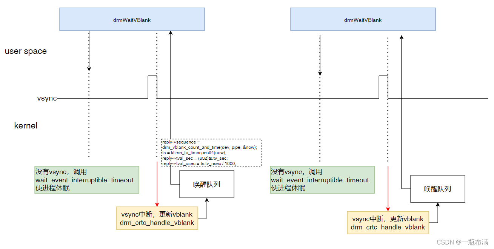

## irq

这个文件提供了三个函数

```
int drm_legacy_irq_control(struct drm_device *dev, void *data,
			   struct drm_file *file_priv)
int drm_irq_uninstall(struct drm_device *dev)
int drm_irq_install(struct drm_device *dev, int irq)
```

这三个函数辅助进行中断的request，但在rockchip中没有用到。rockchip在vop_bind的时候使用了devm的irq_request。

```
	ret = devm_request_irq(dev, vop2->irq, vop2_isr, IRQF_SHARED, dev_name(dev), vop2);

vop: vop@fe040000 {
		compatible = "rockchip,rk3568-vop";
		reg = <0x0 0xfe040000 0x0 0x3000>, <0x0 0xfe044000 0x0 0x1000>;
		reg-names = "regs", "gamma_lut";
		rockchip,grf = <&grf>;
		interrupts = <GIC_SPI 148 IRQ_TYPE_LEVEL_HIGH>;

```

## vblank

vblank处理机制，也就是下述文件提供的功能。

```
kernel/drivers/gpu/drm/drm_vblank.c
```

### 对于驱动，以rk为例

```
static int vop2_bind(struct device *dev, struct device *master, void *data)
{
...
	ret = devm_request_irq(dev, vop2->irq, vop2_isr, IRQF_SHARED, dev_name(dev), vop2);
...
}
```

首先，在bind的时候注册了这个中断处理函数。绑定了如下中断服务程序。

```
static irqreturn_t vop2_isr(int irq, void *data)
{
...
		if (active_irqs & FS_FIELD_INTR) {
			vop2_wb_handler(vp);
			if (likely(!vp->skip_vsync) || (vp->layer_sel_update == false)) {
				drm_crtc_handle_vblank(crtc);
				vop2_handle_vblank(vop2, crtc);
			}
			active_irqs &= ~FS_FIELD_INTR;
			ret = IRQ_HANDLED;
		}
...
}
```

```
#define CVBS_PAL_VDISPLAY		288

/* interrupt define */
#define DSP_HOLD_VALID_INTR		BIT(0)
#define FS_INTR				BIT(1)
#define LINE_FLAG_INTR			BIT(2)
#define BUS_ERROR_INTR			BIT(3)
#define FS_NEW_INTR			BIT(4)
#define ADDR_SAME_INTR			BIT(5)
#define LINE_FLAG1_INTR			BIT(6)
#define WIN0_EMPTY_INTR			BIT(7)
#define WIN1_EMPTY_INTR			BIT(8)
#define WIN2_EMPTY_INTR			BIT(9)
#define WIN3_EMPTY_INTR			BIT(10)
#define HWC_EMPTY_INTR			BIT(11)
#define POST_BUF_EMPTY_INTR		BIT(12)
#define PWM_GEN_INTR			BIT(13)
#define DMA_FINISH_INTR			BIT(14)
#define FS_FIELD_INTR			BIT(15)
#define FE_INTR				BIT(16)
#define WB_UV_FIFO_FULL_INTR		BIT(17)
#define WB_YRGB_FIFO_FULL_INTR		BIT(18)
#define WB_COMPLETE_INTR		BIT(19)
```

这个中断服务程序处理多种类型的中断其中有一项，如果是FS_FIELD_INTR，这几个宏没看明白啥意思。但是应该都是中断的某种类型。而后我们看到了这两个处理函数。

```
				drm_crtc_handle_vblank(crtc);
				vop2_handle_vblank(vop2, crtc);
```

其中`drm_crtc_handle_vblank`是关键，这个是vblank框架处理事件的依据，只有当这个中断被触发时后续的事件才能被处理。

```
 * Drivers must initialize the vertical blanking handling core with a call to
 * drm_vblank_init(). Minimally, a driver needs to implement
 * &drm_crtc_funcs.enable_vblank and &drm_crtc_funcs.disable_vblank plus call
 * drm_crtc_handle_vblank() in it's vblank interrupt handler for working vblank
 * support.
```

从开头文档注释中看，驱动最起码是使用`drm_vblank_init`对vblank进行初始化，并提供`enable`与`disable`回调，并且提供`drm_crtc_handle_vblank`的中断调用，但是不一定是硬件的触发。

这个函数的功能是 更新vblank计数器并发送任何可能挂起的信号。其中可以唤醒休眠的进程，wake_up(queue).

##### vop2_handle_vblank

```
static void vop2_handle_vblank(struct vop2 *vop2, struct drm_crtc *crtc)
{
	struct drm_device *drm = vop2->drm_dev;
	struct vop2_video_port *vp = to_vop2_video_port(crtc);
	unsigned long flags;

	spin_lock_irqsave(&drm->event_lock, flags);
	if (vp->event) {
		drm_crtc_send_vblank_event(crtc, vp->event);
		drm_crtc_vblank_put(crtc);
		vp->event = NULL;
	}
	spin_unlock_irqrestore(&drm->event_lock, flags);

	if (test_and_clear_bit(VOP_PENDING_FB_UNREF, &vp->pending))
		drm_flip_work_commit(&vp->fb_unref_work, system_unbound_wq);
}
```

可以看到在`drm_crtc_handle_vblank`之后是一个`vop2`的`handler vblank`函数，这个函数的意思是将处理好的`event`发送给`file`，然后`commit flip`事件。但是在`drm_crtc_handle_vblank`中已经发送了，不知道能不能去掉这一步。

```
int drm_wait_vblank_ioctl(struct drm_device *dev, void *data,
			  struct drm_file *file_priv)
{
... check flags

仅保留如下声明的四个flag
/*

#define _DRM_VBLANK_FLAGS_MASK (_DRM_VBLANK_EVENT | _DRM_VBLANK_SIGNAL | \
				_DRM_VBLANK_SECONDARY | _DRM_VBLANK_NEXTONMISS)

*/
	flags = vblwait->request.type & _DRM_VBLANK_FLAGS_MASK;

找到pipe check feature

	/* If the counter is currently enabled and accurate, short-circuit
	 * queries to return the cached timestamp of the last vblank.
	 */
	 /* 快速返回条件：查询模式

  如果设备配置了 vblank_disable_immediate（意味着 vblank 中断总是立即可用）且请求为查询操作（而非等待），并且当前 vblank 已启用，则直接调用 drm_wait_vblank_reply() 返回上次 vblank 的时间戳和计数，避免额外的等待。
  */
	if (dev->vblank_disable_immediate &&
	    drm_wait_vblank_is_query(vblwait) &&
	    READ_ONCE(vblank->enabled)) {
	    /* 直接构造reply，并返回 */
		drm_wait_vblank_reply(dev, pipe, &vblwait->reply);
		return 0;
	}
	/* 添加引用计数 */
	ret = drm_vblank_get(dev, pipe);
	if (ret) {
		DRM_DEBUG("crtc %d failed to acquire vblank counter, %d\n", pipe, ret);
		return ret;
	}
	seq = drm_vblank_count(dev, pipe);
	
	/* 
	相对模式（_DRM_VBLANK_RELATIVE）：要求等待相对于当前序列号的一个偏移量，将偏移值加到当前序列得到目标序列号。
	绝对模式（_DRM_VBLANK_ABSOLUTE）：要求等待一个具体的序列号，通过扩展 32 位值到 64 位来与当前计数对齐。 
	*/
	switch (vblwait->request.type & _DRM_VBLANK_TYPES_MASK) {
	case _DRM_VBLANK_RELATIVE:
		req_seq = seq + vblwait->request.sequence;
		vblwait->request.sequence = req_seq;
		vblwait->request.type &= ~_DRM_VBLANK_RELATIVE;
		break;
	case _DRM_VBLANK_ABSOLUTE:
		req_seq = widen_32_to_64(vblwait->request.sequence, seq);
		break;
	default:
		ret = -EINVAL;
		goto done;
	}
/*

如果设置了 _DRM_VBLANK_NEXTONMISS 标志，并且目标序列号已经过去，则将目标序列号设为当前序列号加 1，以确保等待的是下一次 vblank。

*/
	if ((flags & _DRM_VBLANK_NEXTONMISS) &&
	    vblank_passed(seq, req_seq)) {
		req_seq = seq + 1;
		vblwait->request.type &= ~_DRM_VBLANK_NEXTONMISS;
		vblwait->request.sequence = req_seq;
	}
/*
事件通知模式：
如果请求中包含 _DRM_VBLANK_EVENT 标志，则调用 drm_queue_vblank_event() 将等待的事件排入队列。

注意：在这种模式下，vblank_get 的引用不会在这里立即释放，而是由事件完成后异步调用 drm_vblank_put() 来释放，保证事件在等待期间不会丢失。

*/
	if (flags & _DRM_VBLANK_EVENT) {
		/* must hold on to the vblank ref until the event fires
		 * drm_vblank_put will be called asynchronously
		 */
		return drm_queue_vblank_event(dev, pipe, req_seq, vblwait, file_priv);
	}
/* 
同步等待模式：
如果当前序列号与目标序列号不一致，则通过 DRM_WAIT_ON() 宏在 vblank->queue 上等待，直到：

vblank 计数达到目标序列号（vblank_passed() 返回真），
或者 vblank 被禁用（!READ_ONCE(vblank->enabled)）。
超时时间设置为 3 秒。

*/
	if (req_seq != seq) {
		DRM_DEBUG("waiting on vblank count %llu, crtc %u\n",
			  req_seq, pipe);
		DRM_WAIT_ON(ret, vblank->queue, 3 * HZ,
			    vblank_passed(drm_vblank_count(dev, pipe),
					  req_seq) ||
			    !READ_ONCE(vblank->enabled));
	}

	if (ret != -EINTR) {
		drm_wait_vblank_reply(dev, pipe, &vblwait->reply);

		DRM_DEBUG("crtc %d returning %u to client\n",
			  pipe, vblwait->reply.sequence);
	} else {
		DRM_DEBUG("crtc %d vblank wait interrupted by signal\n", pipe);
	}

done:
	drm_vblank_put(dev, pipe);
	return ret;
}
```

基本流程如下所示。





### 使用ioctl+libdrm获得刷新率

```
#include <stdio.h>
#include <stdlib.h>
#include <stdint.h>
#include <unistd.h>
#include <string.h>
#include <errno.h>
#include <poll.h>
#include <sys/time.h>
#if HAVE_SYS_SELECT_H
#include <sys/select.h>
#endif

#include "xf86drm.h"
#include "xf86drmMode.h"

#include "util/common.h"
#include "util/kms.h"

#define CRTC_INDEX 1

extern char *optarg;
extern int optind, opterr, optopt;
static char optstr[] = "D:M";
drmVBlank vbl_share;

struct vbl_info{
	uint32_t sequence;
	unsigned int sec;
	unsigned int usec;
};

void build_vbl(drmVBlank *vbl,int crtc_index,int hope_seq,int is_event){
	memset(vbl,0,sizeof(drmVBlank));
	vbl->request.sequence=hope_seq;
	vbl->request.type=0;
	vbl->request.type |= crtc_index << DRM_VBLANK_HIGH_CRTC_SHIFT;
	vbl->request.type |= DRM_VBLANK_RELATIVE;
	if(is_event)
		vbl->request.type |= (DRM_VBLANK_NEXTONMISS | DRM_VBLANK_EVENT);
}

static void vblank_handler(int fd, unsigned int frame, unsigned int sec,
			   unsigned int usec, void *data)
{
	struct vbl_info *info=(struct vbl_info *)data;

	/* count one frame time */
	if(frame-info->sequence== 1){
		printf("Refresh rate: %.2f FPS\n", 1000000.0 /( (sec - info->sec) * 1000000 + (usec - info->usec)));
	}

	/* update info */
	info->sequence=frame;
	info->sec=sec;
	info->usec=usec;

	/* build a new event*/
	build_vbl(&vbl_share,CRTC_INDEX,1,1);
	vbl_share.request.signal=(unsigned long)(data);
	drmWaitVBlank(fd, &vbl_share);
}

static void usage(char *name)
{
	fprintf(stderr, "usage: %s [-DMs]\n", name);
	fprintf(stderr, "\n");
	fprintf(stderr, "options:\n");
	fprintf(stderr, "  -D DEVICE  open the given device\n");
	fprintf(stderr, "  -M MODULE  open the given module\n");
	exit(0);
}

int main(int argc, char **argv)
{
	const char *device = NULL, *module = NULL;
	int c, fd, ret;
	drmVBlank vbl;
	drmEventContext evctx;
	struct vbl_info *data=(struct vbl_info *)malloc(sizeof(struct vbl_info));
	memset(data,0,sizeof(struct vbl_info));

	opterr = 0;
	while ((c = getopt(argc, argv, optstr)) != -1) {
		switch (c) {
		case 'D':
			device = optarg;
			break;
		case 'M':
			module = optarg;
			break;
		default:
			usage(argv[0]);
			break;
		}
	}

	fd = util_open(device, module);
	if (fd < 0)
		return 1;

	build_vbl(&vbl,CRTC_INDEX,0,0);

	ret = drmWaitVBlank(fd, &vbl);
	if (ret != 0) {
		printf("drmWaitVBlank (relative) failed ret: %i\n", ret);
		return -1;
	}
	printf("starting count: %d\n", vbl.request.sequence);

	build_vbl(&vbl,CRTC_INDEX,1,1);
	vbl.request.signal=(unsigned long)(data);
	ret = drmWaitVBlank(fd, &vbl);
	if (ret != 0) {
		printf("drmWaitVBlank (relative, event) failed ret: %i\n", ret);
		return -1;
	}

	/* Set up our event handler */
	memset(&evctx, 0, sizeof evctx);
	evctx.version = DRM_EVENT_CONTEXT_VERSION;
	evctx.vblank_handler = vblank_handler;
	evctx.page_flip_handler = NULL;

	/* Poll for events */
	while (1) {
		struct timeval timeout = { .tv_sec = 3, .tv_usec = 0 };
		fd_set fds;

		FD_ZERO(&fds);
		FD_SET(0, &fds);
		FD_SET(fd, &fds);
		ret = select(fd + 1, &fds, NULL, NULL, &timeout);

		if (ret <= 0) {
			fprintf(stderr, "select timed out or error (ret %d)\n",
				ret);
			continue;
		} else if (FD_ISSET(0, &fds)) {
			break;
		}

		ret = drmHandleEvent(fd, &evctx);
		if (ret != 0) {
			printf("drmHandleEvent failed: %i\n", ret);
			return -1;
		}
	}

	return 0;
}
```

此代码源于如下路径。

```
https://gitlab.freedesktop.org/mesa/drm/-/blob/main/tests/vbltest/vbltest.c
```

使用方式是，替换掉原有的`vbltest.c`然后更改对应的`crtc index`，`make`之后可以直接运行。

相较于原有代码做了如下修改。

1.添加了`crtc`选择`mask`，`DRM_VBLANK_HIGH_CRTC_SHIFT`

2.先尝试不使用`signal`，因为

```
_DRM_VBLANK_SIGNAL = 0x40000000	/**< Send signal instead of blocking, unsupported */
kernel/include/uapi/drm/drm.h
```

3.后添加对`signal`的使用，发现`kernel`并不会对传入的`singal`做任何事。所以如下flag需要仔细看明白。

4.可以尝试使用`read`直接替代`select`与`drmHandleEvent`。

##### **`sequence` 的含义**

`sequence` 指的是 vblank 的 **序列号（counter）**，用于同步 vblank 事件。它通常表示某个 CRTC（显示控制器）已经发生的 vblank 事件次数。

具体行为取决于 `type` 的值：

| `type` 值               | `sequence` 的含义                                            |
| ----------------------- | ------------------------------------------------------------ |
| `DRM_VBLANK_ABSOLUTE`   | 绝对 vblank 计数，表示等待直到 vblank 计数达到 `sequence` 值。 |
| `DRM_VBLANK_RELATIVE`   | 相对 vblank 计数，表示等待 `sequence` 个 vblank 事件后返回。 |
| `DRM_VBLANK_EVENT`      | 触发 vblank 事件，当 vblank 计数达到 `sequence` 时发送事件通知。 |
| `DRM_VBLANK_NEXTONMISS` | 如果 `sequence` 小于当前 vblank 计数，则使用 **下一个 vblank** 事件。 |
| `DRM_VBLANK_SECONDARY`  | 针对 **辅助 CRTC**，用于多显示器场景。                       |
| `DRM_VBLANK_SIGNAL`     | 仅当 `sequence` 计数达到时，触发 **异步信号** 机制（用于通知进程）。(未曾使用) |

### 总结

vblank是一个模块，用来处理vblank中断，他向用户通过ioctl提供，vsync的中断以及时间戳，用户可以通过不同flag获取不同的服务。他需要驱动提供vsync信号，哪怕信号不是硬件提供。提供这些的目的就是，利用vblank这个时间做到page flip与渲染。（还不是很理解page flip与渲染的区别）。

## GPT 总结

**DRM VBlank（垂直消隐）处理机制**

##### **1. VBlank 的重要性**

**垂直消隐（Vertical Blanking，VBlank）** 在图形渲染中起着关键作用。为了实现**无撕裂（Tear-Free）\**的显示，用户必须将\**页面翻转（Page Flip）\**或\**渲染操作**同步到 VBlank。

- **页面翻转（Page Flip）**：在 VBlank 期间切换显示帧缓冲区（Framebuffer），避免屏幕撕裂。
- **VBlank 等待机制**：允许应用程序等待 VBlank 事件，确保更新时机正确。

##### **2. DRM 提供的 VBlank 机制**

DRM 提供了一系列 **ioctl（输入输出控制）** 调用，以实现：

- **VBlank 同步的 Page Flip**
- **VBlank 等待机制**

##### **3. DRM 核心如何管理 VBlank**

DRM 核心负责 VBlank 事件的管理，包括：

- **去除无效的 VBlank 中断**
- **保持无竞争（Race-Free）的 VBlank 计数**
- **处理计数器溢出和重置**
- **管理 VBlank 引用计数**

DRM 核心依赖 **显示驱动（Driver）** 产生 VBlank **中断**，并且可以**选配**提供 **硬件 VBlank 计数器**。

##### **4. 驱动如何支持 VBlank**

驱动程序需要初始化 **VBlank 处理核心**，方法是调用：

```
c


复制编辑
drm_vblank_init();
```

此外，驱动必须至少实现以下 **关键回调函数**：

- `enable_vblank`：启用 VBlank 中断
- `disable_vblank`：禁用 VBlank 中断

在 VBlank **中断处理程序** 中，驱动需要调用：

```
c


复制编辑
drm_crtc_handle_vblank();
```

以通知 DRM **VBlank 事件已发生**。

##### **5. VBlank 计数与使用**

- **VBlank 中断可以由 DRM 核心或驱动主动启用**，例如在 **Page Flip 操作时**。

- DRM 

  维护 VBlank 的引用计数，以确保只有当用户不再需要 VBlank 时才关闭中断

  - 获取 VBlank 计数

    ```
    drm_crtc_vblank_get();
    ```
    
  - 释放 VBlank 计数

    ```
    drm_crtc_vblank_put();
    ```
    
  - 在 `drm_crtc_vblank_get()` 和 `drm_crtc_vblank_put()` 之间，**VBlank 中断始终保持启用**，不会被关闭。

##### **6. VBlank 禁用的竞态问题**

在 **某些硬件上**，禁用 VBlank **中断可能会导致竞态问题**。这通常由以下两个参数控制：

- `vblank_disable_immediate`：决定是否**立即**禁用 VBlank 中断。
- `max_vblank_count`：定义 VBlank 计数器的**最大值**，防止溢出。

在某些情况下，VBlank 不能 **立即禁用**，DRM 核心会使用 **定时器（Timer）** 在超时后禁用 VBlank。这个超时时间可以通过内核模块参数 `vblankoffdelay` 进行配置。


## 其余笔记

### 1.历史

```
drm: Extract drm_vblank.[hc]

drm_irq.c contains both the irq helper library (optional) and the
vblank support (optional, but part of the modeset uapi, and doesn't
require the use of the irq helpers at all.

Split this up for more clarity of the scope of the individual bits.

v2: Move misplaced hunks to this patch (Stefan).

Cc: Stefan Agner <stefan@agner.ch>
Reviewed-by: Stefan Agner <stefan@agner.ch>
Signed-off-by: Daniel Vetter <daniel.vetter@intel.com>
Link: http://patchwork.freedesktop.org/patch/msgid/20170531092146.12528-1-daniel.vetter@ffwll.ch
```

根据如上patch了解到，以前vblank与irq是放在一起的，现在单独拆分出来。

在早期使用阴极射线管（CRT）的显示器中，屏幕是通过电子束逐行扫描来刷新显示内容。当电子束扫描完一帧后，会有一段时间处于“空闲”状态，即**垂直消隐间隔（Vertical Blanking Interval, VBlank）**。在这一间隔内，显示器不会更新屏幕上的图像，这为在背后更新帧缓冲区提供了“安全窗口”，以避免画面撕裂现象。也就是在这段时间内更新frame，并不会立即显示，这样避免了画面撕裂的现象。但是现在的显示器并不是电子束扫描的形式成像，但是每一帧的显示之间还是有间隔的，这个间隔时间被称为vblank。

```
struct drm_vblank_crtc {
	struct drm_device *dev;
	wait_queue_head_t queue;
	struct timer_list disable_timer;
	seqlock_t seqlock;
	u64 count;
	ktime_t time;
	atomic_t refcount;
	u32 last;
	u32 max_vblank_count;
	unsigned int inmodeset;
	unsigned int pipe;
	int framedur_ns;
	int linedur_ns;
	struct drm_display_mode hwmode;
	bool enabled;
};
```

#### drm_vblank_init

初始化vblank。

```
/**
 * drm_vblank_init - initialize vblank support
 * @dev: DRM device
 * @num_crtcs: number of CRTCs supported by @dev
 *
 * This function initializes vblank support for @num_crtcs display pipelines.
 * Cleanup is handled by the DRM core, or through calling drm_dev_fini() for
 * drivers with a &drm_driver.release callback.
 *
 * Returns:
 * Zero on success or a negative error code on failure.
 */
int drm_vblank_init(struct drm_device *dev, unsigned int num_crtcs)
{
	int ret = -ENOMEM;
	unsigned int i;

	spin_lock_init(&dev->vbl_lock);
	spin_lock_init(&dev->vblank_time_lock);

	dev->num_crtcs = num_crtcs;

	dev->vblank = kcalloc(num_crtcs, sizeof(*dev->vblank), GFP_KERNEL);
	if (!dev->vblank)
		goto err;

	for (i = 0; i < num_crtcs; i++) {
		struct drm_vblank_crtc *vblank = &dev->vblank[i];

		vblank->dev = dev;
		vblank->pipe = i;
		init_waitqueue_head(&vblank->queue);
		timer_setup(&vblank->disable_timer, vblank_disable_fn, 0);
		seqlock_init(&vblank->seqlock);
	}

	DRM_INFO("Supports vblank timestamp caching Rev 2 (21.10.2013).\n");

	/* Driver specific high-precision vblank timestamping supported? */
	if (dev->driver->get_vblank_timestamp)
		DRM_INFO("Driver supports precise vblank timestamp query.\n");
	else
		DRM_INFO("No driver support for vblank timestamp query.\n");

	/* Must have precise timestamping for reliable vblank instant disable */
	if (dev->vblank_disable_immediate && !dev->driver->get_vblank_timestamp) {
		dev->vblank_disable_immediate = false;
		DRM_INFO("Setting vblank_disable_immediate to false because "
			 "get_vblank_timestamp == NULL\n");
	}

	return 0;

err:
	dev->num_crtcs = 0;
	return ret;
}
EXPORT_SYMBOL(drm_vblank_init);
```

rockchip在此调用。

```
	ret = drm_vblank_init(drm_dev, drm_dev->mode_config.num_crtc);

```

**drm用vblank来抽象vsync，vsync是display模块产生的，正常情况下开启后会按照一定时间触发中断。**

**在各家vendor实现的drm driver中会注册vsync的中断服务程序，便于软件进行处理异常，包括vsync**


```
static irqreturn_t vop2_isr(int irq, void *data)
{
...
	/*
	 * The irq is shared with the iommu. If the runtime-pm state of the
	 * vop2-device is disabled the irq has to be targeted at the iommu.
	 */
	if (!pm_runtime_get_if_in_use(vop2->dev))
		return IRQ_NONE;

	if (vop2_core_clks_enable(vop2)) {
		DRM_DEV_ERROR(vop2->dev, "couldn't enable clocks\n");
		goto out;
	}

	/*
	 * interrupt register has interrupt status, enable and clear bits, we
	 * must hold irq_lock to avoid a race with enable/disable_vblank().
	 */
	spin_lock_irqsave(&vop2->irq_lock, flags);
	for (i = 0; i < vp_max; i++)
		vp_irqs[i] = vop2_read_and_clear_active_vp_irqs(vop2, i);
	for (i = 0; i < axi_max; i++)
		axi_irqs[i] = vop2_read_and_clear_axi_irqs(vop2, i);
	wb_irqs = vop2_read_and_clear_wb_irqs(vop2);
	spin_unlock_irqrestore(&vop2->irq_lock, flags);

	for (i = 0; i < vp_max; i++) {
		vp = &vop2->vps[i];
		crtc = &vp->crtc;
		active_irqs = vp_irqs[i];
		if (active_irqs & DSP_HOLD_VALID_INTR) {
			complete(&vp->dsp_hold_completion);
			active_irqs &= ~DSP_HOLD_VALID_INTR;
			ret = IRQ_HANDLED;
		}
...
		if (active_irqs & FS_FIELD_INTR) {
			vop2_wb_handler(vp);
			if (likely(!vp->skip_vsync) || (vp->layer_sel_update == false)) {
			/* 可以看到在此进入了vblank */
				drm_crtc_handle_vblank(crtc);
				vop2_handle_vblank(vop2, crtc);
			}
			active_irqs &= ~FS_FIELD_INTR;
			ret = IRQ_HANDLED;
		}

		ERROR_HANDLER(POST_BUF_EMPTY);
...
}

```

```
/**
 * drm_crtc_handle_vblank - handle a vblank event处理 vblank事件
 * @crtc: where this event occurred
 * 驱动程序应在其vblank中断处理程序中调用此例程，以更新vblank计数器并发送任何可能挂起的信号。
 * Drivers should call this routine in their vblank interrupt handlers to
 * update the vblank counter and send any signals that may be pending.
 * 这是drm_handle_vblank（）的原生KMS版本。
 * This is the native KMS version of drm_handle_vblank().
 *
 * Returns:
 * True if the event was successfully handled, false on failure.
 */
bool drm_crtc_handle_vblank(struct drm_crtc *crtc)
{
	return drm_handle_vblank(crtc->dev, drm_crtc_index(crtc));
}
EXPORT_SYMBOL(drm_crtc_handle_vblank);
```

```
/**
 * drm_handle_vblank - handle a vblank event
 * @dev: DRM device
 * @pipe: index of CRTC where this event occurred
 *
 * Drivers should call this routine in their vblank interrupt handlers to
 * update the vblank counter and send any signals that may be pending.
 *
 * This is the legacy version of drm_crtc_handle_vblank().
 */
bool drm_handle_vblank(struct drm_device *dev, unsigned int pipe)
{
	struct drm_vblank_crtc *vblank = &dev->vblank[pipe];
	unsigned long irqflags;
	bool disable_irq;

	if (WARN_ON_ONCE(!dev->num_crtcs))
		return false;

	if (WARN_ON(pipe >= dev->num_crtcs))
		return false;

	spin_lock_irqsave(&dev->event_lock, irqflags);

	/* Need timestamp lock to prevent concurrent execution with
	 * vblank enable/disable, as this would cause inconsistent
	 * or corrupted timestamps and vblank counts.
	 */
	spin_lock(&dev->vblank_time_lock);

	/* Vblank irq handling disabled. Nothing to do. */
	if (!vblank->enabled) {
		spin_unlock(&dev->vblank_time_lock);
		spin_unlock_irqrestore(&dev->event_lock, irqflags);
		return false;
	}

	drm_update_vblank_count(dev, pipe, true);

	spin_unlock(&dev->vblank_time_lock);
/* 唤醒等待事件 */
	wake_up(&vblank->queue);

	/* With instant-off, we defer disabling the interrupt until after
	 * we finish processing the following vblank after all events have
	 * been signaled. The disable has to be last (after
	 * drm_handle_vblank_events) so that the timestamp is always accurate.
	 */
	disable_irq = (dev->vblank_disable_immediate &&
		       drm_vblank_offdelay > 0 &&
		       !atomic_read(&vblank->refcount));

	drm_handle_vblank_events(dev, pipe);

	spin_unlock_irqrestore(&dev->event_lock, irqflags);

	if (disable_irq)
		vblank_disable_fn(&vblank->disable_timer);

	return true;
}
EXPORT_SYMBOL(drm_handle_vblank);

```


```
/**
 * drm_crtc_wait_one_vblank - wait for one vblank
 * @crtc: DRM crtc
 *
 * This waits for one vblank to pass on @crtc, using the irq driver interfaces.
 * It is a failure to call this when the vblank irq for @crtc is disabled, e.g.
 * due to lack of driver support or because the crtc is off.
 */
void drm_crtc_wait_one_vblank(struct drm_crtc *crtc)
{
	drm_wait_one_vblank(crtc->dev, drm_crtc_index(crtc));
}
EXPORT_SYMBOL(drm_crtc_wait_one_vblank);

/**
 * drm_wait_one_vblank - wait for one vblank
 * @dev: DRM device
 * @pipe: CRTC index
 *
 * This waits for one vblank to pass on @pipe, using the irq driver interfaces.
 * It is a failure to call this when the vblank irq for @pipe is disabled, e.g.
 * due to lack of driver support or because the crtc is off.
 *
 * This is the legacy version of drm_crtc_wait_one_vblank().
 */
void drm_wait_one_vblank(struct drm_device *dev, unsigned int pipe)
{
	struct drm_vblank_crtc *vblank = &dev->vblank[pipe];
	int ret;
	u64 last;

	if (WARN_ON(pipe >= dev->num_crtcs))
		return;

	ret = drm_vblank_get(dev, pipe);
	if (WARN(ret, "vblank not available on crtc %i, ret=%i\n", pipe, ret))
		return;

	last = drm_vblank_count(dev, pipe);

	ret = wait_event_timeout(vblank->queue,
				 last != drm_vblank_count(dev, pipe),
				 msecs_to_jiffies(100));

	WARN(ret == 0, "vblank wait timed out on crtc %i\n", pipe);

	drm_vblank_put(dev, pipe);
}
EXPORT_SYMBOL(drm_wait_one_vblank);
```

等待事件在此被加入到queue中。


### store_vblank🔒

```
static void store_vblank(struct drm_device *dev, unsigned int pipe,
			 u32 vblank_count_inc,
			 ktime_t t_vblank, u32 last)
{
	struct drm_vblank_crtc *vblank = &dev->vblank[pipe];

	assert_spin_locked(&dev->vblank_time_lock);

	vblank->last = last;

	write_seqlock(&vblank->seqlock);
	vblank->time = t_vblank;
	vblank->count += vblank_count_inc;
	write_sequnlock(&vblank->seqlock);
}
```


### drm_reset_vblank_timestamp 🔒

```
/*
 * Reset the stored timestamp for the current vblank count to correspond
 * to the last vblank occurred.
 当最近一次vblank发生之后，重置当前vblank计数中已经存储的时间戳
 * Only to be called from drm_crtc_vblank_on().
 * 只能当vblank启用时被调用
 * Note: caller must hold &drm_device.vbl_lock since this reads & writes
 * device vblank fields.
 */
static void drm_reset_vblank_timestamp(struct drm_device *dev, unsigned int pipe)
{
	u32 cur_vblank;
	bool rc;
	ktime_t t_vblank;
	int count = DRM_TIMESTAMP_MAXRETRIES;

	spin_lock(&dev->vblank_time_lock);


	/*
	 * sample the current counter to avoid random jumps
	 * when drm_vblank_enable() applies the diff
	 */
	 
	 /*
	 采样当前的计数与计数对应的时间戳，然后判断
	 条件一：再次读取的计数与cur_vblank不一样，说明在获取时间戳的这段时间内计数发生了改变
	 条件二：重试次数大于零，继续重试
	 
	 */
	 
	do {
		cur_vblank = __get_vblank_counter(dev, pipe);
		rc = drm_get_last_vbltimestamp(dev, pipe, &t_vblank, false);
	} while (cur_vblank != __get_vblank_counter(dev, pipe) && --count > 0);

	/*
	 * Only reinitialize corresponding vblank timestamp if high-precision query
	 * available and didn't fail. Otherwise reinitialize delayed at next vblank
	 * interrupt and assign 0 for now, to mark the vblanktimestamp as invalid.
	 */
	 /*
	 如果 drm_get_last_vbltimestamp 没有成功（即 rc 为 false），则将 t_vblank 设为 0。这标识当前未能获得有效的高精度时间戳，后续将在下一次 vblank 中断时再更新。
	 */
	if (!rc)
		t_vblank = 0;

	/*
	 * +1 to make sure user will never see the same
	 * vblank counter value before and after a modeset
	 */
	 /*
	 调用 store_vblank(dev, pipe, 1, t_vblank, cur_vblank) 将采样到的时间戳和计数器信息写入对应的 vblank 结构体。这里传入的 1 表示在当前计数上增加 1，这样做的原因是确保在模式切换（modeset）前后用户不会看到相同的 vblank计数值，从而避免潜在的混淆或错误。
	 不是很明白+1为什么？需要结合上下文来看
	 
	 */
	store_vblank(dev, pipe, 1, t_vblank, cur_vblank);

	spin_unlock(&dev->vblank_time_lock);
}

```

### drm_update_vblank_count🔒

```
/*
 * Call back into the driver to update the appropriate vblank counter
 * (specified by @pipe).  Deal with wraparound, if it occurred, and
 * update the last read value so we can deal with wraparound on the next
 * call if necessary.
 *
 * Only necessary when going from off->on, to account for frames we
 * didn't get an interrupt for.
 *
 * Note: caller must hold &drm_device.vbl_lock since this reads & writes
 * device vblank fields.
 */
 
 该函数主要用于更新指定 CRTC（即 pipe 对应的显示管道）的 vblank（垂直消隐）计数器，确保软件记录的计数能正确反映硬件事件，并处理诸如计数器回绕、模式切换期间计数不可靠等问题。下面逐步分析其功能：
static void drm_update_vblank_count(struct drm_device *dev, unsigned int pipe,
				    bool in_vblank_irq)
{
	struct drm_vblank_crtc *vblank = &dev->vblank[pipe];
	u32 cur_vblank, diff;
	bool rc;
	ktime_t t_vblank;
	int count = DRM_TIMESTAMP_MAXRETRIES;
	int framedur_ns = vblank->framedur_ns;
	u32 max_vblank_count = drm_max_vblank_count(dev, pipe);

	/*
	 * Interrupts were disabled prior to this call, so deal with counter
	 * wrap if needed.
	 * NOTE!  It's possible we lost a full dev->max_vblank_count + 1 events
	 * here if the register is small or we had vblank interrupts off for
	 * a long time.
	 *
	 * We repeat the hardware vblank counter & timestamp query until
	 * we get consistent results. This to prevent races between gpu
	 * updating its hardware counter while we are retrieving the
	 * corresponding vblank timestamp.
	 */
	do {
		cur_vblank = __get_vblank_counter(dev, pipe);
		rc = drm_get_last_vbltimestamp(dev, pipe, &t_vblank, in_vblank_irq);
	} while (cur_vblank != __get_vblank_counter(dev, pipe) && --count > 0);

	if (max_vblank_count) {
		/* trust the hw counter when it's around */
		diff = (cur_vblank - vblank->last) & max_vblank_count;
	} else if (rc && framedur_ns) {
		u64 diff_ns = ktime_to_ns(ktime_sub(t_vblank, vblank->time));

		/*
		 * Figure out how many vblanks we've missed based
		 * on the difference in the timestamps and the
		 * frame/field duration.
		 */
		diff = DIV_ROUND_CLOSEST_ULL(diff_ns, framedur_ns);

		if (diff == 0 && in_vblank_irq)
			DRM_DEBUG_VBL("crtc %u: Redundant vblirq ignored."
				      " diff_ns = %lld, framedur_ns = %d)\n",
				      pipe, (long long) diff_ns, framedur_ns);
	} else {
		/* some kind of default for drivers w/o accurate vbl timestamping */
		diff = in_vblank_irq ? 1 : 0;
	}

	/*
	 * Within a drm_vblank_pre_modeset - drm_vblank_post_modeset
	 * interval? If so then vblank irqs keep running and it will likely
	 * happen that the hardware vblank counter is not trustworthy as it
	 * might reset at some point in that interval and vblank timestamps
	 * are not trustworthy either in that interval. Iow. this can result
	 * in a bogus diff >> 1 which must be avoided as it would cause
	 * random large forward jumps of the software vblank counter.
	 */
	if (diff > 1 && (vblank->inmodeset & 0x2)) {
		DRM_DEBUG_VBL("clamping vblank bump to 1 on crtc %u: diffr=%u"
			      " due to pre-modeset.\n", pipe, diff);
		diff = 1;
	}

	DRM_DEBUG_VBL("updating vblank count on crtc %u:"
		      " current=%llu, diff=%u, hw=%u hw_last=%u\n",
		      pipe, vblank->count, diff, cur_vblank, vblank->last);

	if (diff == 0) {
		WARN_ON_ONCE(cur_vblank != vblank->last);
		return;
	}

	/*
	 * Only reinitialize corresponding vblank timestamp if high-precision query
	 * available and didn't fail, or we were called from the vblank interrupt.
	 * Otherwise reinitialize delayed at next vblank interrupt and assign 0
	 * for now, to mark the vblanktimestamp as invalid.
	 */
	if (!rc && !in_vblank_irq)
		t_vblank = 0;

	store_vblank(dev, pipe, diff, t_vblank, cur_vblank);
}
```

### drm_vblank_count🔒

```
static u64 drm_vblank_count(struct drm_device *dev, unsigned int pipe)
{
	struct drm_vblank_crtc *vblank = &dev->vblank[pipe];

	if (WARN_ON(pipe >= dev->num_crtcs))
		return 0;

	return vblank->count;
}

```


### drm_crtc_accurate_vblank_count 🌐

```
/**
 * drm_crtc_accurate_vblank_count - retrieve the master vblank counter
 * @crtc: which counter to retrieve
 *
 * This function is similar to drm_crtc_vblank_count() but this function
 * interpolates to handle a race with vblank interrupts using the high precision
 * timestamping support.
 *
 * This is mostly useful for hardware that can obtain the scanout position, but
 * doesn't have a hardware frame counter.
 */
 
 此函数类似于drm_crtc_vblank_count（），但此函数使用高精度时间戳支持进行插值，以处理vblank中断的竞争。这对于可以获得扫描位置但没有硬件帧计数器的硬件最有用。
u64 drm_crtc_accurate_vblank_count(struct drm_crtc *crtc)
{
	struct drm_device *dev = crtc->dev;
	unsigned int pipe = drm_crtc_index(crtc);
	u64 vblank;
	unsigned long flags;

	WARN_ONCE(drm_debug & DRM_UT_VBL && !dev->driver->get_vblank_timestamp,
		  "This function requires support for accurate vblank timestamps.");

	spin_lock_irqsave(&dev->vblank_time_lock, flags);

	drm_update_vblank_count(dev, pipe, false);
	vblank = drm_vblank_count(dev, pipe);

	spin_unlock_irqrestore(&dev->vblank_time_lock, flags);

	return vblank;
}
EXPORT_SYMBOL(drm_crtc_accurate_vblank_count);
```


### __disable_vblank

```
static void __disable_vblank(struct drm_device *dev, unsigned int pipe)
{
	if (drm_core_check_feature(dev, DRIVER_MODESET)) {
		struct drm_crtc *crtc = drm_crtc_from_index(dev, pipe);

		if (WARN_ON(!crtc))
			return;

		if (crtc->funcs->disable_vblank) {
			crtc->funcs->disable_vblank(crtc);
			return;
		}
	}

	dev->driver->disable_vblank(dev, pipe);
}

```

### 引用计数管理


**drm_crtc_vblank_get/drm_vblank_get****：增加引用计数**

```
该函数在内部通过原子操作和自旋锁来安全地增加 vblank 的引用计数。
当引用计数从 0 增加到 1 时，调用 drm_vblank_enable() 启用对应的 vblank 中断。
如果 vblank 已经获取但未启用，则会撤销引用计数增加并返回错误。
```

**drm_crtc_vblank_put/drm_vblank_put****：减少引用计数**

```

```


### drm_crtc_wait_one_vblank


```
/**
 * drm_wait_one_vblank - wait for one vblank
 * @dev: DRM device
 * @pipe: CRTC index
 *
 * This waits for one vblank to pass on @pipe, using the irq driver interfaces.
 * It is a failure to call this when the vblank irq for @pipe is disabled, e.g.
 * due to lack of driver support or because the crtc is off.
 *
 * This is the legacy version of drm_crtc_wait_one_vblank().
 */
void drm_wait_one_vblank(struct drm_device *dev, unsigned int pipe)
{
	struct drm_vblank_crtc *vblank = &dev->vblank[pipe];
	int ret;
	u64 last;

	if (WARN_ON(pipe >= dev->num_crtcs))
		return;

	ret = drm_vblank_get(dev, pipe);
	if (WARN(ret, "vblank not available on crtc %i, ret=%i\n", pipe, ret))
		return;

	last = drm_vblank_count(dev, pipe);

	ret = wait_event_timeout(vblank->queue,
				 last != drm_vblank_count(dev, pipe),
				 msecs_to_jiffies(100));

	WARN(ret == 0, "vblank wait timed out on crtc %i\n", pipe);

	drm_vblank_put(dev, pipe);
}
EXPORT_SYMBOL(drm_wait_one_vblank);

/**
 * drm_crtc_wait_one_vblank - wait for one vblank
 * @crtc: DRM crtc
 *
 * This waits for one vblank to pass on @crtc, using the irq driver interfaces.
 * It is a failure to call this when the vblank irq for @crtc is disabled, e.g.
 * due to lack of driver support or because the crtc is off.
 */
void drm_crtc_wait_one_vblank(struct drm_crtc *crtc)
{
	drm_wait_one_vblank(crtc->dev, drm_crtc_index(crtc));
}
EXPORT_SYMBOL(drm_crtc_wait_one_vblank);
```

等待指定 CRTC（由 `pipe` 指定）的下一次vblank事件到来。该函数是面向驱动内部的“传统”接口，要求 vblank 中断必须处于启用状态，否则等待会失败。

```
https://blog.csdn.net/wuweidonggmail/article/details/113931763
https://blog.csdn.net/M120674/article/details/123156492
```

## drm_wait_vblank_ioctl

```
	DRM_IOCTL_DEF(DRM_IOCTL_WAIT_VBLANK, drm_wait_vblank_ioctl, DRM_UNLOCKED),
```

```
https://blog.csdn.net/fengchaochao123/article/details/135262216
```


**仅在当前文件被调用（静态函数）**
使用 **🔒** 表示“锁定”，寓意函数只在本文件内部可见，不对外暴露。

**拥有全局符号（全局函数）**
使用 **🌐** 表示“全球、全局”，寓意函数拥有全局符号，可在整个程序中被访问。

**没有全局符号但在外部文件被调用（内部链接但跨文件使用）**
使用 **🔗** 表示“链接”，寓意函数虽然不导出全局符号，但通过链接机制仍然在外部文件中被调用。


